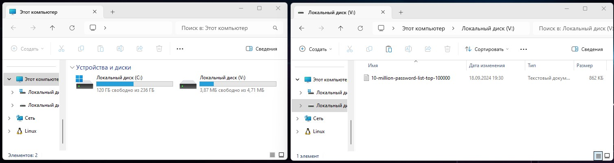

# Специалист по информационной безопасности: расширенный курс
## Модуль 1. Основы информационной безопасности
### Блок 3. Криптографическая защита информации
### Желобанов Егор SIB-48

# Домашнее задание к занятию «3.1. Теоретические основы криптографии, симметричные криптосистемы»

## Задача №1 - HashCat

Каким-то образом у вас оказался хэш пароля. Вот такой: `5693299e0bbe87f327caa802008af432fbe837976b1232f8982d3e101b5b6fab`.

Что нужно сделать: вам нужно попробовать по длине хэша угадать его тип (это будет один из тех, что упоминался на лекции, как минимум, в табличке в конце лекции).

### Ответ:

1. Функция хэширования - `GOST R 34.11-94`
2. Пароль - `MARINA`

---

## Задача №2 - VeraCrypt

Отправьте контейнер и пароль к нему в ЛК пользователя

### Ответ:

1. [Ссылка на контейнер](assets/container)
2. Пароль - `m{$99W7%*lM*bGvFf|Fs#k@jf?We}ykd`

Диск примонтировался, положил внутрь текстовый файл из первого задания [10-million-password-list-top-100000.txt](assets/10-million-password-list-top-100000.txt):

