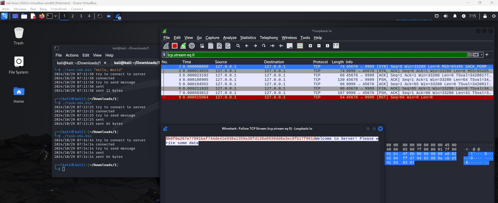
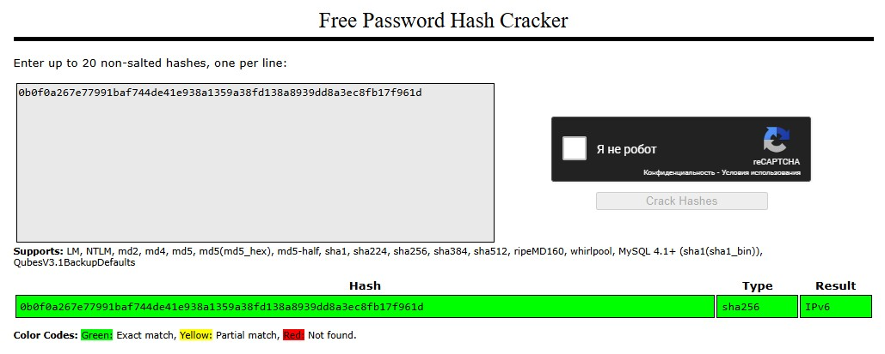

# Специалист по информационной безопасности: расширенный курс
## Модуль 2. Сети передачи данных и безопасность
### Блок 1. Сетевые устройства и протоколы
### Желобанов Егор SIB-48

# Домашнее задание к занятию «1.2. Сетевые технологии, ключевые устройства»

### Задача «Знакомство с Wireshark»

1. Установил VirtualBox 7.1.4.
2. С официального сайта Kali Linux в разделе [Pre-built Virtual Machines](https://www.kali.org/get-kali/#kali-virtual-machines) скачал готовый образ VM для VirtualBox.
3. Выполнил все по инструкции, запустил `server-x64.bin`, и далее `text-x64.bin`, увидел сообщение.
4. Далее запустил `task-x64.bin`, зашел по пути `Follow->TCP Stream`, и в окне увидел хэш:

    

5. Полученный хэш - `0b0f0a267e77991baf744de41e938a1359a38fd138a8939dd8a3ec8fb17f961d`
6. Расшифровал его на сайте [crackstation.net](https://crackstation.net/):

    

7. Ответ - `IPv6`
