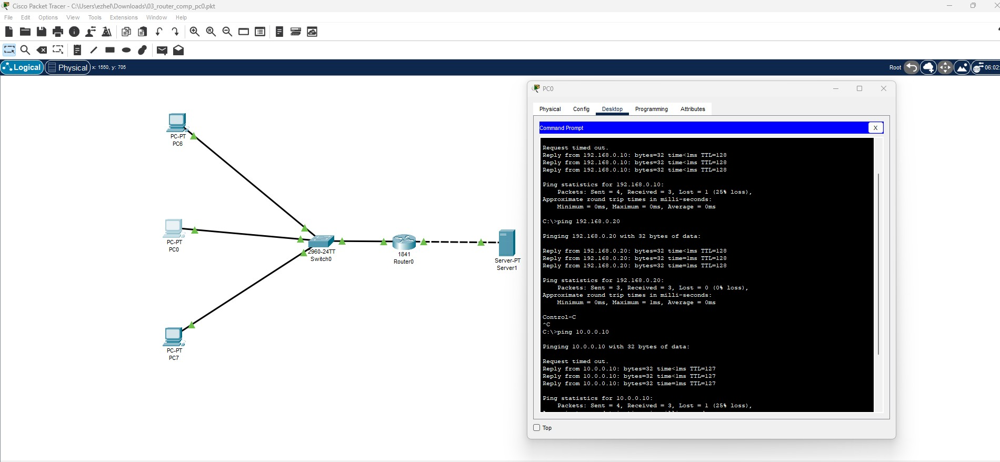
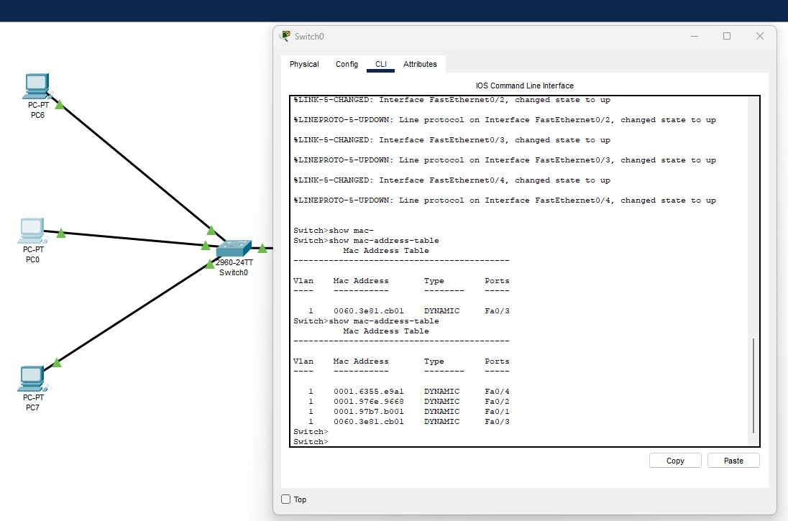

# Специалист по информационной безопасности: расширенный курс
## Модуль 2. Сети передачи данных и безопасность
### Блок 1. Сетевые устройства и протоколы
### Желобанов Егор SIB-48

# Домашнее задание к занятию «1.3. Протоколы сетевого уровня: IPv4, IPv6»

### Задание 1. PC0

1. Я воспользовался уже [готовым примером](https://github.com/netology-code/ibnet-homeworks/blob/v2/02_ip/assets/03_router.pkt) (имею опыт работы с Cisco Packet Tracer).

2. Посмотрел адреса устройств:
    * PC6 - 192.168.0.10/24 gateway 192.168.0.1
    * PC7 - 192.168.0.20/24 gateway 192.168.0.1
    * Server1 - 10.0.0.10/24 gateway 10.0.0.1

3. Соответственно добавил PC0 с такими же праметрами:
    * PC0 - 192.168.0.30/24 gateway 192.168.0.1

4. Попинговал с него разные устройства в сети, пинги проходят:
    

5. Вывод команды `show mac-address-table` на коммутатрое Switch0:
    

6. [Ссылка на pkt-файл проекта](assets/03_router_comp_pc0.pkt)
