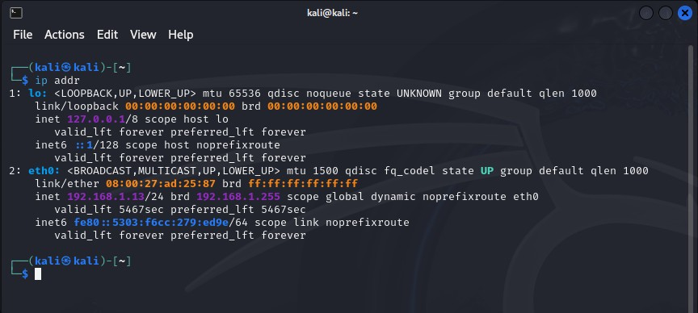
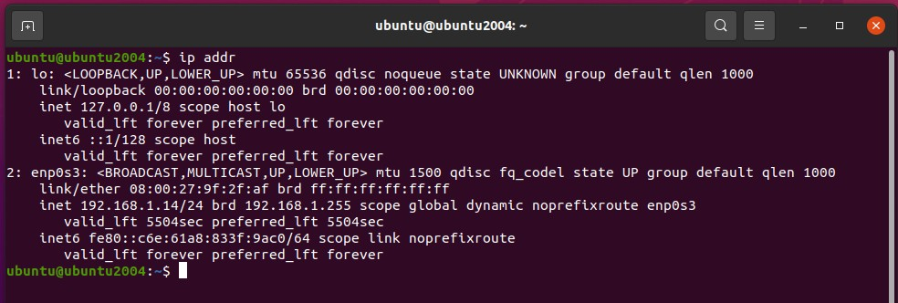
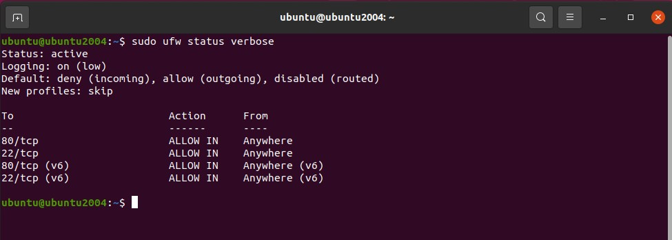
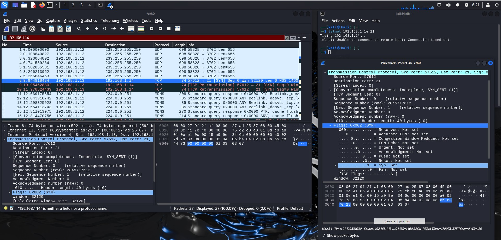
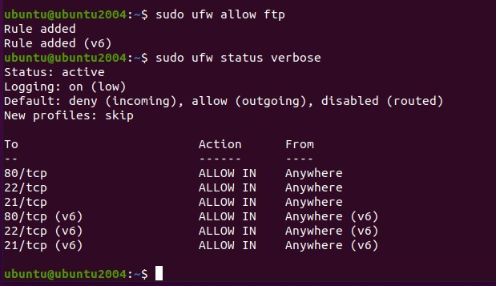
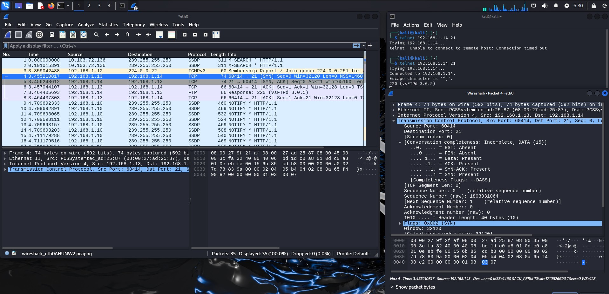

# Специалист по информационной безопасности: расширенный курс
## Модуль "Сети передачи данных и безопасность"
### Блок 1. Сетевые устройства и протоколы
### Желобанов Егор SIB-48

# Домашнее задание к занятию «1.4. Протоколы транспортного уровня: TCP, UDP»

### Задание 1. Firewall

1. Развернул две виртуальные машины, Kali и Ubuntu. Ввиду особенностей домашней сети:

    * Kali имеет ip - 192.168.1.13
   
    * Ubuntu имеет ip - 192.168.1.14
   

2. Установил в Ubuntu нужные пакеты, и проверил доступность из терминала Kali:
   ```shell
   ┌──(kali㉿kali)-[~]
   └─$ telnet 192.168.1.14 21
   Trying 192.168.1.14...
   Connected to 192.168.1.14.
   Escape character is '^]'.
   220 (vsFTPd 3.0.5)

   ┌──(kali㉿kali)-[~]
   └─$ telnet 192.168.1.14 22
   Trying 192.168.1.14...
   Connected to 192.168.1.14.
   Escape character is '^]'.
   SSH-2.0-OpenSSH_8.2p1 Ubuntu-4ubuntu0.11

   ┌──(kali㉿kali)-[~]
   └─$ telnet 192.168.1.14 80
   Trying 192.168.1.14...
   Connected to 192.168.1.14.
   Escape character is '^]'.
   ```
   
3. Включил firewall командой `sudo ufw enable`, проверяю доступность:
   ```shell
   ┌──(kali㉿kali)-[~]
   └─$ telnet 192.168.1.14 21
   Trying 192.168.1.14...
   
   ┌──(kali㉿kali)-[~]
   └─$ telnet 192.168.1.14 22
   Trying 192.168.1.14...

   ┌──(kali㉿kali)-[~]
   └─$ telnet 192.168.1.14 80
   Trying 192.168.1.14...
   ```
   
4. Разрешаем доступ к портам в Ubuntu командами `sudo ufw allow ssh` и `sudo ufw allow http`, и проверяем их доступность (как видно. 22 и 80 порты открыты, а на 21 порт доступа нет):
   ```shell
   ┌──(kali㉿kali)-[~]
   └─$ telnet 192.168.1.14 80
   Trying 192.168.1.14...
   Connected to 192.168.1.14.
   Escape character is '^]'.

   ┌──(kali㉿kali)-[~]
   └─$ telnet 192.168.1.14 22
   Trying 192.168.1.14...
   Connected to 192.168.1.14.
   Escape character is '^]'.
   SSH-2.0-OpenSSH_8.2p1 Ubuntu-4ubuntu0.11

   ┌──(kali㉿kali)-[~]
   └─$ telnet 192.168.1.14 21
   Trying 192.168.1.14...
   ```
   
5. Вывод команды `sudo ufw status verbose` на Ubuntu:
   

### Задание 2. Wireshark

1. МЭ включен, 21 порт заблокирован. Выполняем команду `telnet 192.168.1.14 21`:
   
2. Как видно из скриншота, происходит следующее:
   * отправляем SYN пакет с ip 192.168.1.13 на ip 192.168.1.14:21
   * TCP retransmission (повторная передача) пакета с ip 192.168.1.13 на ip 192.168.1.14:21
   * TCP retransmission (повторная передача) пакета с ip 192.168.1.13 на ip 192.168.1.14:21

3. Разрешаем доступ на 21 порт командой `sudo ufw allow ftp`, и сразу посмотрим правила командой `sudo ufw status verbose`:
   

4. Повторяем команду `telnet 192.168.1.14 21` из терминала Kali и смотрим Wireshark:
   
5. Теперь доступ есть, и смотрим как происходит соединение:
   * Установка соединения:
       * отправка SYN пакета с ip 192.168.1.13 на ip 192.168.1.14:21  
       * приходит SYN, ACK пакет с ip 192.168.1.14:21 на ip 192.168.1.13 
       * отправляем ACK пакет (подтверждение) с ip 192.168.1.13 на 192.168.1.14:21
   * Соединение установлено:
       * приходит response (отклик) с ip 192.168.1.14:21 на ip 192.168.1.13 протокол соединения FTP
       * отправляется ACK пакет с ip 192.168.1.13 на ip 192.168.1.14:21
   * Завершение соединения:
       * отправка FIN, ACK пакет с ip 192.168.1.13 на ip 192.168.1.14:21
       * приходит FIN, ACK пакет с ip 192.168.1.14:21 на ip 192.168.1.13
       * отправляем ACK пакет с ip 192.168.1.13 на ip 192.168.1.14:21 
   * Соединение закрыто.

6. Ответ на вопрос - разница в процессе соединения при включенном МЭ и выключенном МЭ проявляется в том, что при выключенном МЭ на запрос об установке соединения инициатор получает ответ в виде пакетов SYN, ACK с последующим соединением, а при включенном МЭ инициатор соединения не получает ответ на запрос и отправляет его несколько раз повторно (TCP retransmission).