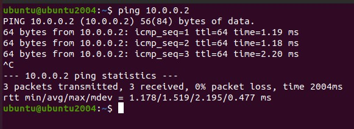
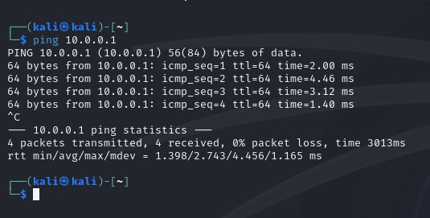
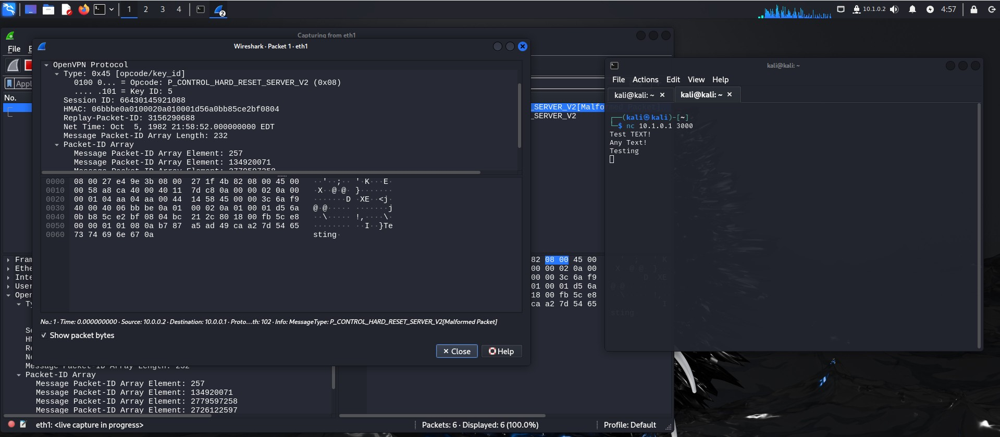
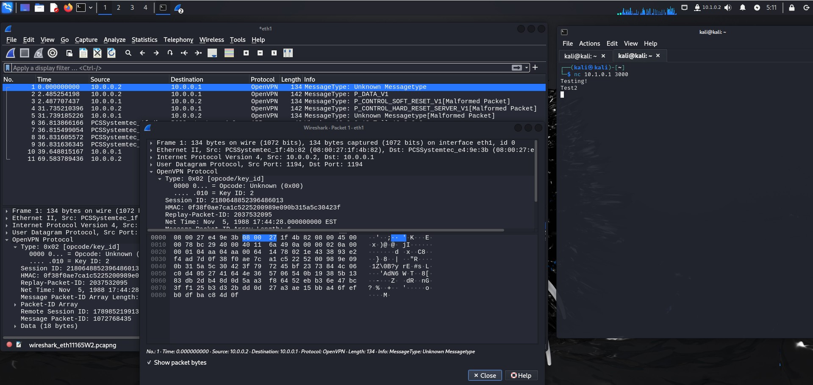
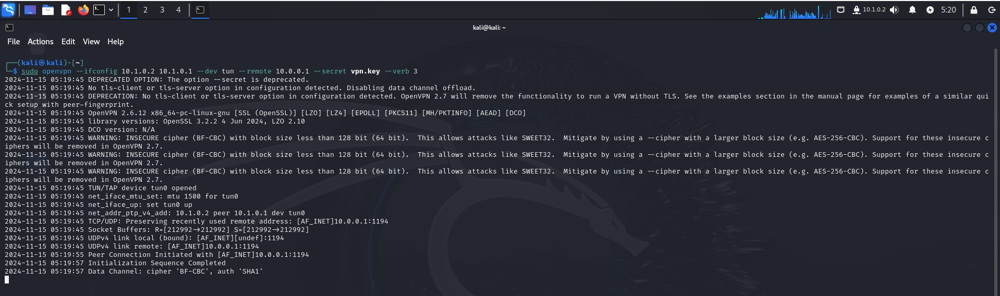
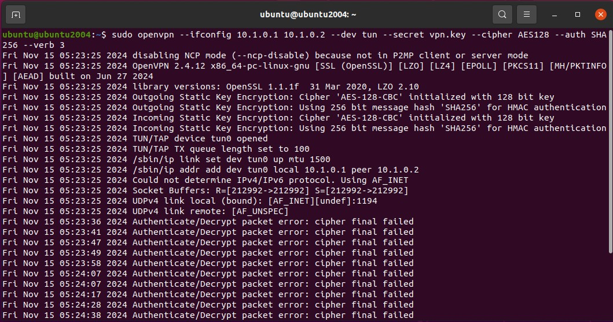
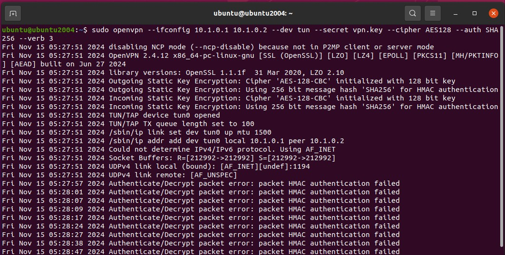
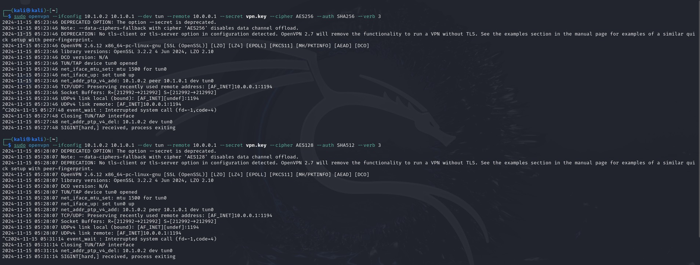

# Специалист по информационной безопасности: расширенный курс
## Модуль 2. Сети передачи данных и безопасность
### Блок 2. Работа в сети Интернет и беспроводных сетях
### Желобанов Егор SIB-48

# Домашнее задание к занятию «2.1. Виртуальные частные сети VPN»

1. На виртуальных машинах добавл по дополнительному адаптеру "внутренняя сеть", настроил вручную адреса:

    * ubuntu - 10.0.0.1
    * kali - 10.0.0.2

    Машины пингуют друг друга:

    
    

2. P2P. Создал туннели как описано в задании, данные в консолях серверов передаются, текст появляется и там и там:

    
    

3. Сгенерировал `vpn.key` и передал его в Kali:

    

4. Создал туннели с помощью `vpn.key`, данные передаются между серверами в зашифрованном виде:

    

5. запустил на Kali команду `sudo openvpn --ifconfig 10.1.0.2 10.1.0.1 --dev tun --remote 10.0.0.1 --secret vpn.key --verb 3`:

    

    * Версия OpenSSL - 3.2.2
    * Алгоритм шифрования - AES-256-CBC - 256 бит длина ключа
    * Алгоритм HMAC аутентификации - SHA1 - 160 бит длина ключа

6. На сервере ввел команду `sudo openvpn --ifconfig 10.1.0.1 10.1.0.2 --dev tun --secret vpn.key --cipher AES128 --auth SHA256 --verb 3`.

    * при подключении с клиента `sudo openvpn --ifconfig 10.1.0.2 10.1.0.1 --dev tun --remote 10.0.0.1 --secret vpn.key --cipher AES256 --auth SHA256 --verb 3`

    

    * при подключении с клиента `sudo openvpn --ifconfig 10.1.0.2 10.1.0.1 --dev tun --remote 10.0.0.1 --secret vpn.key --cipher AES128 --auth SHA512 --verb 3`

    

    * скриншоты ввода на Kali:

    
