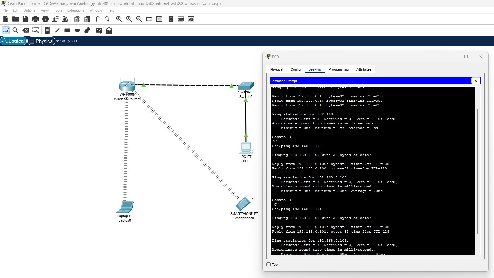

# Специалист по информационной безопасности: расширенный курс
## Модуль "Сети передачи данных и безопасность"
### Блок 2. Работа в сети Интернет и беспроводных сетях
### Желобанов Егор SIB-48

# Домашнее задание к занятию «2.2. Беспроводные сети Wi-Fi»

1. Для организации сети, использовал устройства, как указано в задании:

    * WiFi-роутер WRT300
    * Два WiFi устройства: Laptop и Smartphone.
    * Коммутатор Switch-PT.
    * Персональный компьютер PC-PT.

2. На Wi-Fi роутере настроил следующие параметры:
   * SSID - `test`
   * Channel - `10-2.457 GHz`
   * аутентификация - `WPA2-PSK`
   * парольная фраза - `testtest`
   * тип шифрования - `AES`

3. Параметры роутера оставил по умолчанию, IP тоже, в итоге адреса устройств выглядят так:

   * роутер - 192.168.0.1/24 (статика)
   * ПК - 192.168.0.50/24, шлюз - 192.168.0.1 (статика)
   * смартфон - 192.168.0.101/24 (dhcp)
   * ноутбук - 192.168.0.100/24 (dhcp)

4. Как результат - все устройства свободно пингуют друг друга. На скриншоте выполнен пинг роутера и беспроводных устройств с персонального компьютера:

   

5. Также приложил [файл проекта](assets/wifi-lan.pkt).