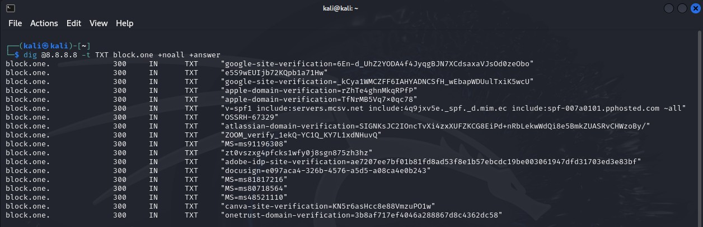

# Специалист по информационной безопасности: расширенный курс
## Модуль 2. Сети передачи данных и безопасность
### Блок 2. Работа в сети Интернет и беспроводных сетях
### Желобанов Егор SIB-48

# Домашнее задание к занятию «2.3. Работа сети Интернет (часть 1): BGP, DNS»

1. Задание Zoom. Начал с крупных иностранных компаний, затем отечественных, методом перебора вручную нашел необходимое количество:

    * [netology.ru](https://netology.ru/)
    

    * [amazon.com](https://amazon.com)
    

    * [severstal.com](https://severstal.com/rus/)
    

    * [block.one](https://block.one)
    

    * [veon.com](https://veon.com)
    

2. Задание BGP. Создал необходимую топологию, [файл проекта](asset/BGP.pkt) прилагаю (дополнительно прикреплю к заданию). Как видно на скриншотах, `host1` пингует `host2` и наоборот:

        

3. Необязательное задание Internet*. Судя по маршрутам, на роутере R2, мы видим что пакеты с любых ip адресов перенаправляются на адрес `10.3.3.2`, а на схеме видим что адрес "интернета" - `10.3.3.4`:

    

