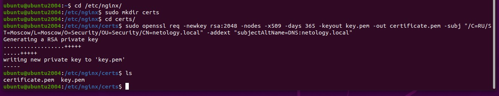
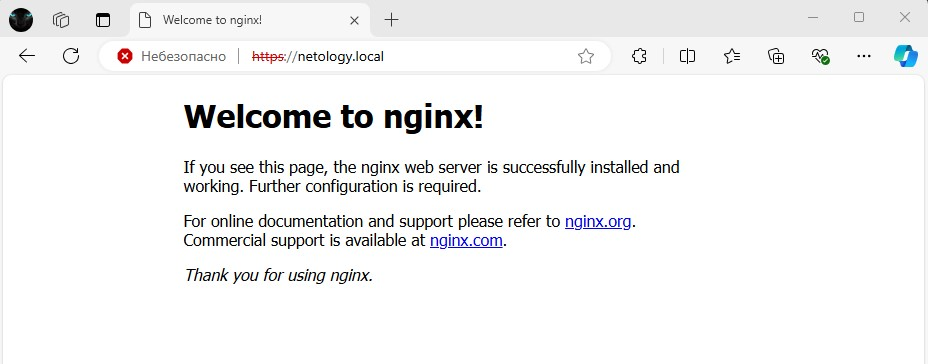
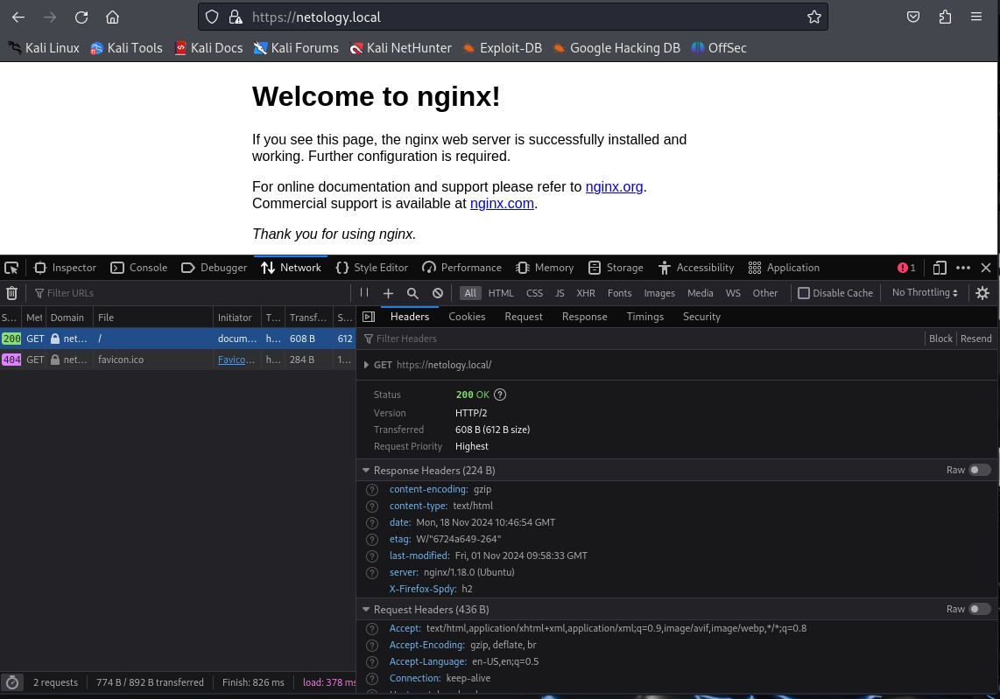
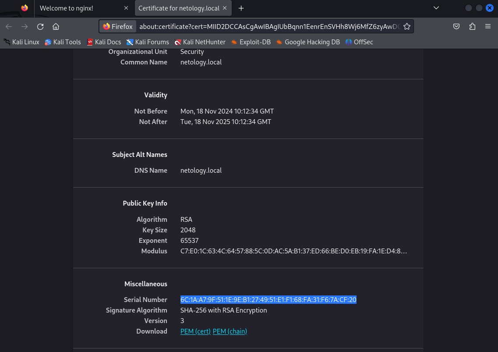
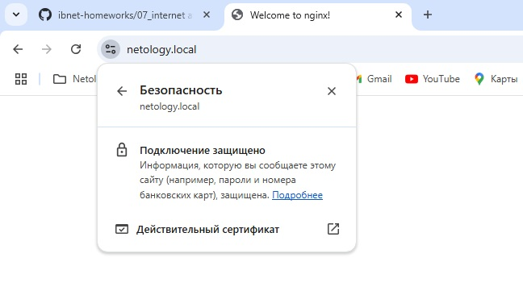
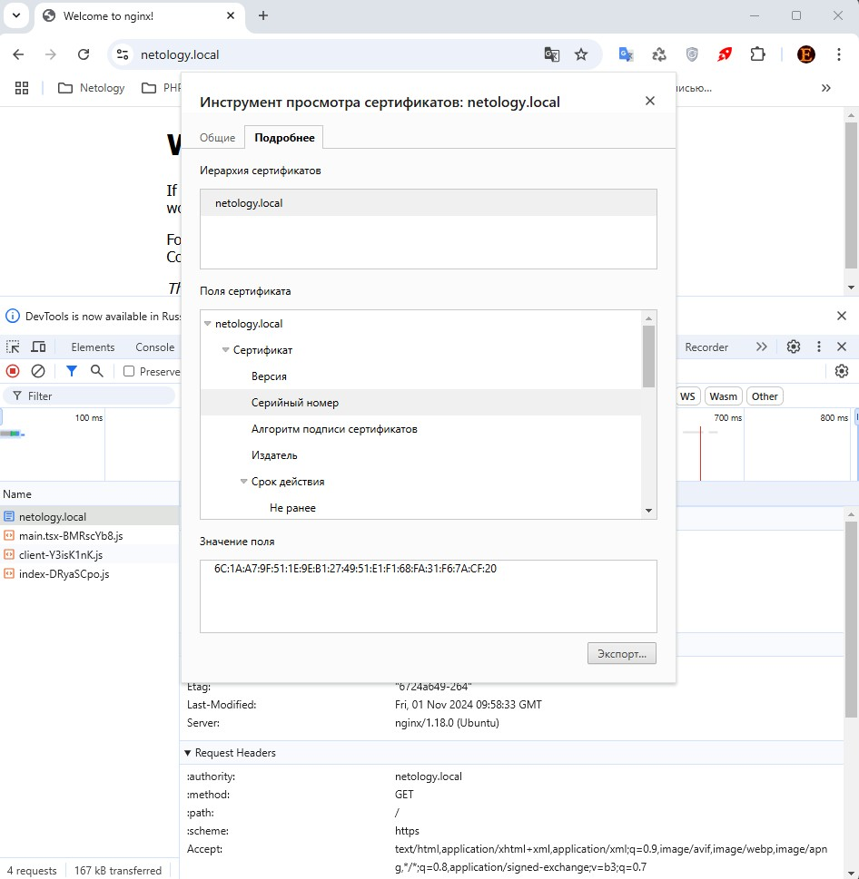
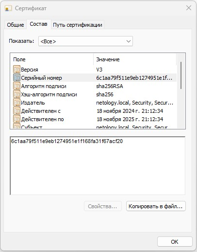

# Специалист по информационной безопасности: расширенный курс
## Модуль "Сети передачи данных и безопасность"
### Блок 2. Работа в сети Интернет и беспроводных сетях
### Желобанов Егор SIB-48

# Домашнее задание к занятию «2.4. Работа сети Интернет (часть 2): HTTP, HTTPS, HTTP2»

1. Задание Nginx

    * установил nginx.
    * сгенерировал сертификат и ключ:
    
    * настроил все как указано в инструкции, сайт открывается по адресу `netology.local` и переадресует на https:
    
    * включил `http2`, в kali это видно на скриншоте:
    
    * и также серийный номер сертификата:
    
    * в windows также все открывается, сертификат импортирован в доверенные:
    
    * информация о сертификате в chrome:
    :
    * информация о сертификате в windows:
    
    * также прилагаю и сам [сертификат](assets/netology.local.crt).