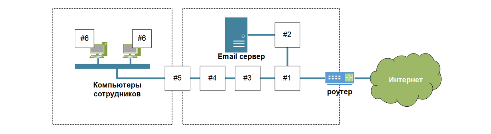

# Специалист по информационной безопасности: расширенный курс
## Модуль "Сети передачи данных и безопасность"
### Блок 3. Обеспечение безопасности сетей
### Желобанов Егор SIB-48

# Домашнее задание к занятию «3.1. Основы сетевой безопасности»

### 1. Ритейл

Вы являетесь экспертом ИБ в крупной ритейл компании. Компания в условиях пандемии COVID-19 переводит продажи в онлайн (интернет) и запускает Интернет-Сайт.

1. Для разграничения доступа из Интернета к публикуемому сервису необходимо установить межсетевой экран. Для защиты сетей от нежелательного трафика и несанкционированного доступа можно применить:
    * Cisco ASA 5500 Series
    * АПКШ Континент
    * МЭ Рубикон К
2. Для определения и подавления DDoS атаки на ваш интернет магазин, можно применить различные варианты:
    * Kaspersky DDoS Protection (Лаборатория Касперского).
    * Через провайдера интернет-канала, используя технолигию BGP.
    * Также можно использовать сторонние сервисы на примере Group-IB). Для выявления и блокирования бот-активности можно использовать продукт от Group-IB "Fraud Hunting Platform", модуль "Preventive Proxy".
3. Для определения и блокирования сложных WEB атак на ваш интернет-магазин, когда злоумышленники используют SQL инъекцию для получения доступа к вашей базе клиентов, нужно использовать WAF:
    * Nemesida WAF
    * Ростелеком-Солар (использует WAF от Positive Tehnologies)
    * PT Application Firewall

### 2. Промышленность

Вы являетесь экспертом ИБ в крупной промышленной компании. В компании появились новые инвестиции и руководство компании планирует модернизировать систему электронной почты и сделать более безопасным доступ сотрудников в Интернет.

Какие средства защиты информации вы порекомендуете:
1. Для разграничения доступа из Интернета в DMZ, также необходимо использовать межсетевой экран. В данном случае подойдут сертифицированные ФСТЭК (например):
   * АПКШ Континент
   * МЭ Рубикон К
2. Для защиты электронной почты от вирусов и спама, подойдет антивирус для почтового сервера, например Security для Microsoft Exchange Servers (если используется MS Exchange) и/или использование почтового шлюза, например Kaspersky Secure Mail Gateway (KSMG), данные решения имеют сертификацию ФСТЭК.
3. Для определения и блокирования вредоносного ПО я бы порекомендовал использовать Kaspersky Endpoint Security (KES), данное решение сертифицировано ФСТЭК.
4. Для контроля WEB трафика, URL фильтрации, можно использовать прокси-сервер, например Kaspersky Web Traffic Security (KWTS), данное решение также имеет сертификацию ФСТЭК.
5. Для разграничения доступа между корпоративной сетью и DMZ нужно также установить межсетевой экран, желательно другого вендора, например аппартный комплекс UserGate (имеет сертификат ФСТЭК).
6. Для защиты от вредоносного ПО на рабочей станции - обязательно авторизация пользователя без прав администратора + САЗ, например сертифицированный ФСТЭК Kaspersky Endpoint Security.
