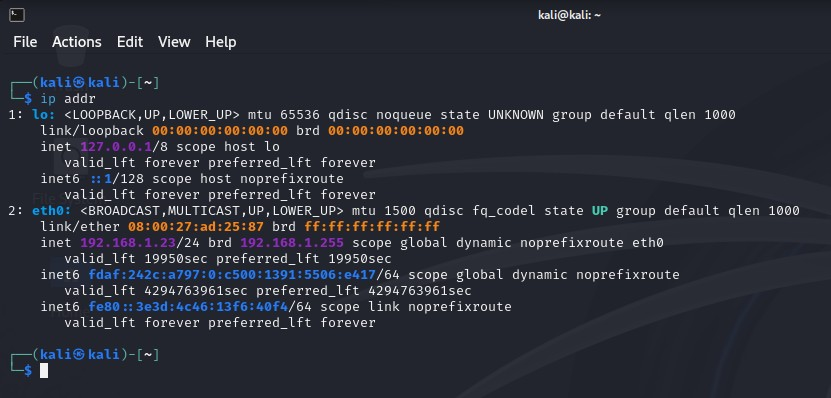
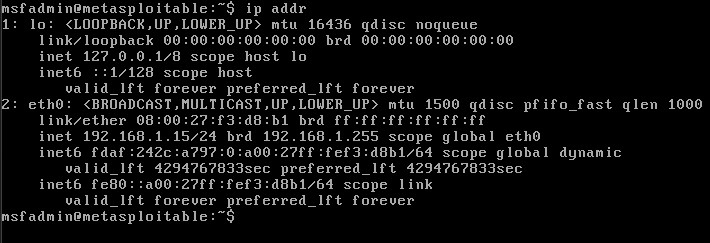
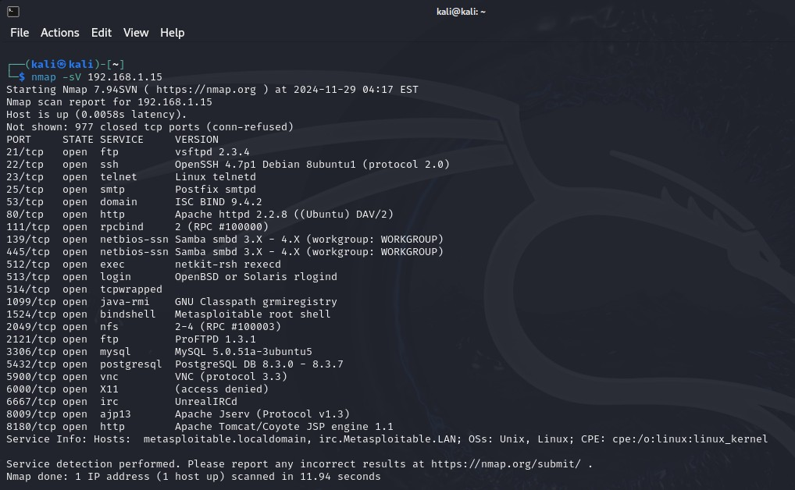
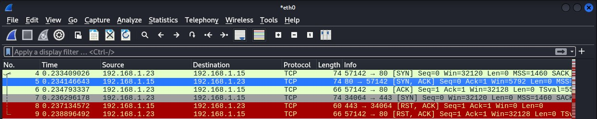
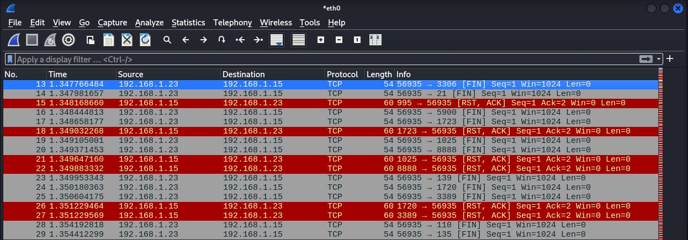
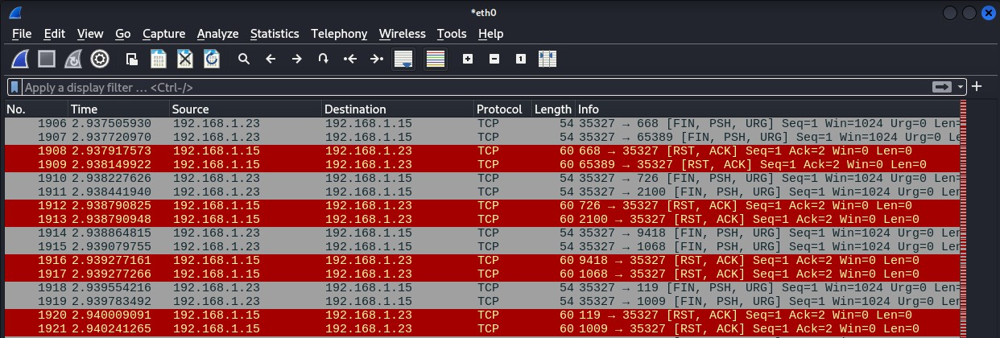
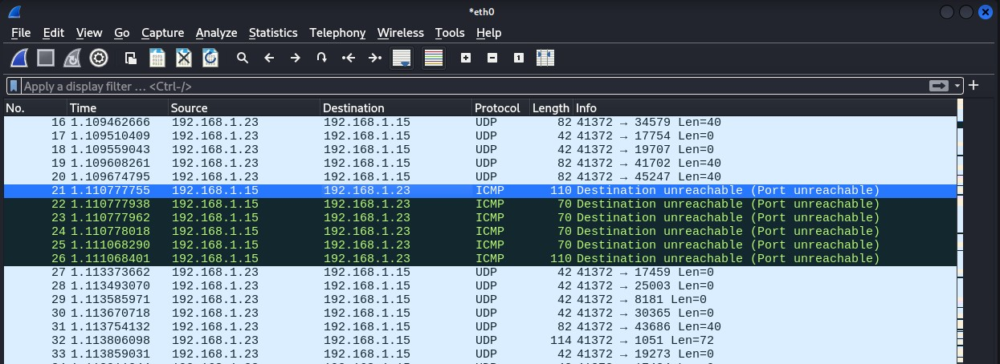

# Специалист по информационной безопасности: расширенный курс
## Модуль "Сети передачи данных и безопасность"
### Блок 3. Обеспечение безопасности сетей
### Желобанов Егор SIB-48

# Домашнее задание к занятию «3.2. Атаки»

### 1. Metasploitable

1. Виртуальная машина Kali у меня уже существует, в моей сети она имеет адрес `192.168.1.23`:  

   

2. Скачал и развернул виртуальную машину Metasploitable, в моей сети она имеет адрес `192.168.1.15`:  
    
    

3. Просканировал ВМ Metasploitable с машины Kali, получен список разрешенных сетевых сервисов:  

    

4. Используя ресурс [www.exploit-db.com](https://www.exploit-db.com/), обнаружены уязвимости:

   * [vsftpd 2.3.4 - Backdoor Command Execution](https://www.exploit-db.com/exploits/49757)
   * [PostgreSQL 8.3.6 - Conversion Encoding Remote Denial of Service](https://www.exploit-db.com/exploits/32849)
   * [ProFTPd IAC 1.3.x - Remote Command Execution](https://www.exploit-db.com/exploits/15449)

### 2. SYN, FIN, Xmas, UDP

Для выполнения задания также использовал вспомогательные ресурсы:

   * [статья на nmap.org](https://nmap.org/man/ru/man-port-scanning-techniques.html)
   * [статья на sources.ru](https://sources.ru/security/attack2/05-01.html)

Ответы на вопросы и результаты сканирования различными методами:  

   * SYN - метод, основанный на принципах создания TCP-соединения и состоящий в последовательной передаче на объект сканирования 
   TCP SYN-запросов на создание соединения на различные порты. Если порт открыт, то на данный сканирующий запрос будет получен ответ
   TCP SYN АСК; если же порт закрыт - ответом будет TCP RST. 
   Для запуска выполнил команду `sudo nmap -sS 192.138.1.15` в терминале, результат смотрел в Wireshark:  
   
   * FIN - в основу данного метода легли некоторые тонкости реализации протокола TCP в различных сетевых ОС: на передаваемый TCP FIN-запрос
   закрытые порты отвечают пакетом с флагом RST, а открытые порты данное сообщение игнорируют. Однако сетевые ОС фирмы Microsoft таким методом
   просканировать не удастся, так как в их реализации протокола TCP передача пакета TCP RST в ответ на подобный запрос не предусмотрена. 
   Для запуска выполнил команду `sudo nmap -sF 192.138.1.15` в терминале, результат смотрел в Wireshark:  
   
   * Xmas - устанавливаются FIN, PSH и URG флаги. если в ответ приходит RST пакет, то порт считается закрытым, отсутствие ответа означает, 
   что порт открыт либо фильтруется. Порт помечается как фильтруется, если в ответ приходит ICMP ошибка о недостижимости 
   (тип 3, код 1, 2, 3, 9, 10 или 13). Для запуска выполнил команду `sudo nmap -sX 192.138.1.15` в терминале, результат смотрел в Wireshark:  
   
   * UDP - на каждый порт сканируемой машины отправляется UDP-пакет без данных. Если в ответ было получено ICMP-сообщение о недоступности порта,
   это означает, что порт закрыт. В противном случае предполагается, что сканируемый порт открыт. Для запуска выполнил команду `sudo nmap -sU 192.138.1.15` в терминале, результат смотрел в Wireshark:  
   