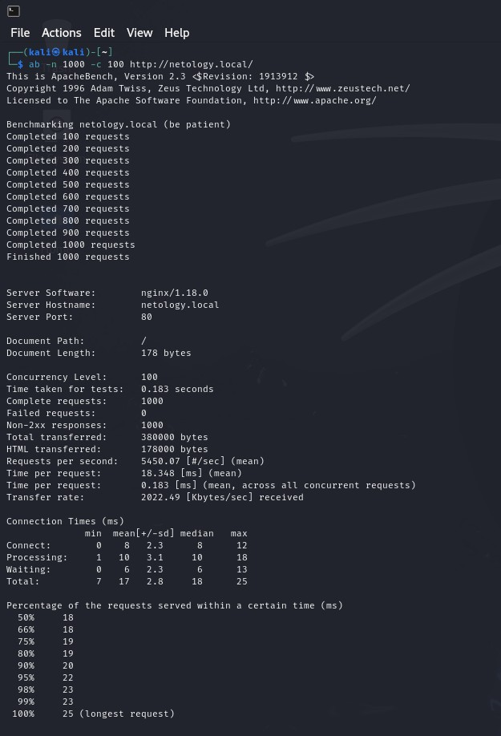
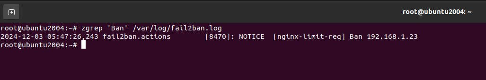

# Специалист по информационной безопасности: расширенный курс
## Модуль 2. Сети передачи данных и безопасность
### Блок 3. Обеспечение безопасности сетей
### Желобанов Егор SIB-48

# Домашнее задание к занятию «3.3. Организация безопасности сети»

Использую ubuntu с уже установленным nginx, отключил 301 редирект, SSL и https. В моей сети машины имеют другую адресацию:  
* Kali - `192.168.1.23`
* Ubuntu - `192.168.1.18`

1. Выполнение запроса `ab -n 1000 -c 100 http://netology.local/` до включения `limit_req` на nginx:



2. Добавил в конфигурационный файл nginx необходимые строки, мой файл выглядит следующим образом:
```shell
limit_req_zone $binary_remote_addr zone=limit:10m rate=50r/s;

server {
  server_name netology.local;

  listen 80;

  root /var/www/html;

  index index.html index.htm index.nginx-debian.html;

  limit_req zone=limit burst=50 nodelay;

  location / {
    try_files $uri $uri/ =404;
  }
}
```
3. Выполняю в Kali `ab -n 1000 -c 100 http://netology.local/` еще раз, после включения `limit_req`:


4. Установил `fail2ban`, добавил нужную строку, проверил статус сервиса:  


5. В Kali выполнил `ab -n 1000 -c 100 http://netology.local/`, и был забанен уже на второй раз:


6. Удостоверился что адрес Kali действительно забанен:


