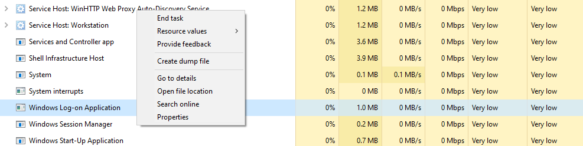

# Специалист по информационной безопасности: расширенный курс
## Модуль "Безопасность операционных систем, системное программирование"
### Блок 1. ОС Windows
### Желобанов Егор SIB-48

# Домашнее задание к занятию «1.1. ОС Windows. Часть 1»

Так как сейчас с сайта Microsoft достаточно проблемно скачать образ именно Windows 10, я использовал давно скачанный оттуда образ Windows 10 21H1.
Система установлена в Virtualbox 7.1.4, дополнения гостевой ОС не устанавливал.

### Ответы на вопросы:

1. Какой процесс отображается в логе первым? Какой у него PID?
    
Первым в лог записан процесс типа "Drivers" PROCMON24.SYS - это драйвер монитора процесса - PID у него 4.
Но, т.к. это драйвер мониторинга процессов, то следующий за ним процесс более значимый и я думаю его можно считать первым процессом в логе. И это `ntoskrnl.exe` - файл ядра операционных систем семейства Windows. Этот файл запускается загрузчиком ядра NTLDR в безопасном режиме. Простыми словами - запускает ядро. Его PID - 4.    

2. Какой "драйвер" загружается первым? Что это за драйвер (ответьте своими словами)?

Первым "драйвер" в лог записан `PROCMON24.SYS` - как я указывал в пункте 1, это драйвер монитора процесса. Этот драйвер выполняет сбор логов процессов с начала запуска системы, и на милисекунды запускается раньше ядра.

3. Какой PID у родительского процесса для smss.exe (не у самого smss.exe, а у того, кто его создал)?

Родительским процессом процесса `smss.exe` является `System` с PID - 4. 

4. Какой процесс является родительским для процесса winlogon.exe? Где расположен файл winlogon.exe?

Родительским процессом процесса `winlogon.exe` является `smss.exe` с PID - 504. Расположен файл winlogon здесь: `C:\Windows\System32\winlogon.exe`

5. Какой процесс является родительским для процесса lsass.exe?

Родительским процессом процесса `lsass.exe` является `wininit.exe` с PID - 532

6. Что будет если в таск менеджере (taskmgr.exe) завершить работу следующего процесса:

Ответ - после завершения данного процесса система выходит на экран блокировки ОС, при этом закрывая все открытые приложения в системе, собственно совершает logout сессии текущего пользователя.

