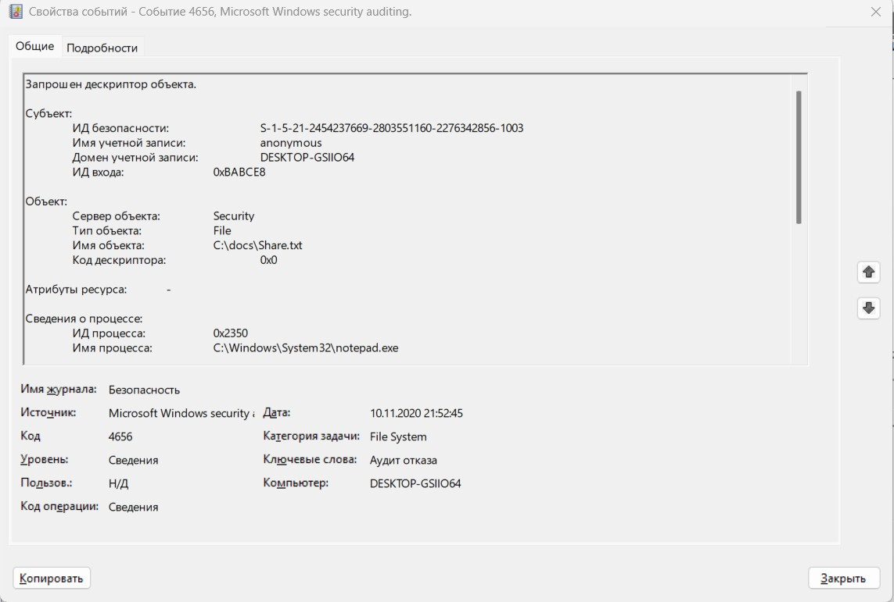
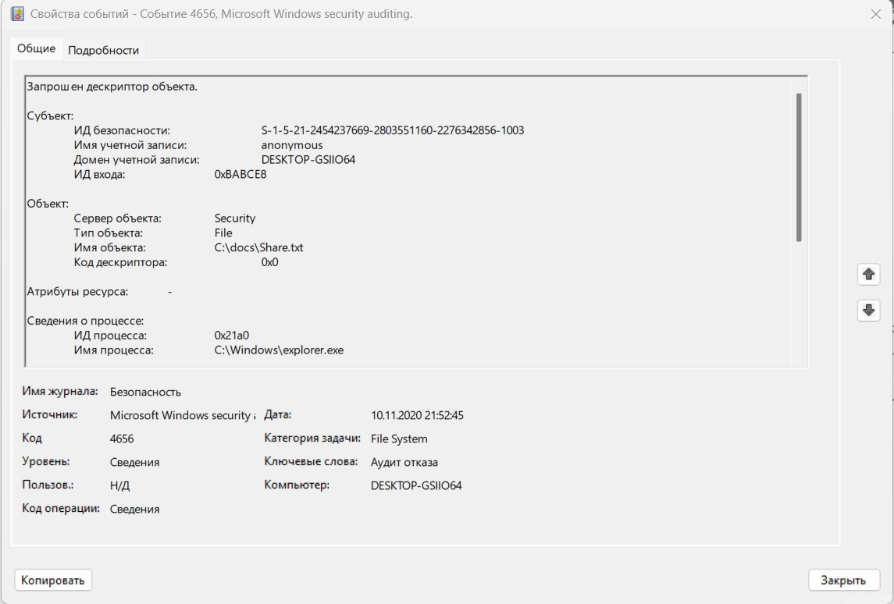

# Специалист по информационной безопасности: расширенный курс
## Модуль "Безопасность операционных систем, системное программирование"
### Блок 1. ОС Windows
### Желобанов Егор SIB-48

# Домашнее задание к занятию «1.2. ОС Windows. Часть 2»

Скачал [выгрузку журнала событий events.evtx](assets/events.evtx)

Ответы на вопросы:

### 1. Для каких пользователей (логины и SID'ы) зарегистрированы события типа Audit Failure (в русскоязычной Windows - Аудит отказа) по доступу к файлу Share.txt?

##### Ответ:
2 пользователя:
 - anonymous, SID S-1-5-21-2454237669-2803551160-2276342856-1003, зарегистрировано 3 события
 - teacher, SID S-1-5-21-2454237669-2803551160-2276342856-1001, зарегистрировано 1 событие

### 2. Каковы ID событий (Event ID) и время, когда это было зафиксировано (в русскоязычной Windows Код события)?

##### Ответ:
Event ID у всех событий одинаковый - `4656`

Три события от пользователя `anonymous` имеют одинаковую дату и время - `10.11.2020 21:52:45`;  
Одно событие от пользователя `teacher` имеет дату и время - `10.11.2020 21:52:24`.

### 3. С помощью каких процессов (приложений) была осуществлена попытка доступа (в русскоязычной Windows Имя процесса)?

##### Ответ:
Попытка доступа пользователем `anonymous` была осуществлена с помощью `notepad.exe` и `explorer.exe`  
Попытка доступа пользователем `teacher` была осуществлена с помощью `notepad.exe`

Также прилагаю скриншоты событий:

  

  

  

