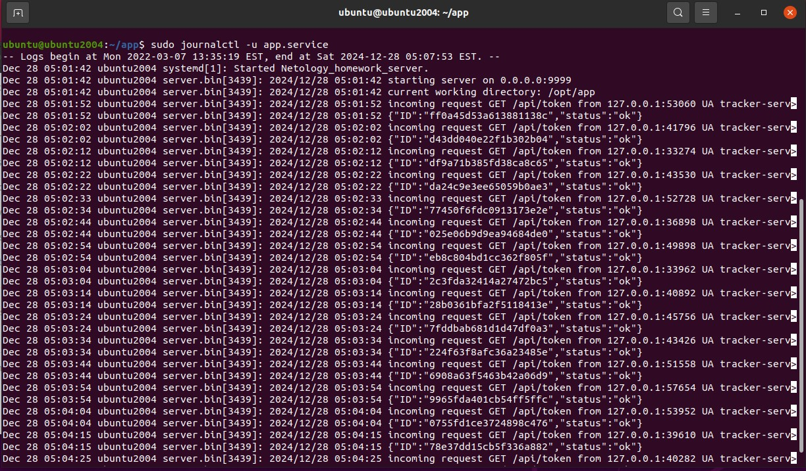
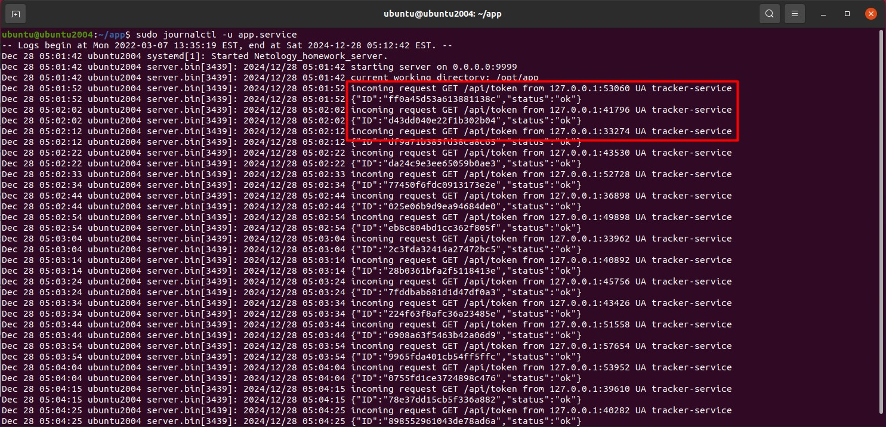
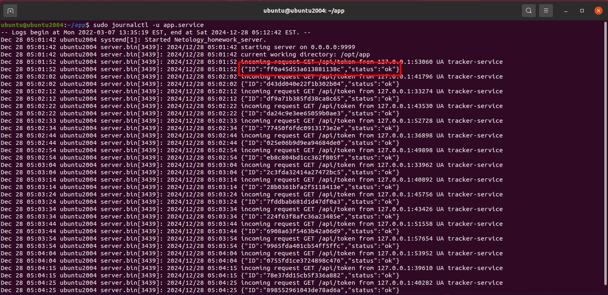
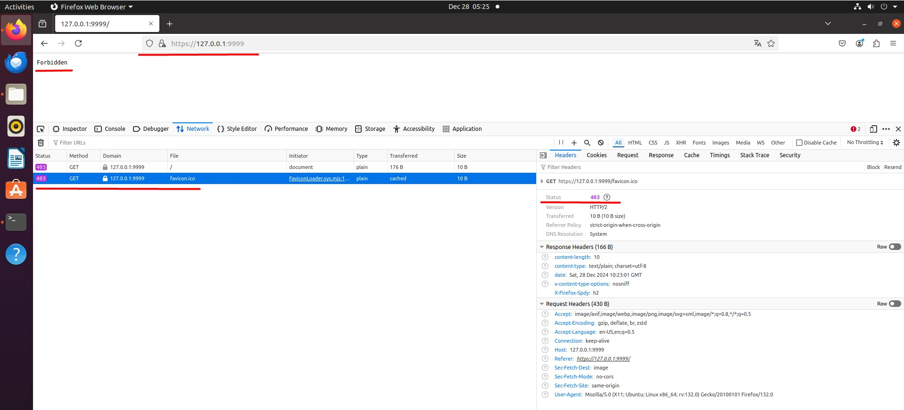

# Специалист по информационной безопасности: расширенный курс
## Модуль "Безопасность операционных систем, системное программирование"
### Блок 2. ОС Linux
### Желобанов Егор SIB-48

# Домашнее задание к занятию «2.1. ОС Linux. Часть 1»

Задание выполнялось в виртуальной машине Ubuntu 20.04 в Virtualbox

Скачал [исполняемый файл сервера](assets/server/server.bin), [сертификат](assets/server/certificate.pem) и [приватный ключ](assets/server/key.pem).

### Ответы на вопросы:
1. На каком IP и порту запускается сервис?

#### Ответ:

Как видно на скриншоте, строка `starting server on 0.0.0.0:9999` означает все адреса (или любой адрес) локальной машины и порт 9999:

2. Кто (IP и порт) шлёт запросы на этот сервис и на какой путь?

#### Ответ:

Как видно на скриншоте, запросы отправляет `127.0.0.1` по разным портам (в первой строке выделенного красным прямоугольником, порт 53060), путь запроса `/api/token`: 

3. Какие ответы (формат) получает клиент из п.2 получает в ответ на свои запросы?

#### Ответ:

Ответы возвращаются в формате JSON, к примеру `{"ID":"ff0a45d53a613881138c","status":"ok"}`, что видно на скриншоте:

4. Какой ответ (HTTP статус код) получите вы, если пошлёте из браузера запрос на этот же адрес (сертификат самоподписанный, поэтому вам необходимо принять его)?

#### Ответ:

Отправив запрос в браузере виртуальной машины на адрес `https://127.0.0.1:9999/`, я получил код `403 Forbidden`:

