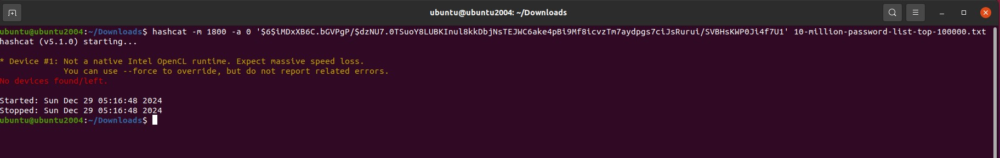
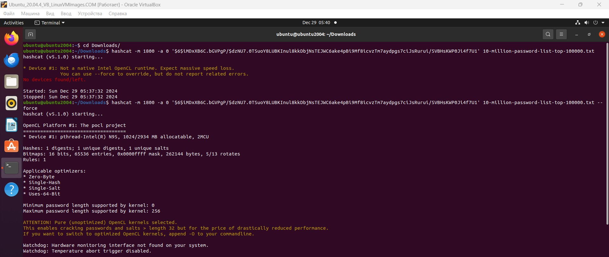
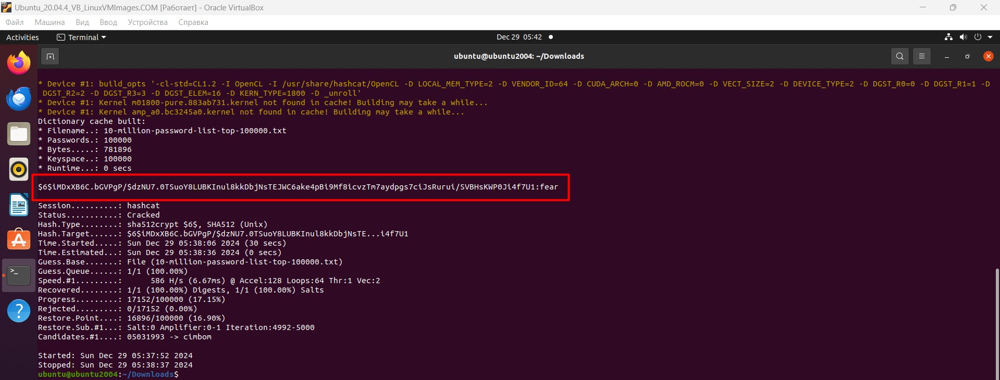

# Специалист по информационной безопасности: расширенный курс
## Модуль 3. Безопасность операционных систем, системное программирование
### Блок 2. ОС Linux
### Желобанов Егор SIB-48

# Домашнее задание к занятию «2.1. ОС Linux. Часть 1»

### Задача
У вас есть фрагмент записи из файла `/etc/shadow:`

`hackme:$6$iMDxXB6C.bGVPgP/$dzNU7.0TSuoY8LUBKInul8kkDbjNsTEJWC6ake4pBi9Mf8icvzTm7aydpgs7ciJsRurui/SVBHsKWP0Ji4f7U1:....`

Подберите пароль к данной учётной записи.

#### Решение

Для подбора пароля с помощью HashCat я скачал файл [10-million-password-list-top-100000.txt с GitHub](https://github.com/vit81g/SecLists/blob/master/Passwords/Common-Credentials/10-million-password-list-top-100000.txt)

Далее определяем алгоритм шифрования, в нашем случае `$6$ - SHA-512`.  
Определив алгоритм, подбираем параметры для hascat:
* `-m 1800` - указываем что наш хэш SHA-512
* `-a 0` - указываем вид атаки, в данном случае по словарю

Ввиду особенности моей виртуальной машины, сначала я получил ошибку, выполнив команду `hashcat -m 1800 -a 0 '$6$iMDxXB6C.bGVPgP/$dzNU7.0TSuoY8LUBKInul8kkDbjNsTEJWC6ake4pBi9Mf8icvzTm7aydpgs7ciJsRurui/SVBHsKWP0Ji4f7U1' 10-million-password-list-top-100000.txt`:

Но затем нашел информацию на сайте hashcat, добавил флаг `--force`. Выполняем команду, и видим, что в данном случае пароль это - `fear` (на втором скриншоте):

