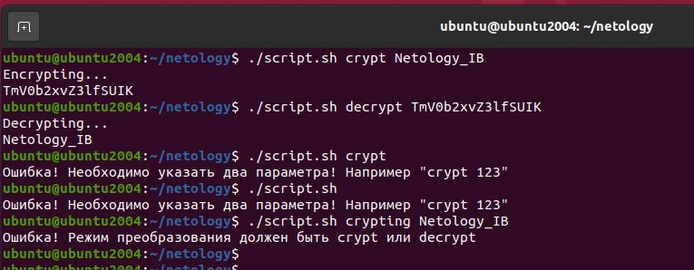

# Специалист по информационной безопасности: расширенный курс
## Модуль "Безопасность операционных систем, системное программирование"
### Блок 3. Использование скриптовых языков
### Желобанов Егор SIB-48

# Домашнее задание к занятию «3.1. Использование командных оболочек. Часть 1»

### Задание 1. Напишите два скрипта, каждый из которых принимает один параметр и:

* первый - прибавляет к параметру единицу как строку.

Написал [скрит](assets/task1_1.sh), также добавил в него в целях самостоятельного изучения bash проверку на ввод параметра, и проверку на целое число введенного параметра:  
```shell
#!/bin/bash

if [[ $# -eq 1 ]]; then
    REGEX="^[0-9]+$"
    if [[ $1 =~ $REGEX ]]; then
        let A=$1+1
        echo $A
    else
        echo "Ошибка! Параметр должен являться целым числом!"
        exit 1
    fi
else
    echo 'Ошибка! Необходимо указать один обязательный параметр! Например test_1.sh 5'
    exit 1
fi
```

* торой - прибавляет к параметру единицу как число.

Написал [скрипт](assets/task1_2.sh), где также добавил условия для проверки существования парамтре:  
```shell
#!/bin/bash

if [[ $# -eq 1 ]]; then
    echo ${1}1
else
    echo 'Ошибка! Необходимо указать один обязательный параметр! Например test_1.sh 5'
    exit 1
fi
```

### Задание 2. Напишите скрипт, который выводит содержимое каталога и подсчитывает в нём количество файлов.

В данном задании немного стало неясно, должен ли скрипт уметь опредеить каталог где он находится или каталог в котором перебирать файлы
нужно указать в скрипте. Поэтому написал два варианта, в [первом скрипте](assets/task2_1.sh) подразумеваем что скрипт запускается внутри каталога
в котором нужно подсчитать файлы, и также добавил проверку чтобы не учитывать подкаталоги:  
```shell
#!/bin/bash

var=0
SCRIPT_DIR="$(dirname "$(readlink -f "$0")")"

for mv in $(ls)
do
    # добавил проверку на файл, чтобы не учитывать каталоги
    if [[ -f $mv ]]
    then
        let var++
        echo $mv
    fi
done
echo "Total files in $SCRIPT_DIR: $var"
```

Во [втором варианте скрипта](assets/task2_2.sh) уже в теле скрипта прописан путь к каталогу, и также добавлена проверка
на файл, чтобы не учитыватькаталоги. Конечно можно было бы еще реализовать путь к каталогу в виде параметра, но этот вариант
я уже н стал писать, думаю два варианта будет достаточно:  
```shell
#!/bin/bash

var=0
# указываем каталог в котором производим подсчет
for file in /etc/*
do
    # добавил проверку на файл, чтобы не учитывать каталоги
    if [[ -f $file ]]
    then
        let var++
        echo $file
    fi
done
echo "Total files in /etc: $var"
```


### Задание 3. Напишите скрипт, который принимает один параметр и определяет, какой объект передан этим параметром (файл, каталог или не существующий).

Написал [скрипт](assets/task3.sh), в который также в учебных целях добавил проверку на ввод параметра:  
```shell
#!/bin/bash

if [[ $# -eq 1 ]]; then
    if [[ -d $1 ]]
    then
        echo "$1 - directory"
    elif [[ -f $1 ]]
    then
        echo "$1 - file"
    else
        echo "$1 - not exist"
	exit 1
    fi
else
    echo 'Ошибка! Необходимо указать один обязательный параметр! Например test.sh /etc/passwd'
    exit 1
fi
```

### Задание 4* (необязательное)
Легенда:

Пользователи в нашей компании начали пересылать друг другу некие "секретные" сообщения. Т.к. доступа к средствам криптографии у них нет, для "шифрования" они используют преобразование строк в формат Base64.

Задача:

Написать скрипт для Bash, который:

1. принимает на входе два аргумента. Первый - режим преобразования, второй - строка;
2. если первый параметр равен crypt - преобразует второй параметр в строку Base64;
3. если первый параметр равен decrypt - преобразует второй параметр в текст;
4. если первый параметр равен любой другой строке - выйти из скрипта с ненулевым кодом возврата и сообщить об этом пользователю;
5. если количество параметров скрипта не равно двум - выйти из скрипта с ненулевым кодом возврата выдать сообщение пользователю и завершить работу.

Ответ:

Написал [скрипт](assets/task4.sh) для bash, тело скрипта и результат работы ниже:

```shell
#!/bin/bash

if [[ $# -eq 2 ]]; then
    if [[ $1 == "crypt" ]]; then
       echo "Encrypting..."
       echo $2 | base64
    elif [[ $1 == "decrypt" ]]; then
       echo "Decrypting..."
       echo $2 | base64 -d
    else
       echo "Ошибка! Режим преобразования должен быть crypt или decrypt"
       exit 1
    fi
else
    echo 'Ошибка! Необходимо указать два параметра! Например "crypt 123"'
    exit 1
fi
```

