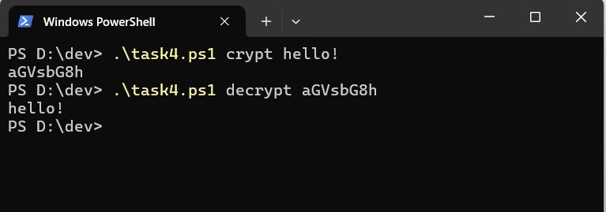

# Специалист по информационной безопасности: расширенный курс
## Модуль "Безопасность операционных систем, системное программирование"
### Блок 3. Использование скриптовых языков
### Желобанов Егор SIB-48

# Домашнее задание к занятию «3.2. Использование командных оболочек. Часть 2»

### Задание 1. Напишите два скрипта, каждый из которых принимает один параметр и:

* первый - прибавляет к параметру единицу как строку.

Написал [скрипт](assets/task1_1.ps1), добавил проверку на существование одного введенного параметра:  

```powershell
if ($args.Count -eq 1)
{
    $par = $args[0]
    Write-Host ("$par" + "1")
}
else
{
    Write-Host "Ошибка! Необходимо указать один обязательный параметр! Например test1_1.ps1 5"
}
```

* второй - прибавляет к параметру единицу как число.

Написал [скрипт](assets/task1_2.ps1), добавил проверку на существование одного введенного параметра, а также проверку, что параметр является целым числом:  

```powershell
if ($args.Count -eq 1)
{
    if ($args[0] -is [int])
    {
        $par = $args[0]
        Write-Host ($par + 1)
    }
    else
    {
        Write-Host "Ошибка! Параметр должен быть числом!"
    }
}
else
{
    Write-Host "Ошибка! Необходимо указать один обязательный параметр! Например test1_1.ps1 5"
}
```

### Задание 2. Напишите скрипт, который выводит содержимое каталога и подсчитывает в нём количество файлов.

Написал следующий [скрипт](assets/task2.ps1), который запускаем внутри каталога, где производится подсчет:  

```powershell
$files = Get-ChildItem
$i = 0

foreach ($n in $files)
{
    $i++
    Write-Host ($n.Name)
}

Write-Host ("Total: " + $i)
```

### Задание 3. Напишите скрипт, который принимает один параметр и определяет, какой объект передан этим параметром (файл, каталог или не существующий).

Написал [скрипт](assets/task3.ps1), также добавив проверки на ввод одного обязательного параметра и проверки существования объекта:  

```powershell
if ($args.Count -eq 1)
{
    # проверяем на существование
    if (Test-Path $args[0])
    {
        # проверяем является ли файлом
        if (Test-Path -Path $args[0] -PathType Leaf)
        {
            Write-Host ($args[0] + " - file")
        }
        else
        # соответственно иначе - это каталог
        {
            Write-Host ($args[0] + " - directory")
        }
    }
    else
    {
        Write-Host ($args[0] + " - not exist")
    }
}
else
{
    Write-Host "Ошибка! Необходимо указать один обязательный параметр! Например c:\windows"
}
```

### Задание 4* (необязательное).  

#### Легенда
Пользователи в нашей компании начали пересылать друг другу некие "секретные" сообщения. Т.к. доступа к средствам криптографии у них нет, для "шифрования" они используют преобразование строк в формат Base64.

#### Задача
Написать скрипт, который:

* принимает на входе два аргумента. Первый - режим преобразования, второй - строка;
* если первый параметр равен crypt - преобразует второй параметр в строку Base64;
* если первый параметр равен decrypt - преобразует второй параметр в текст;
* если первый параметр равен любой другой строке - выйти из скрипта с ненулевым кодом возврата и сообщить об этом пользователю;
* если количество параметров скрипта не равно двум - выйти из скрипта с ненулевым кодом возврата выдать сообщение пользователю и завершить работу.

Написал [скрипт](assets/task4.ps1), добавил проверки на ввод двух параметров, а также в учебных целях в проверке первого параметра, если он не
равен `crypt` или `decrypt` использовал вызов собственного события исключения `throw`:  

```powershell
if ($args.Count -eq 2)
{
    $str = $args[1]

    if ($args[0] -eq "crypt")
    {
        $crypt = [System.Convert]::ToBase64String([Text.Encoding]::UTF8.GetBytes($str))
        Write-Host $crypt
    }
    elseif ($args[0] -eq "decrypt")
    {
        $decrypt = [Text.Encoding]::Utf8.GetString([Convert]::FromBase64String($str))
        Write-Host $decrypt
    }
    else
    {
        throw "Ошибка! Первый параметр должен быть crypt или decrypt"
        #Exit 2
    }
}
else
{
    Write-Host "Ошибка! Необходимо указать два обязательных параметра! Например crypt 123"
}
```


