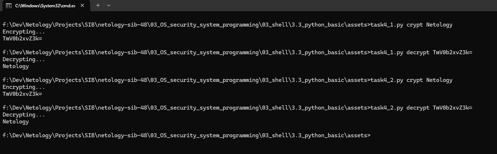

# Специалист по информационной безопасности: расширенный курс
## Модуль "Безопасность операционных систем, системное программирование"
### Блок 3. Использование скриптовых языков
### Желобанов Егор SIB-48

# Домашнее задание к занятию «3.3. Язык Python. Основы»

### Задание 1. Напишите два скрипта, каждый из которых принимает один параметр и:

* первый - прибавляет к параметру единицу как строку.

Написал [скрипт](assets/task1_1.py), добавил проверку на существование одного введенного параметра:  

```python
import sys

if ((len(sys.argv) - 1) == 1 ) :
    print(str(sys.argv[1]) + "1")
else :
    print ("Ошибка! Необходимо указать один обязательный параметр! Например: .\\task1_1.py 5")
```

* второй - прибавляет к параметру единицу как число.

Написал [скрипт](assets/task1_2.py), добавил проверку на существование одного введенного параметра, и проверку, что параметр является числом:  

```python
import sys

if ((len(sys.argv) - 1) == 1 ) :
    if (sys.argv[1]).isdigit() :
        print(int(sys.argv[1]) + 1)
    else :
        print ("Ошибка! Параметр должен быть числом! Например: .\\task1_2.py 5")
else :
    print ("Ошибка! Необходимо указать один обязательный параметр! Например: .\\task1_2.py 5")
```

### Задание 2. Напишите скрипт, который выводит содержимое каталога и подсчитывает в нём количество файлов.

Написал [скрипт](assets/task2.py), подсчитывающий количество файлов в каталоге из которого он был запущен:  

```python
import os

dirs = os.listdir()
filesCount = 0

for i in dirs:
    if os.path.isfile(i):
        print(i)
        filesCount += 1

print("Total: " + str(filesCount))
```

### Задание 3. Напишите скрипт, который принимает один параметр и определяет, какой объект передан этим параметром (файл, каталог или не существующий).

Написал [скрипт](assets/task3.py), добавил проверки на ввод одного обязательного параметра и проверки существования объекта:  

```python
import sys
import os

if ((len(sys.argv) - 1) == 1):
    if os.path.exists(sys.argv[1]):
        if os.path.isfile(sys.argv[1]):
            print(sys.argv[1] + " - file")

        if os.path.isdir(sys.argv[1]):
            print(sys.argv[1] + " - directory")
    else:
        print(sys.argv[1] + " - not exist")
else:
    print("Ошибка! Необходимо указать один обязательный параметр! Например: .\\task3.py c:\\windows")
```

### Задание 4* (необязательное). 

#### Легенда
Пользователи в нашей компании начали пересылать друг другу некие "секретные" сообщения. Т.к. доступа к средствам криптографии у них нет, для "шифрования" они используют преобразование строк в формат Base64.

#### Задача
Написать скрипт, который:

* принимает на входе два аргумента. Первый - режим преобразования, второй - строка;
* если первый параметр равен crypt - преобразует второй параметр в строку Base64;
* если первый параметр равен decrypt - преобразует второй параметр в текст;
* если первый параметр равен любой другой строке - выйти из скрипта с ненулевым кодом возврата и сообщить об этом пользователю;
* если количество параметров скрипта не равно двум - выйти из скрипта с ненулевым кодом возврата выдать сообщение пользователю и завершить работу.

#### Ответ:

Написал два варианта скриптов, добавил проверку на ввод двух обязательных параметров, а также проверку первого параметра, который должен быть `crypt` или `decrypt`, иначе получаем ошибку.

* первый вариант [скрипта](assets/task4_1.py):  

```python
import sys
import base64

if ((len(sys.argv) - 1) == 2):
    arg1 = sys.argv[1]
    arg2 = sys.argv[2]

    if arg1 == 'crypt':
        message_bytes = arg2.encode('ascii')
        base64_bytes = base64.b64encode(message_bytes)
        print('Encrypting...')
        print(base64_bytes.decode('ascii'))
    elif arg1 == 'decrypt':
        base64_bytes = arg2.encode('ascii')
        message_bytes = base64.b64decode(base64_bytes)
        print("Decrypting...")
        print(message_bytes.decode('ascii'))
    else:
        print("Ошибка! Первый параметр должен быть crypt или decrypt!")
else:
    print("Ошибка! Необходимо указать два обязательных параметра! Например: .\\task4.py crypt text")
```

* второй вариант [скрипта](assets/task4_2.py) отличается только тем, что методы шифрования/дешифрования заданы одной строкой:  

```python
import sys
import base64

if ((len(sys.argv) - 1) == 2):
    arg1 = sys.argv[1]
    arg2 = sys.argv[2]

    if arg1 == 'crypt':
        print('Encrypting...')
        print(base64.b64encode(arg2.encode('ascii')).decode('ascii'))
    elif arg1 == 'decrypt':
        print("Decrypting...")
        print(base64.b64decode(arg2.encode('ascii')).decode('ascii'))
    else:
        print("Ошибка! Первый параметр должен быть crypt или decrypt!")
else:
    print("Ошибка! Необходимо указать два обязательных параметра! Например: .\\task4.py crypt text")
```

Результат работы обоих вариантов скриптов одинаков:


