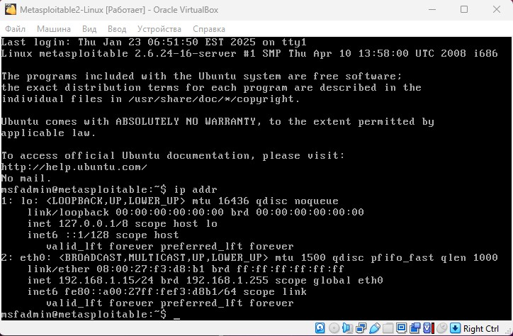
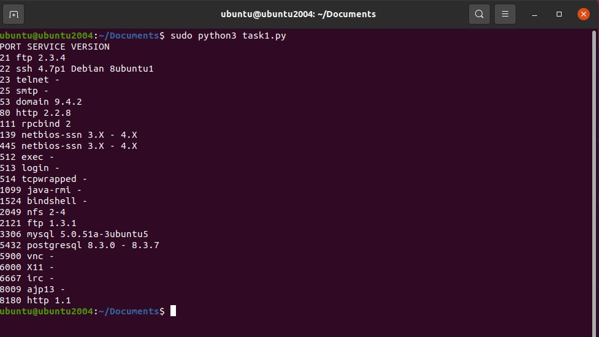

# Специалист по информационной безопасности: расширенный курс
## Модуль "Безопасность операционных систем, системное программирование"
### Блок 3. Использование скриптовых языков
### Желобанов Егор SIB-48

# Домашнее задание к занятию «3.4. Язык Python в информационной безопасности»

### Задание 1

Просканируйте с помощью Python ВМ Metasploitable. Определите установленные службы (нужно вывести название и версию службы, номер порта.)

### Ответ:

Запускать скрипт я буду на виртуальной машине Ubuntu, предварительно установил утилиту `nmap` и настроил сеть для ВМ Metasploitable как "Сетевой мост", в моей сети машина получила адрес `192.168.1.15`:



Написал [скрипт](asstes/task1.py), но при тестировании обнаружил что не у всех сервисов есть номер версии, поэтому добавил `i["service"].get('version', '-')` и поместил вывод версии в крайний столбец:  

```python
import nmap3

nmap = nmap3.Nmap()
result = nmap.nmap_version_detection("192.168.1.15")
print("PORT SERVICE VERSION")
for i in result["192.168.1.15"]["ports"]:
    print(i["portid"], i["service"]["name"], i["service"].get('version', '-'))
```

Результат работы скрипта:


