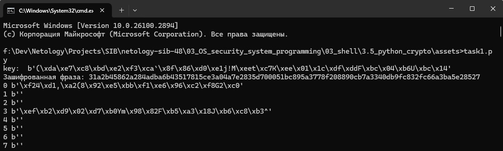
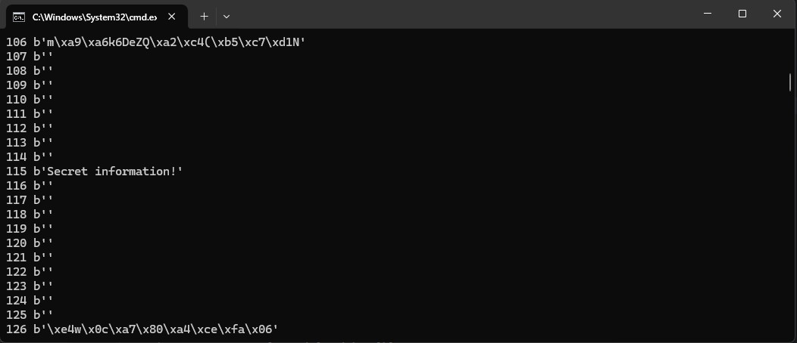

# Специалист по информационной безопасности: расширенный курс
## Модуль "Безопасность операционных систем, системное программирование"
### Блок 3. Использование скриптовых языков
### Желобанов Егор SIB-48

# Домашнее задание к занятию «3.5. Язык Python. Криптография»

### Задание 1

Реализуйте атаку грубой силой на текст, зашифрованный AES. В качестве пароля возьмите трёхзначное число.

### Ответ:

Написал [скрипт](assets/task1.py), внутри которого стразу указана наша секретная фраза, ее шифрование и метод дешифровки с перебором
по трёхзначному числовому ключу:  

```python
from Crypto.Cipher import AES
from Crypto import Random
import hashlib

# Блоки:
BS = AES.block_size
pad = lambda s: s + (BS - len(s) % BS) * chr(BS - len(s) % BS)

# Секретная фраза:
plain_text = 'Secret information!'

# Присвоение переменной key хэша от трехзначного числа:
key = hashlib.sha256(b"115").digest()

# Вывод для информации значения key:
print("key: ", key)

# Шифрование нашей секретной фразы:
text = pad(plain_text)
iv = Random.new().read(BS)
cipher = AES.new(key, AES.MODE_CBC, iv)
cipher_text = (iv + cipher.encrypt(text.encode()))
print("Зашифрованная фраза:", cipher_text.hex())

# Функция расшифровки с перебором трёхзначного числового ключа:
def bruteForceAES(cipher_value, cipher_text_value):
    unpad = lambda s : s[:-ord(s[len(s)-1:])]
    iv = cipher_text_value[:BS]
    i = 0

    for l in range(10):
        for m in range(10):
            for n in range(10):
                new_key = str(l) + str(m) + str(n)
                byte_new_key = new_key.encode('utf-8')
                hash_new_key = hashlib.sha256(byte_new_key).digest()
                cipher_value = AES.new(hash_new_key, AES.MODE_CBC, iv)
                result = unpad(cipher_value.decrypt(cipher_text_value[BS:]))
                print(i, result)
                i += 1

# Вызов функции bruteForceAES
print (bruteForceAES(cipher, cipher_text))
```

Результат работы скрипта, как видно числовой ключ равен `115`, секретная фраза - `Secret information!`, и скрипт отрабатывает правильно:

Для информации добавил вывод зашифрованной фразы:



И соответственно вывод результата, по ключу 115 наша расшифрованная секретная фраза:


