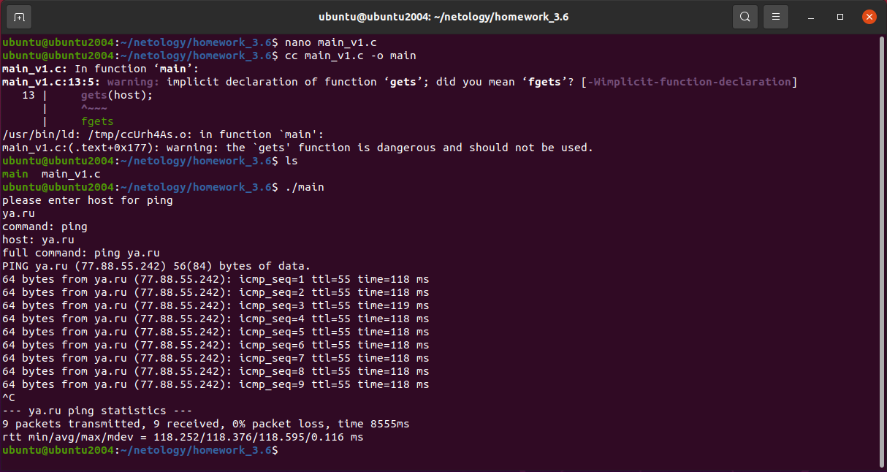
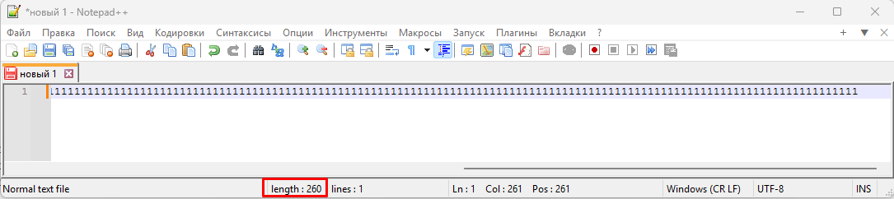
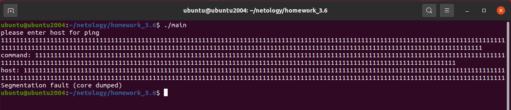
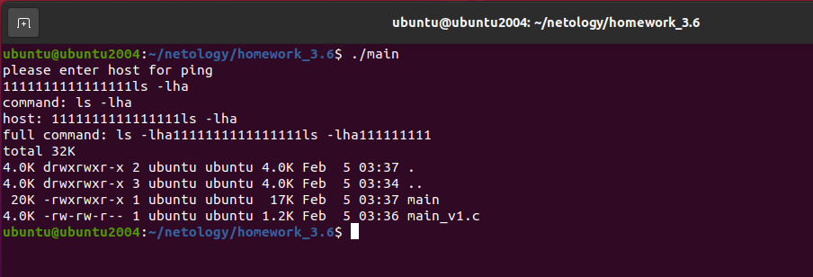
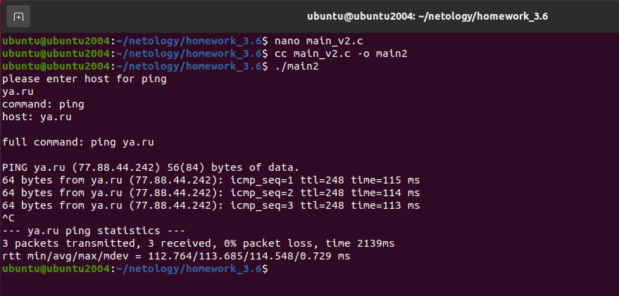
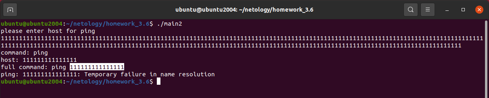
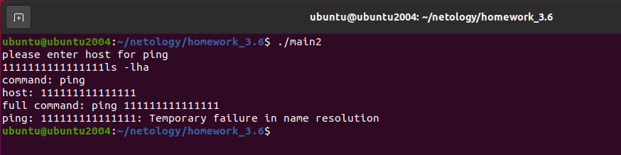
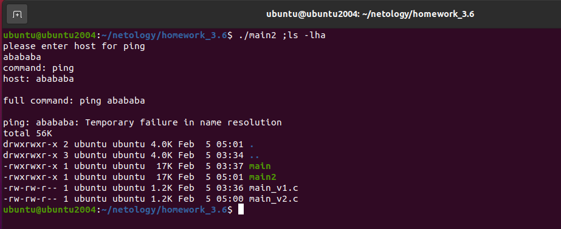
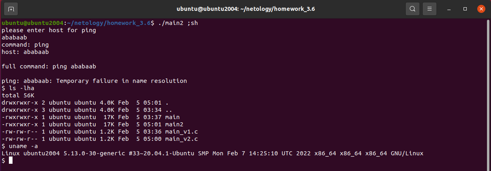

# Специалист по информационной безопасности: расширенный курс
## Модуль "Безопасность операционных систем, системное программирование"
### Блок 4. Анализ программного обеспечения
### Желобанов Егор SIB-48

# Домашнее задание к занятию «4.1. Язык С и программные уязвимости»

### Задание 1

Первый вариант кода сохранил в файле [main_v1.c](assets/main_v1.c). Задание выполняю в ранее развернутой виртуальной машине Ubuntu.

Скомпилировал программу, получил предупреждения, запустил `./main`, в качестве хоста указал `ya.ru`, программа работает:

#### Вопросы:

1. Какое предупреждение `(Warning)` было выведено при компиляции? По желанию: проведите доп.исследование на предмет сути предупреждения (с чем оно связано, какие риски от использования одной из функций в программе и что это за функция).

#### Творческая часть: попробуйте подобрать данные (по аналогии с лекцией) так, чтобы:

2. Приложение "упало" (вы получили сообщение segmentation fault или другое, свидетельствующее об ошибке).
3. Вам удалось выполнить вместо ping другую команду.

#### Ответы:

1. При компиляции было получено предупреждение: функция `gets` опасна и не должна использоваться (нам предлагается использовать `fgets`).
Функция `gets` может приводить к созданию ошибок и открывает возможность для нарушений компьютерной безопасности при помощи переполнения буфера.

2. В качестве хоста пробуем ввести строку более 256 символов, строку вводил сначала в `Notepad++`, чтобы посчитать точно длину строки, в итоге длина получилась 260 символов:

    

    Как и ожидалось, приложение упало с сообщением `segmentation fault`:

    

3. Удалось выполнить другую команду (ls -lha), введя `1111111111111111ls -lha`:

   

### Задание 2

Сохранил "исправленный" вариант кода в файле [main_v2.c](assets/main_v2.c). Задание выполняю в ранее развернутой виртуальной машине Ubuntu.

Скомпилировал программу, никаких предупреждений уже не было, запустил `./main2`, в качестве хоста указал `ya.ru`, программа работает:

#### Проведите повторный анализ и посмотрите:

1. Можно ли реализовать переполнение?
2. Можно ли выполнить произвольную команду (если да, то как)?
3. Если ответ на п.2 - да, то можно ли получить shell (т.е. запустить sh и bash и продолжить работу с интерпретатором команд в интерактивном режиме)?

#### Ответы:

1. Нет, переполнение с помощью строки более 256 символов реализовать не удалось:

   

2. Выполнить команду воспользовавшись вариантом из прошлого задания, введя `1111111111111111ls -lha` не удалось:

   

   Но получилось выполнить команду, введя `./main2 ;ls -lha`:

   

3. Также удалось получить shell, выполнив `./main2 ;sh`, в котором я выполнил команды `ls -lha` и `uname -a`:

   
