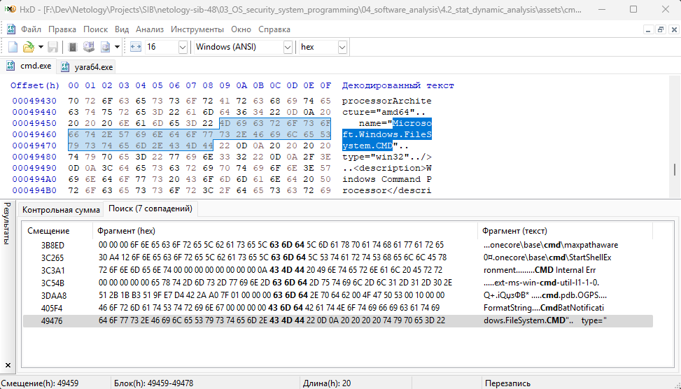
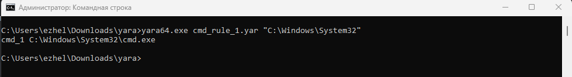
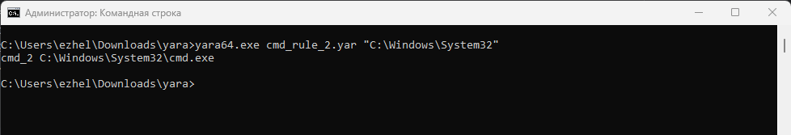
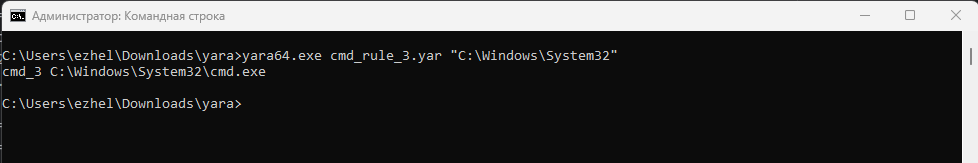

# Специалист по информационной безопасности: расширенный курс
## Модуль "Безопасность операционных систем, системное программирование"
### Блок 4. Анализ программного обеспечения
### Желобанов Егор SIB-48

# Домашнее задание к занятию «4.2. Статистический и динамический анализ»

### Задание:

Создайте три правила Yara для определения файла **cmd.exe**.
В итоге у вас должны получится три отдельных файла, по которым должен определяться только файл **cmd.exe**.

##### Ответ:

Выполнять задание я буду на ПК с операционной системой Windows 11. Скачал архив с бинарными файлами для x64 версии
[по ссылке из документации](https://github.com/VirusTotal/yara/releases/latest). Также сохранил его в локальном [репозитории](assets/yara-v4.5.2-2326-win64.zip).

Также в локальном репозитории сохранил свой [файл cmd.exe](assets/cmd.exe), если потребуется проверка.

1. Написал [первое правило](assets/cmd_rule_1.yar) для Yara, которое ищет только одну строку hex:

   ```text
   rule cmd_1
   {
       meta:
           description = "This rule 1 for cmd.exe file. Netology task 4.2"
           author = "Egor Zhelobanov"
           date = "08.02.2025"
           version = "1.0"
       strings:
           $hex_string = {4D 69 63 72 6F 73 6F 66 74 2E 57 69 6E 64 6F 77 73 2E 46 69 6C 65 53 79 73 74 65 6D 2E 43 4D 44}
       condition:
           $hex_string
   }
   ```
   Данная строка на мой взгляд уникальна для файла `cmd.exe`:

   

   Результат выполнения сканирования в каталоге `C:\Windows\system32` с помощью правила №1:

   

2. [Второе правило](assets/cmd_rule_2.yar) осуществляет поиск строке с модификатором XOR, и по hex-строке дополнительно, т.к. текст `This program cannot be run in DOS mode` присутствует во многих exe-файлах и не только:

   ```text
   rule cmd_2
    {
        meta:
            description = "This rule 2 for cmd.exe file. Netology task 4.2"
            author = "Egor Zhelobanov"
            date = "08.02.2025"
            version = "1.0"
        strings:
            $xor_string = "This program cannot be run in DOS mode" xor wide ascii
            $hex_string = {67 1E 87 47 12 9F 85 46 52 69 63 68 13 9F 85 46}
        condition:
            all of them
    }
   ```
   
   Результат выполнения сканирования в каталоге `C:\Windows\system32` с помощью правила №2:

   

3. [Третье правило](assets/cmd_rule_3.yar) осуществляет поиск по трем параметрам: по сигнатуре, по текстовой строке и по hex:

   ```text
   rule cmd_3
   {
       meta:
           description = "This rule 3 for cmd.exe file. Netology task 4.2"
           author = "Egor Zhelobanov"
           date = "08.02.2025"
           version = "1.0"
       strings:
           $signature = {4D 5A}
           $text_string = "This program cannot be run in DOS mode" nocase
           $hex_string = {57 FE EB 15 13 9F 85 46 13 9F 85 46 13 9F 85 46}
       condition:
           all of them
   }
   ```
   
   Результат выполнения сканирования в каталоге `C:\Windows\system32` с помощью правила №3:

   
