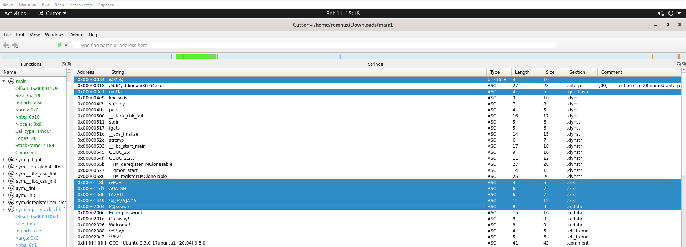
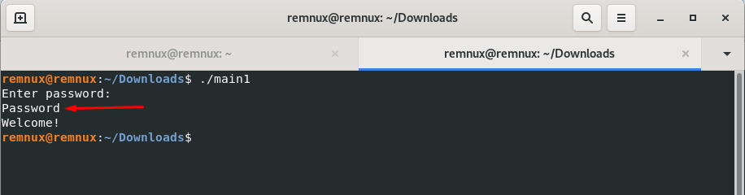

# Специалист по информационной безопасности: расширенный курс
## Модуль 3. Безопасность операционных систем, системное программирование
### Блок 4. Анализ программного обеспечения
### Желобанов Егор SIB-48

# Домашнее задание к занятию «4.3. Реверс-инжиниринг»

### Задание 1: 

Чем отличается декомпиляция от дизассемблирования?

#### Ответ:

* Декомпиляция - использование программы `декомпилятора` для получения близкого к оригиналу исходного кода приложения.
* Дизассемблирование - использование программы `дизассемблера` для получения примерного кода или листинга на языке ассемблера. Также желательно хорошее знание языка ассемблера.

### Задание 2* (необязательное):

Найдите пароль, который требует программа [main1](assets/main1). (При вводе правильного пароля будет выведен текст "Welcome!").

#### Ответ:

1. Для анализа приложения скачал [Virtual Appliance File REMnux v7 в формате OVA](https://deac-fra.dl.sourceforge.net/project/remnux/ova-virtualbox/remnux-v7-focal-virtualbox.ova?viasf=1) для Virtualbox.
2. Импортировал REMnux из OVA в Virtualbox. В соответствии с [документацией REMnux](https://docs.remnux.org/install-distro/keep-the-distro-up-to-date), выполнил обновление.
3. Запустил программу `Cutter`, открыл в ней программу [main1](assets/main1), перешел на вкладку `Strings`:

    

4. Начал анализировать и перебирать строковые данные, которые отметил. Пробовал различные варианты, менять регистр, исключать слеши, вводить справа налево и т.д.
5. Добравшись до строки `P@ssword`, и попробовав различные варианты ввода, правильный пароль был определен:

    

6. Правильный пароль - **Password**
