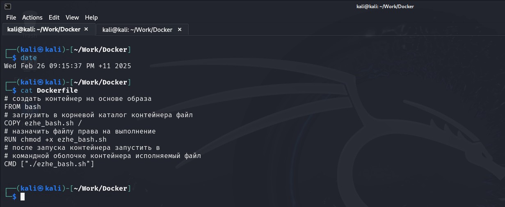

# Специалист по информационной безопасности: расширенный курс
## Модуль "Современная разработка ПО"
### Желобанов Егор SIB-48

# Домашнее задание к занятию «1.1. Контейнеризация (Docker)»

### Задание 1. Образы и контейнеры Docker

#### Описание задания

Необходимо установить базовые компоненты Docker. Выполните загрузку готового образа из общедоступного репозитория,
запустите контейнер на основе загруженного образа, реализуйсте базовые операции с контейнерами и образами.

Выполните задание, руководствуясь подробной [инструкцией](https://github.com/netology-code/ibdev-homeworks/blob/master/01_docker_new/task/docker.md).

### Ответы:

* скриншот вывода результатов команды `ifconfig` (на Kali Linux):

    

* скриншот вывода результатов команды `sudo docker pull bash`:

  

* скриншот вывода результатов команды `sudo docker run -it bash`:

  

* скриншот вывода результатов команды `sudo docker stop loving_shamir`:

  

* скриншот вывода результатов команды `sudo docker rm loving_shamir`:

  

* скриншот вывода результатов команды `sudo docker rmi bash`:

  

* скриншот вывода результатов команды `sudo docker ps -a`:

  

* скриншот вывода результатов команды `sudo docker image ls`:

  

### Задание 2. Bash в Docker

#### Описание задания

Необходимо выполнить работу с контейнером Docker в интерактивном режиме и предоставить объективные доказательства 
присутствия в контейнере.

Выполните задание, руководствуясь подробной [инструкцией](https://github.com/netology-code/ibdev-homeworks/blob/master/01_docker_new/task/bash.md).

### Ответы:

* скриншот вывода результатов команды `sudo docker run --rm -it bash`:

  

* скриншот вывода результатов команды `whoami` и `cat /etc/*release*` (в контейнере):

  

* скриншот вывода результатов команды `ls -la /` (в контейнере):

  

* скриншот вывода результатов команды `whoami` и `cat /etc/*release*` (в основной системе):

  

* скриншот вывода результатов команды `ls -la /` (в основной системе):

  

### Задание 3. Dockerfile

#### Описание задания

Вы запустили контейнер на основе готового образа из общедоступного репозитория Docker HUB и вручную выполнили отдельные 
команды для решения простых задач. Далее необходимо подготовить образ, который будет содержать заложенные директивы. 
Они будут автоматически выполнены при запуске контейнера. Директивы прописываются в специальном конфигурационном файле Dockerfile.

Выполните задание, руководствуясь подробной [инструкцией](https://github.com/netology-code/ibdev-homeworks/blob/master/01_docker_new/task/dockerfile.md).

### Ответы:

* скриншот вывода содержимого [файла](assets/task03/ezhe_bash.sh) скрипта `ezhe_bash.sh`:

  

* скриншот вывода содержимого [файла Dockerfile](assets/task03/Dockerfile) `cat Dockerfile`:

  

* скриншот результатов сборки образа `sudo docker build -t image_ezhe_bash .`:

  

* скриншот результатов запуска контейнера `sudo docker run –rm image_ezhe_bash`:

  

* скриншот результатов запуска скрипта в основной системе `./ezhe_bash.sh`:

  

### Задание 4. Docker-compose

#### Описание задания

Необходимо реализовать запуск подготовленной связки контейнеров с использованием конфигурационного файла docker-compose.yml.

До сих пор вы взаимодействовали с одиночным контейнером, как обособленным элементов для решения своих задач. 
Теперь вам предстоит поработать с более сложной технологией контейнеризации - запуском подготовленной связки 
контейнеров (не менее двух). Это отдельные программные сервисы, которые взаимодействуют между собой в рамках единой задачи.

Выполните задание, руководствуясь подробной [инструкцией](https://github.com/netology-code/ibdev-homeworks/blob/master/01_docker_new/task/dockercompose.md).

### Ответы:

* скриншот вывода содержимого подготовленного [файла index.html](assets/task04/index.html), содержащий мое Ф.И.О.:

  

* скриншот вывода содержимого подготовленного [файла](assets/task04/docker-compose.yml) `docker-compose.yml`:

  

* скриншот результатов запуска подготовленной связки контейнеров командой `sudo docker-compose up`:

  

* скриншот первоначальной титульной страницы Nginx при подключении браузером к контейнеру:

  

* скриншот запуска связки контейнеров после замены файла `index.html` в контейнере, содержащий мое Ф.И.О.:

  

* скриншот моего варианта титульной страницы Nginx при подключении браузером к контейнеру, содержащий мое Ф.И.О.:

  

* скриншот вывода результатов команды остановки связки контейнеров `sudo docker-compose down`:

  

