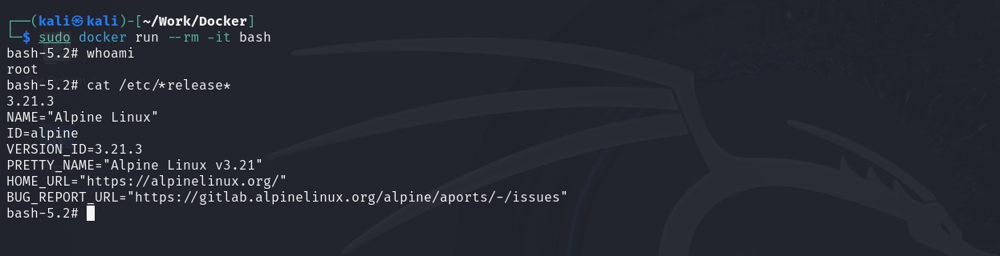

# Специалист по информационной безопасности: расширенный курс
## Модуль "Современная разработка ПО"
### Желобанов Егор SIB-48

# Домашнее задание к занятию «1.1. Контейнеризация (Docker)»

### Задание 1. Образы и контейнеры Docker

#### Описание задания

Необходимо установить базовые компоненты Docker. Выполните загрузку готового образа из общедоступного репозитория,
запустите контейнер на основе загруженного образа, реализуйсте базовые операции с контейнерами и образами.

Выполните задание, руководствуясь подробной [инструкцией](https://github.com/netology-code/ibdev-homeworks/blob/master/01_docker_new/task/docker.md).

### Ответы:

* скриншот вывода результатов команды `ifconfig` (на Kali Linux):

    

* скриншот вывода результатов команды `sudo docker pull bash`:

  

* скриншот вывода результатов команды `sudo docker run -it bash`:

  

* скриншот вывода результатов команды `sudo docker stop loving_shamir`:

  

* скриншот вывода результатов команды `sudo docker rm loving_shamir`:

  

* скриншот вывода результатов команды `sudo docker rmi bash`:

  

* скриншот вывода результатов команды `sudo docker ps -a`:

  

* скриншот вывода результатов команды `sudo docker image ls`:

  

### Задание 2. Bash в Docker

#### Описание задания

Необходимо выполнить работу с контейнером Docker в интерактивном режиме и предоставить объективные доказательства 
присутствия в контейнере.

Выполните задание, руководствуясь подробной [инструкцией](https://github.com/netology-code/ibdev-homeworks/blob/master/01_docker_new/task/bash.md).

### Ответы:

* скриншот вывода результатов команды `sudo docker run --rm -it bash`:

  

* скриншот вывода результатов команды `whoami` и `cat /etc/*release*` (в контейнере):

  

* скриншот вывода результатов команды `ls -la /` (в контейнере):

  

* скриншот вывода результатов команды `whoami` и `cat /etc/*release*` (в основной системе):

  

* скриншот вывода результатов команды `ls -la /` (в основной системе):

  

### Задание 3. Dockerfile

#### Описание задания

Вы запустили контейнер на основе готового образа из общедоступного репозитория Docker HUB и вручную выполнили отдельные 
команды для решения простых задач. Далее необходимо подготовить образ, который будет содержать заложенные директивы. 
Они будут автоматически выполнены при запуске контейнера. Директивы прописываются в специальном конфигурационном файле Dockerfile.

Выполните задание, руководствуясь подробной [инструкцией](https://github.com/netology-code/ibdev-homeworks/blob/master/01_docker_new/task/dockerfile.md).

### Ответы:

