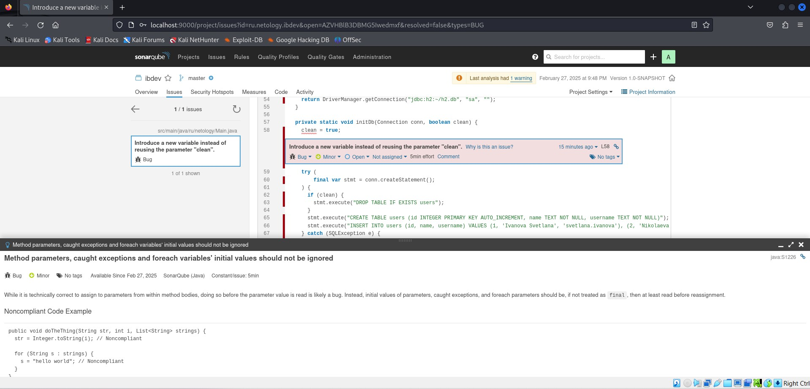
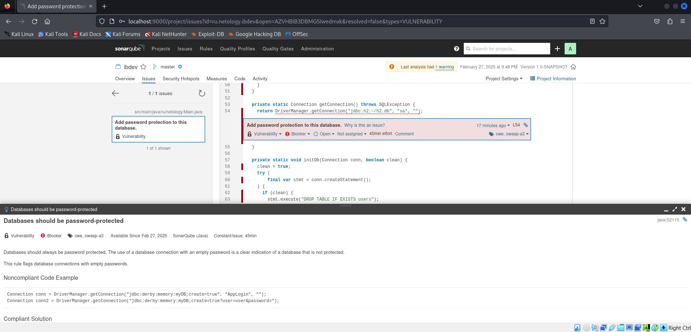
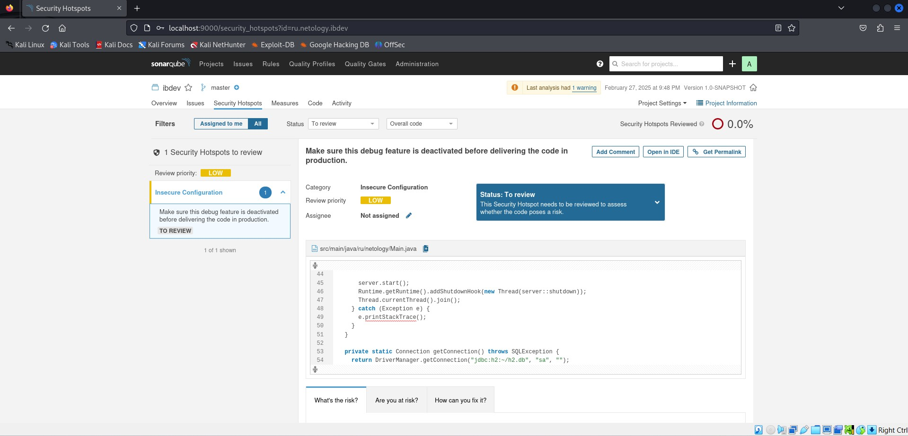
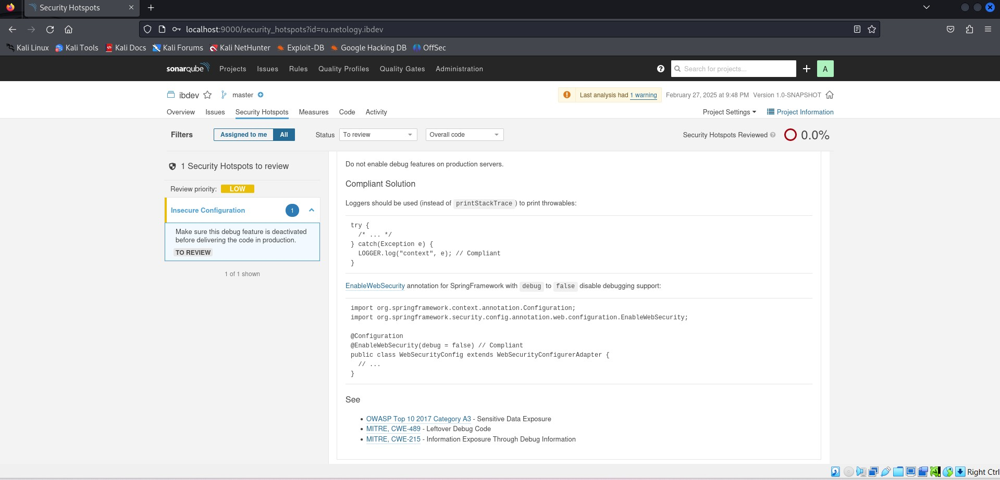
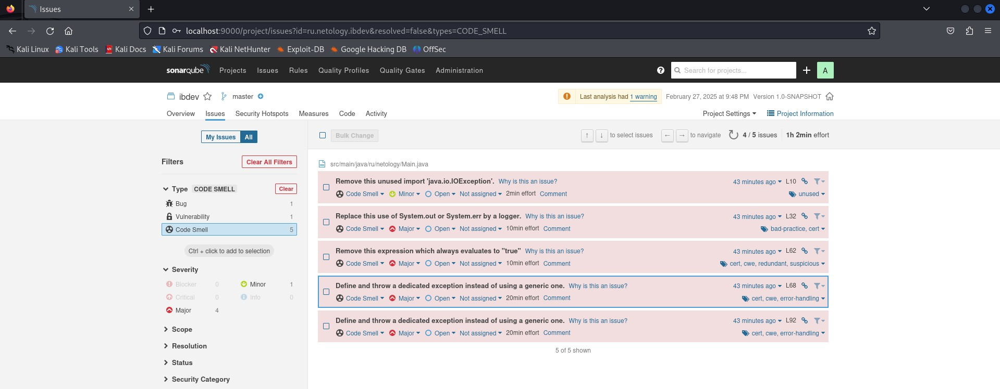
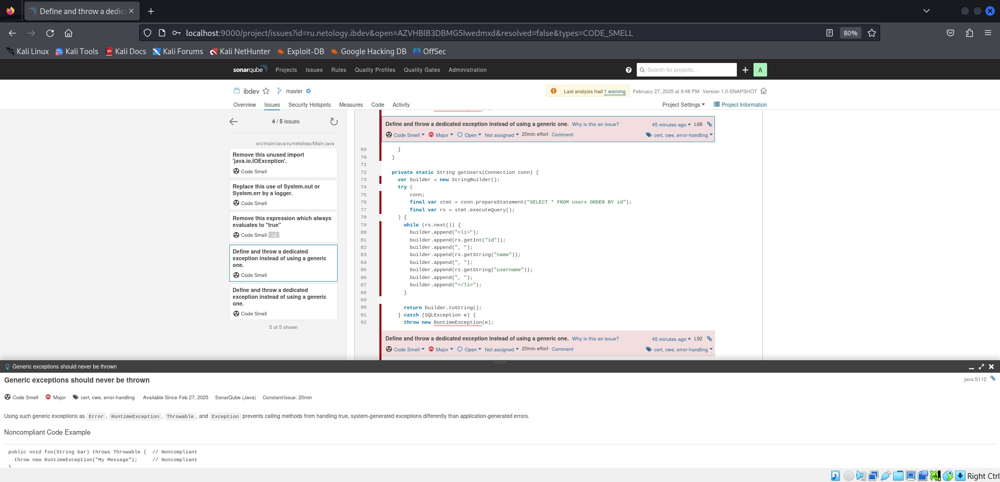

# Специалист по информационной безопасности: расширенный курс
## Модуль "Современная разработка ПО"
### Желобанов Егор SIB-48

# Домашнее задание к занятию «1.2. Популярные языки, системы сборки, управления зависимостями»

### Задание SonarQube

#### Описание проекта

Мы подготовили для вас учебный проект, написанный на языке Java и использующий систему сборки Maven.

Проект представляет собой веб-сервер, работающий на порту 8080 и отвечающий HTTP-запросам.

Страница http://localhost:8080/users.html закрыта логином и паролем admin/secret.

Чтобы собрать образ и запустить его (это необязательно для выполнения ДЗ), вам нужно:

1. Скачать [app.tgz](assets/app.tgz).
2. Скачать [Dockerfile](assets/Dockerfile).
3. Скачать [docker-compose.yml](assets/docker-compose.yml).
4. В каталоге со скачанными файлами выполнить: `docker-compose up --build ibdev`.

#### Вопросы:

1. Какие баги были выявлены: количество, описание, почему SonarQube их считает багами? См. ссылку `Why is this an issue?`.
2. Какие уязвимости были выявлены: количество, категории, описание, почему SonarQube их считает уязвимостями?
3. Какие Security Hotspots были выявлены: количество, категории, приоритет, описание, почему SonarQube их считает Security HotSpot'ами?
4. К каким CWE идёт отсылка для Security Hotspots из п. 2? См. вкладку `How can you fix it?` в нижней части страницы.
5. Какие запахи кода были выявлены: количество, описание, почему SonarQube их считает запахами кода? См. ссылку `Why is this an issue?`.

#### Ответы:

Развернул SonarQube по инструкции из задания, прошел все шаги, ниже привожу ответы на вопросы по заданию.

1. Был выявлен 1 баг - "Introduce a new variable instead of reusing the parameter "clean"." - Введите новую переменную вместо повторного использования параметра «clean»
   т.е. повторное использование переменной в приватном методе "private static void", и необходимо создать новую переменную:

    

2. Выявлена 1 уязвимость - "Databases should be password-protected", т.е. база данных не защищена паролем, категория 
   Blocker - блокирует всю работу над продуктом, до исправления. Базы данных должны быть защищены паролем. Использование 
   соединения с базой данных с пустым паролем является явным признаком того, что база данных не защищена, и SonarQube считает это уязвимостью.

   

3. Выявлен один Security Hotspots. Категория - Insecure Configuration (небезопасная конфигурация). Приоритет - Low (низкий)
   Описание - предоставление кода в рабочей среде с активированными функциями отладки. Функции отладки приложения позволяют разработчикам 
   легче находить ошибки и, таким образом, облегчают работу злоумышленников. Часто он дает доступ к подробной информации как о системе, в которой запущено приложение, так и о пользователях.

   

4. Отсылка идет к следующим CWE: 
    - OWASP Top 10 2017 Category A3 - Sensitive Data Exposure
    - MITRE, CWE-489 - Leftover Debug Code
    - MITRE, CWE-215 - Information Exposure Through Debug Information

   

5. Выявлено 5 запахов кода:

   - Неиспользованный импорт `java.io.IOException`. Неиспользованный и бесполезный импорт необходимо исключить. 
     Если их оставить, код станет менее читабельным, поскольку их присутствие может сбивать с толку.
   - Стандартные выходные данные не должны использоваться напрямую для регистрации чего-либо. `System.out.println(authorization)`.
     Если программа напрямую записывает данные в стандартный вывод, абсолютно невозможно выполнить эти требования. 
     Вот почему настоятельно рекомендуется определить и использовать специальный регистратор.
   - Булевы выражения не должны быть излишними: `clean = true;` Выражение всегда истинно. Если логическое выражение не изменяет оценку условия, 
     то оно совершенно не нужно и может быть удалено. 
     Если оно является необоснованным, поскольку не соответствует замыслу программиста, то это ошибка, и выражение следует исправить.
   - `Generic exceptions should never be thrown` (Общие исключения никогда не должны создаваться). `throw new RuntimeException(e);` Использование 
     таких универсальных исключений, как Error, RuntimeException, Throwable и Exception, не позволяет вызывающим методам 
     обрабатывать истинные системные исключения иначе, чем ошибки, генерируемые приложением. 
   - И последний запах кода такого же плана как и предыдущий, но в другом участке кода файла `Main.java`.

    

    
