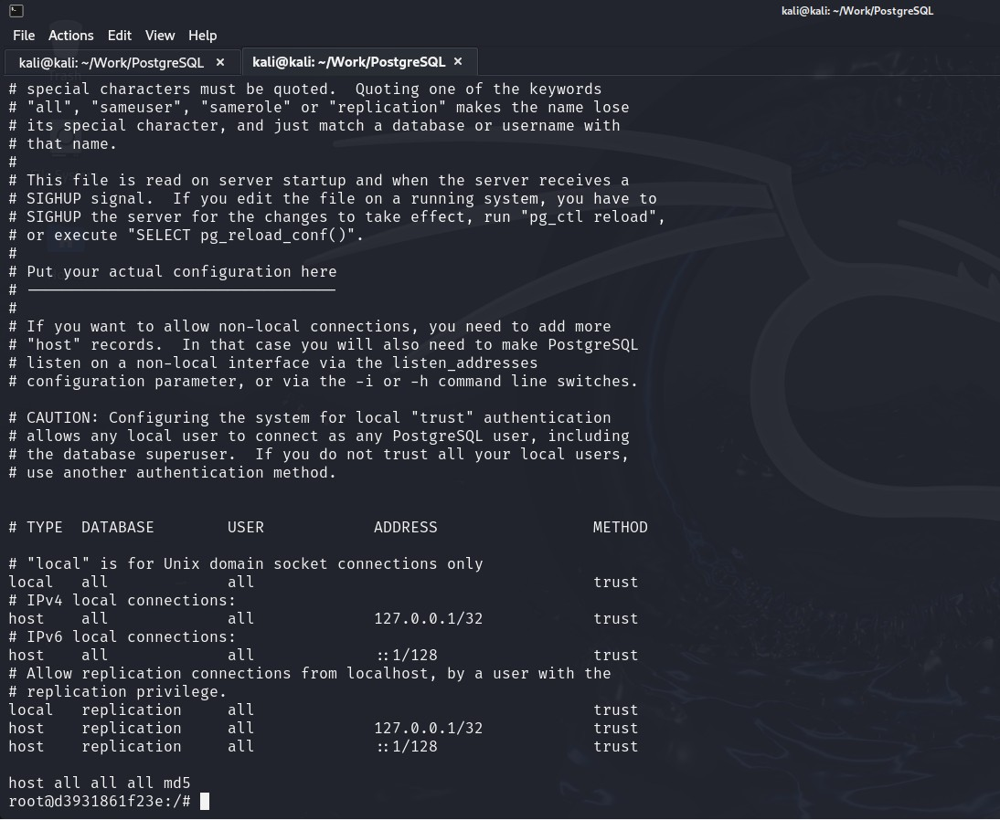
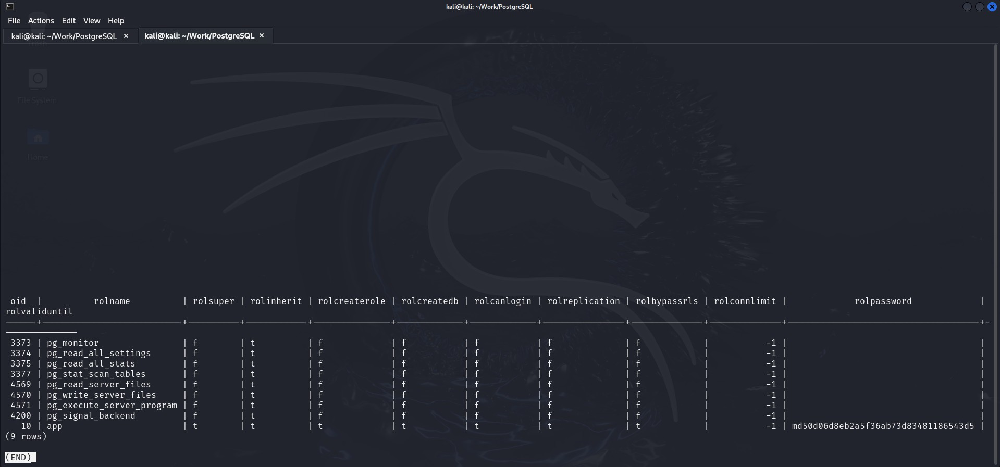
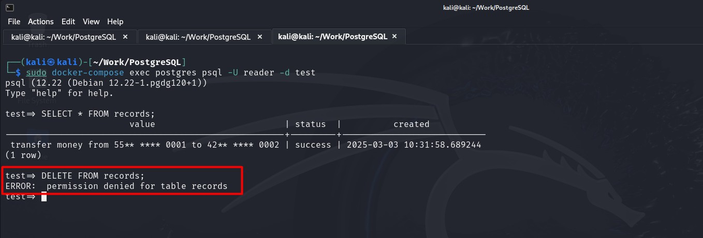
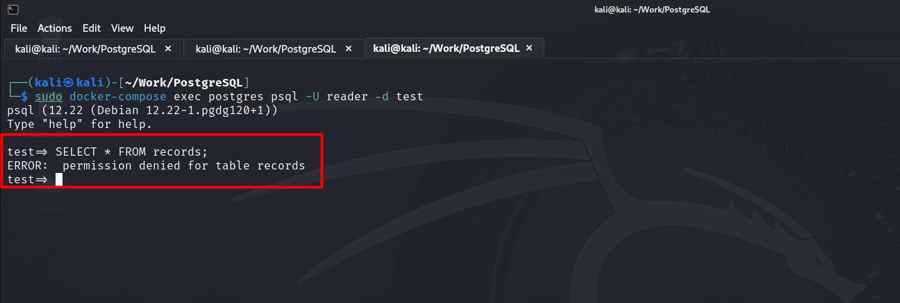

# Специалист по информационной безопасности: расширенный курс
## Модуль 4. Современная разработка ПО
### Желобанов Егор SIB-48

# Домашнее задание к занятию «4.4. Системы хранения данных (СУБД)»

### Задание 1. «PostgreSQL Authentication»

Вы посмотрите, как настроена по умолчанию аутентификация в Docker образе PostgreSQL v12.

В качестве целевой конфигурации используйте файл [docker-compose.yml](assets/task01/docker-compose.yml)

### Этапы выполнения

Изучите разделы документации,
касающиеся [аутентификации пользователей PostgreSQL v12](https://postgrespro.ru/docs/postgrespro/12/client-authentication):

1. [Файл pg_hba.conf](https://postgrespro.ru/docs/postgrespro/12/auth-pg-hba-conf).
2. [Аутентификация Trust](https://postgrespro.ru/docs/postgrespro/12/auth-trust).
3. [Аутентификация Password](https://postgrespro.ru/docs/postgrespro/12/auth-password).

**Важно**. Все команды нужно выполнять в каталоге, в котором расположен ваш файл `docker-compose.yml`.

Используйте информацию для запуска контейнера и подключения к нему:

1. Запустите контейнер командой `docker-compose up`.
2. Для помещения shell (bash) в контейнер используйте команду `docker-compose exec postgres /bin/bash`.
3. Для получения доступа к psql (оболочке выполнения запросов) используйте команду
   `docker-compose exec postgres psql -U app -d db`. От имени пользователя app подключайтесь к базе db.

#### Вопросы:

1. Какие методы аутентификации используются для подключения по TCP/IP с адресов `127.0.0.1/32` и `::1/128`?
2. Какие методы аутентификации используются для подключения по TCP/IP со всех остальных адресов, кроме указанных в
   предыдущем пункте по протоколу?
3. Верно ли утверждение: пароль роли `app` хранится в виде `функция_хеширования password` (пароль хранится в поле
   `rolpassword`)? Если не верно, то приведите описание алгоритма, который используется для хранения хеша.
4. Какое значение имеют поля `rolsuper`, `rolcreaterole`, `rolcreatedb`, `rolbypassrls` с указанием назначения данных
   столбцов? `t` будет означать «да», `f` — «нет». См. https://postgrespro.ru/docs/postgresql/12/catalog-pg-authid.
5. Почему значения полей `rolcanlogin` и `rolpassword` для роли `app` не изменились, и вы по-прежнему можете
   подключиться с помощью `psql` без указания пароля, хотя в `pg_hba.conf` для host `all all all` указано `reject`?

#### Ответы:

1. Ко всем базам (all), для всех пользователей (all), метод - trust который предполагает, что любой подключающийся к серверу 
   авторизован для доступа к базе данных вне зависимости от указанного имени пользователя базы данных, даже если это имя
   суперпользователя:

   

2. Ко всем базам (all), для всех пользователей (all), для всех адресов (all), метод - md5, который предотвращает перехват
   паролей и предусматривает хранение паролей на сервере в зашифрованном виде, но не защищает в случае похищения
   хешей паролей с сервера.

3. Верно. Алгоритм MD5. Он предотвращает перехват паролей и предусматривает хранение паролей на сервере в зашифрованном
   виде, но не защищает в случае похищения хешей паролей с сервера.

4. Значения полей:
   * `rolsuper` - t. app имеет права суперпользователя;
   * `rolcreaterole` - t. app может создавать другие роли;
   * `rolcreatedb` - t. app может создавать базы данных;
   * `rolbypassrls` - t. app не подчиняется никаким политикам защиты на уровне строк;

   

5. Изменен метод аутентификации, добавлена строка `- POSTGRES_HOST_AUTH_METHOD=reject` в файл 
   [docker-compose.yml](assets/task01/docker-compose2.yml). Заново развернут контейнер.  
   **Ответ на вопрос** - Потому что сначала обрабатывается local с параметрами `all all trust` (доступ для всех с локальной машины),
   host (IPv4) с параметрами `all all 127.0.0.1/32 trust` (доступ для всех с локальной машины), 
   host (IPv6) с параметрами `all all ::1/128 trust` (доступ для всех с локальной машины). В файле `pg_hba.conf` в самом конце
   имеется запись `host all all all reject` которая предусматривает аутентификацию пользователей при подключении с других хостов,
   и этот файл обрабатывается сверху вниз до первого совпадения.

### Задание 2. «CIS PostgreSQL Benchmarks»

Изучите [CIS Benchmarks](https://www.cisecurity.org/cis-benchmarks/) на СУБД PostgreSQL v12, а именно `Ensure login via "host" TCP/IP Socket is configured correctly`.

#### Вопросы: 

1. Какие методы **не рекомендуется** использовать для удалённых подключений?
2. Какие методы **рекомендуется** использовать для удалённых подключений?

#### Ответы:

На странице 110 [CIS Benchmarks на СУБД PostgreSQL v12](assets/task02/CIS_PostgreSQL_12_Benchmark_v1.0.0.pdf) в разделе
`5.2 Ensure login via "host" TCP/IP Socket is configured correctly (Scored)`, описаны ответы на наши вопросы:

1. Для удаленного подключения не рекомендуется использовать методы:
   * trust,
   * password,
   * ident. 
   * md5 - метод md5 является самым популярным и может использоваться как в зашифрованных, так и в незашифрованных сеансах,
     однако он уязвим для атак повторного воспроизведения пакетов. Рекомендуется использовать scram-sha-256 вместо md5.

2. Для удаленного подключения рекомендуется использовать следующие методы:
   * gss,
   * sspi,
   * pam,
   * ldap,
   * radius,
   * cert

### Задание 3. «PostgreSQL ПРД»

Изучите механизмы управления пользователями и ПРД, реализованные в СУБД PostgreSQL.

В качестве целевой конфигурации использую файл [docker-compose.yml](assets/task03/docker-compose.yml)

#### Этапы выполнения

Изучите разделы документации по управлению пользователями и ПРД:
1. [Роли](https://postgrespro.ru/docs/postgresql/12/user-manag).
2. [Система прав](https://postgrespro.ru/docs/postgresql/12/ddl-priv).

**Важно**. Все команды нужно выполнять в каталоге, в котором расположен ваш файл `docker-compose.yml`.

Используйте информацию для запуска контейнера и подключения к нему:
1. Запустите контейнер командой `docker-compose up`.
2. Для получения shell (bash) в контейнер используйте команду `docker-compose exec postgres /bin/bash`.
3. Для получения доступа к psql (оболочке выполнения запросов) используйте команду `docker-compose exec postgres psql -U app -d db`. От имени пользователя app подключайтесь к базе db.

PostgreSQL хранит информацию о ролях и ПРД в системной базе данных. Дальше вы будете использовать ключевые слова SQL:
* `CREATE` — создание;
* `DROP` — изменение;
* `SELECT` — выборка данных;
* `INSERT` — вставка данных;
* `DELETE` — удаление данных;
* `GRANT` — предоставление прав;
* `REVOKE` — отзыв прав.

В простом случае есть разделение на структуры, вроде БД, или таблицы и данные, вроде строк в таблице. БД и таблицы создаются или удаляются с помощью запросов `CREATE` или `DROP`, а вот данные можно вставлять или удалять с помощью запросов `INSERT` или `DELETE`.

Так как сама СУБД хранит информацию о структурах в системных БД, то запросы типа `CREATE` или `DROP` находят своё отражение в виде строк в таблицах системных БД.

#### Вопросы:

Какое сообщение отображается вместо `???` в результате выполнения запросов с недостаточными правами доступа: `ERROR:  ???`?

#### Ответы:

1. На первый запрос `DELETE FROM records;` получено сообщение `ERROR:  permission denied for table records`:

   

2. На второй запрос `SELECT * FROM records;` получено сообщение `ERROR:  permission denied for table records`:

   
