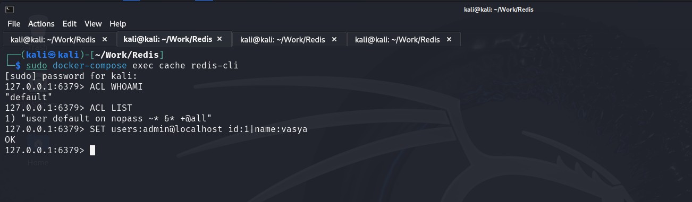
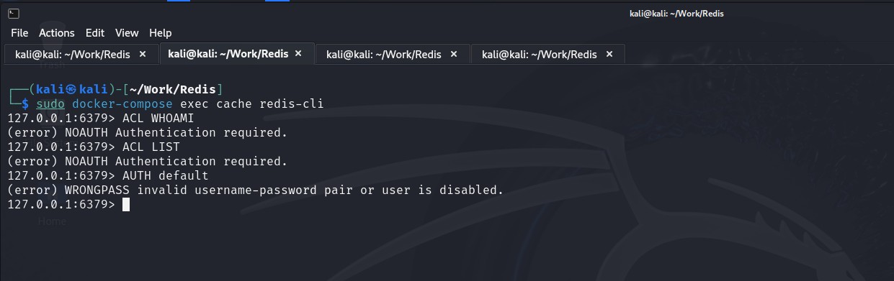
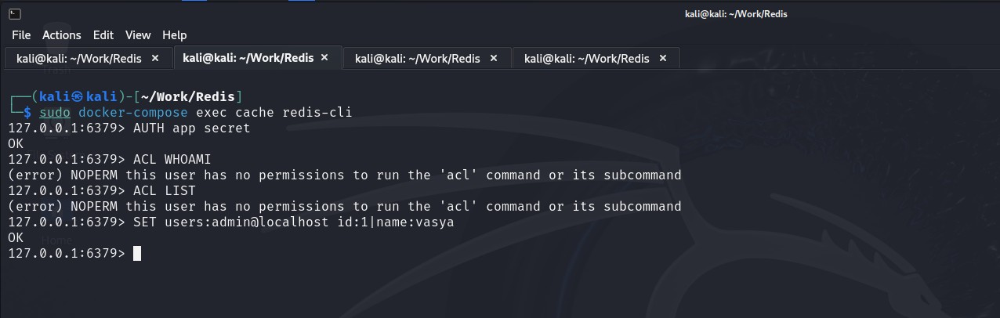
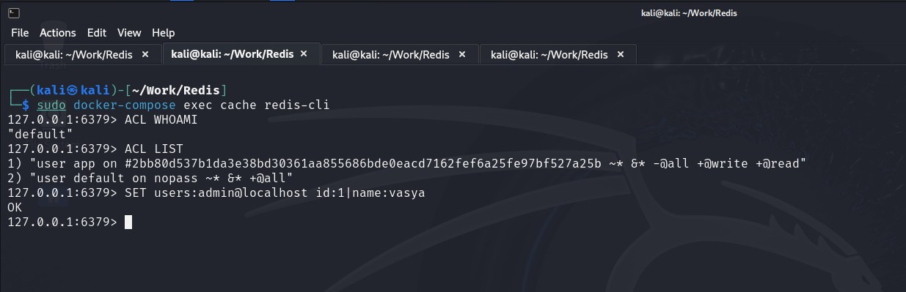
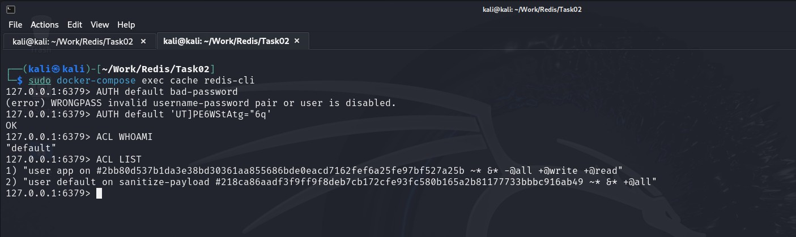
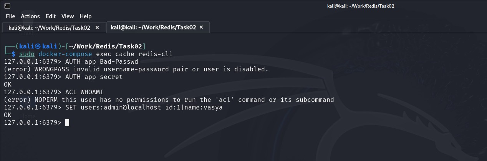
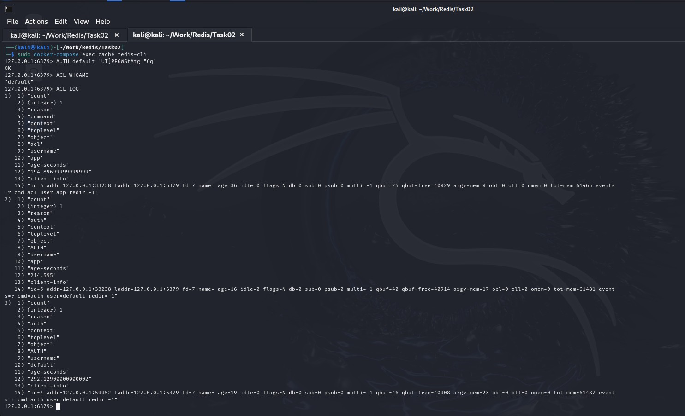

# Специалист по информационной безопасности: расширенный курс
## Модуль 4. Современная разработка ПО
### Желобанов Егор SIB-48

# Домашнее задание к занятию «4.5. Системы хранения данных: кеши, очереди, файловая система»

### Задание 1. «Redis ACL»

В качестве целевой конфигурации использую файл [docker-compose.yml](assets/task01/docker-compose.yml).

Так же скачал файл конфигурации [redis.conf](assets/task01/redis.conf), поместил оба файла в директорию `Work/Redis` на 
виртуальной машине Kali, в которой и выполняю это задание.

#### По выполнению 1-й части

Выполнил все пункты, скриншот прилагаю:



#### По выполнению 2-й части

Отредактировал файл `redis.conf`: на 759 строке добавил запись `user default off`, привожу скриншот выполнения команд
`ACL WHOAMI`, `ACL LIST` и `AUTH default`:



#### По выполнению 3-й части

Отредактировал файл `redis.conf`: на 760 строке добавил запись `user app on #2bb80d537b1da3e38bd30361aa855686bde0eacd7162fef6a25fe97bf527a25b ~* +@read +@write`

Достал пароль из хэша: `2bb80d537b1da3e38bd30361aa855686bde0eacd7162fef6a25fe97bf527a25b:secret:SHA256PLAIN`

Привожу скриншот выполнения команд по этому заданию:



#### По выполнению 4-й части

Отредактировал файл `redis.conf`: на 759 строке удалил запись `user default off`. Привожу скриншот выполнения команд:



### Задание 2. «Redis ACL LOGS»*

#### Описание:

1. У пользователя default выставлен пароль `UT]PE6WStAtg="6q` в виде хеш-функции SHA-256, доступны все ключи и все команды,
   пользователь включен.

2. У пользователя app выставлен пароль в виде хеш-функции SHA-256 `#2bb80d537b1da3e38bd30361aa855686bde0eacd7162fef6a25fe97bf527a25b`,
   доступны все ключи, команды доступны только в категориях `@read`, `@write`, пользователь включен.

Необходимо прислать записи из лога событий ACL для событий:

* попытка входа с неверным паролем;
* попытка доступа к неразрешённой команде.

#### Ответ:

1. Кодируем пароль в SHA-256, `UT]PE6WStAtg="6q` равен `218ca86aadf3f9ff9f8deb7cb172cfe93fc580b165a2b81177733bbbc916ab49`.
2. Добавил записи на 760-й строке файла [redis.conf](assets/task02/redis.conf) сразу для двух пользователей, `default` и `app`:

    ```redis
    user default on #218ca86aadf3f9ff9f8deb7cb172cfe93fc580b165a2b81177733bbbc916ab49 ~* +@all
    user app on #2bb80d537b1da3e38bd30361aa855686bde0eacd7162fef6a25fe97bf527a25b ~* +@read +@write
    ```
   
3. Заходим в контейнер, и авторизуемся пользователем default сначала с неправильным паролем, а затем верным:

   

4. Заходим в контейнер, и авторизуемся пользователем app, сначала с неправильным паролем, а затем верным, и выполняем не разрешенную команду:

   

5. Вывод команды `ACL LOG` из-под пользователя default:

   
