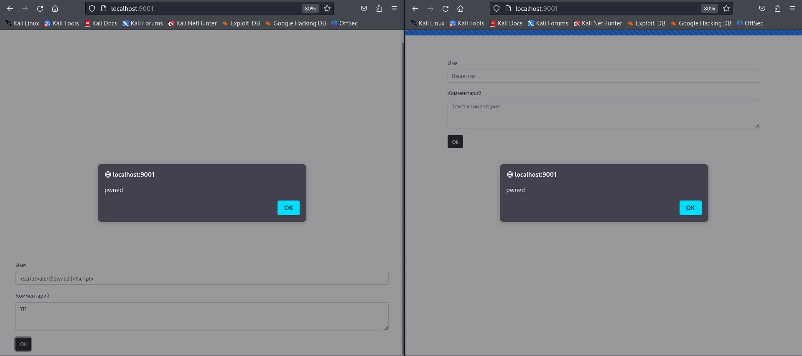

# Специалист по информационной безопасности: расширенный курс
## Модуль 4. Современная разработка ПО
### Желобанов Егор SIB-48

# Домашнее задание к занятию «4.7. JavaScript»

### Задание 1. «Комментарии»

Для запуска системы комментариев использую представленный файл [docker-compose.yml](assets/task01/docker-compose.yml).

Файл располагается в виртуальной машине Kali в каталоге `Work/JavaScript`, запустил систему, фронтенд
доступен по адресу `http://localhost:9001`, открыл два окна - обычное и приватное:

После небольших проверок, попробовал ввести код `` непосредственно в теле сообщения, и
это не сработало. После нескольких попыток и вариаций, код
`<noembed></noembed>`, введенный в поле имени сработал:

И что интересно, после этого и код `` введенный в поле имени - также сработал:

### Задание 2. «Трекер»*

Для выполнения задания воспользовался запуском системы, описанной в файле [docker-compose.yml](assets/task02/docker-compose.yml).
Система запустилась, и доступна по адресу `http://localhost:9002`:

Открыв средства разработчика и отправив тестовые данные, увидел какие данные были отправлены помимо данных платежа:

На мой взгляд ничего криминального. Также взял код из файла [tracker.min.js](assets/task02/tracker.min.js) и прогнал его
через онлайн [деобфускатор](https://trumanwl.com/ru/crypto/javascript-deobfuscator), получив более читаемый код, сохранил
его в файле [tracker.js](assets/task02/tracker.js). Проанализировав код, пришел к выводу, что подозрения скорее всего
не обоснованы.

#### Мой ответ на данное задание - подозрения могут быть не обоснованными.
