# Специалист по информационной безопасности: расширенный курс
## Модуль "Администрирование СЗИ"
### Желобанов Егор SIB-48

# Домашнее задание к занятию «1.2. СЗИ от несанкционированного доступа»

### Описание задачи

Вы являетесь специалистом по ИБ в компании. Руководство компании приняло решение внедрить СЗИ — Secret Net Studio. Перед вами поставлена задача по установке и конфигурации этой системы для защиты данных.

Для того чтобы выполнить эту задачу, вам необходимо выполнить следующие шаги:
1. Скачать и установить Secret Net Studio.
2. Настроить параметры входа в систему, чтобы защититься от подбора паролей пользователей.
3. Настроить полномочное управление доступом, чтобы ограничить доступ недопущенных пользователей к конфиденциальным документам.
4. Настроить контроль устройств, чтобы исключить утечку конфиденциальной информации с использованием съёмных носителей и технологий беспроводного доступа.

### Задание 1. Установка Secret Net Studio

1. Развернул виртуальную машину с операционной системой Windows 10 в Virtualbox:

    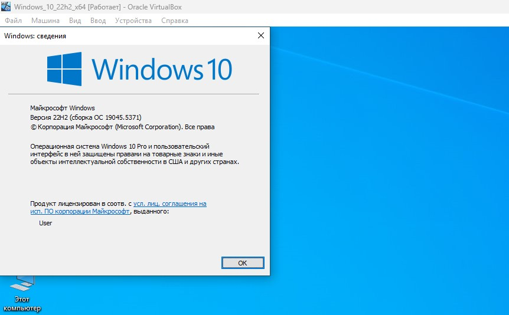

2. Установил Microsoft Office 2019 в виртуальной машине:

   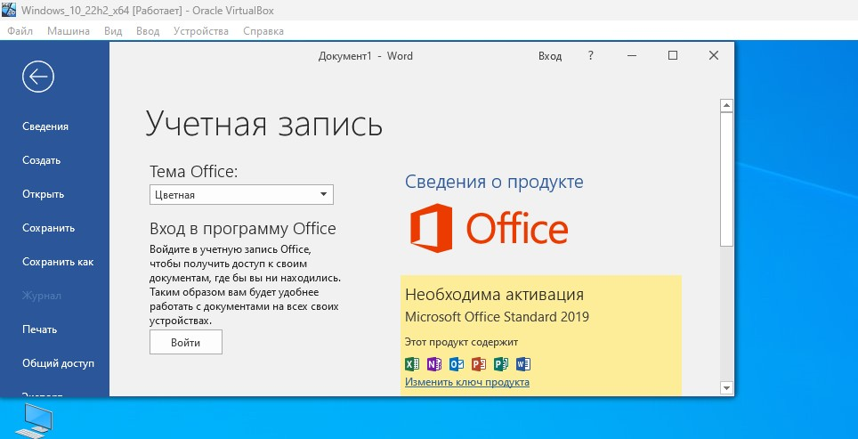

3. Зарегистрировался на [сайте Кода Безопасности](https://www.securitycode.ru/).

4. На вкладке «Демоверсии продуктов» скачал Secret Net Studio 8.8 и демо-ключ к нему:

   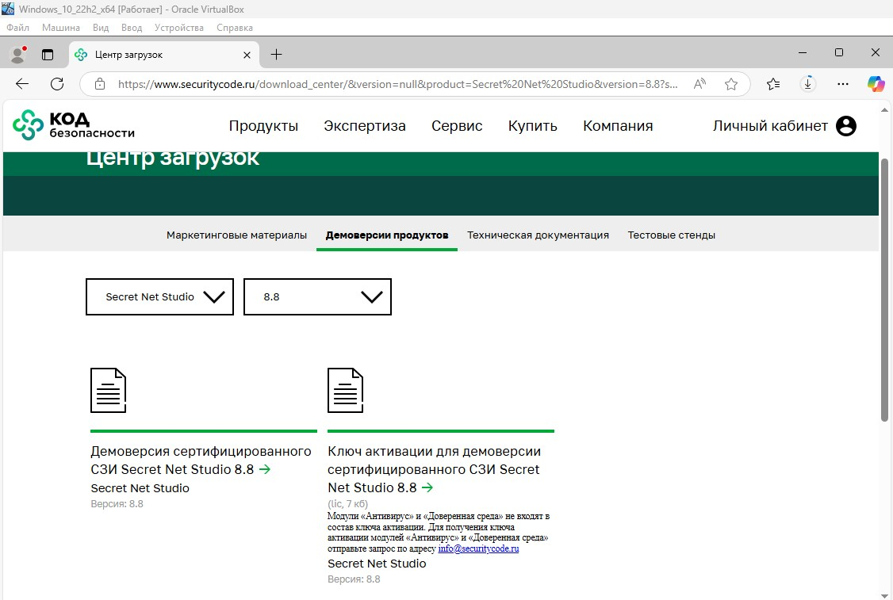

   

5. Установил Secret Net Studio 8.8

   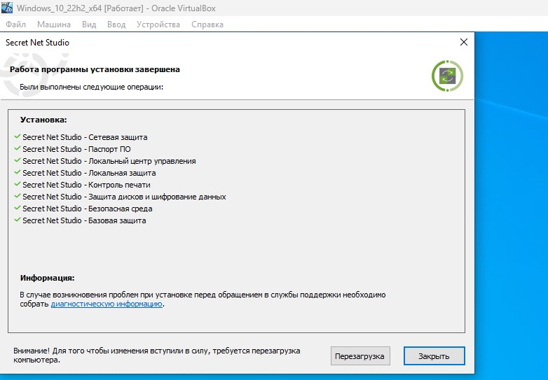

### Задание 2. Настройка параметров входа в систему

Настроил параметры входа в систему, установив:

1. «Максимальный период неактивности до блокировки экрана» - 5 минут.
2. «Количество неудачных попыток аутентификации» - 3 попытки.
3. «Время блокировки при достижении количества неудачных попыток аутентификации» - 5 минут.

   

4. «Парольная политика» - минимальная длина 8 символов, срок действия не более 180 дней, с ограничением на содержание символов.

   

5. После установки параметров входа, сохранил настройки.

### Задание 3. Настройка полномочного управления доступом

1. Задал названия уровней конфиденциальности: общедоступно, коммерческая тайна:

   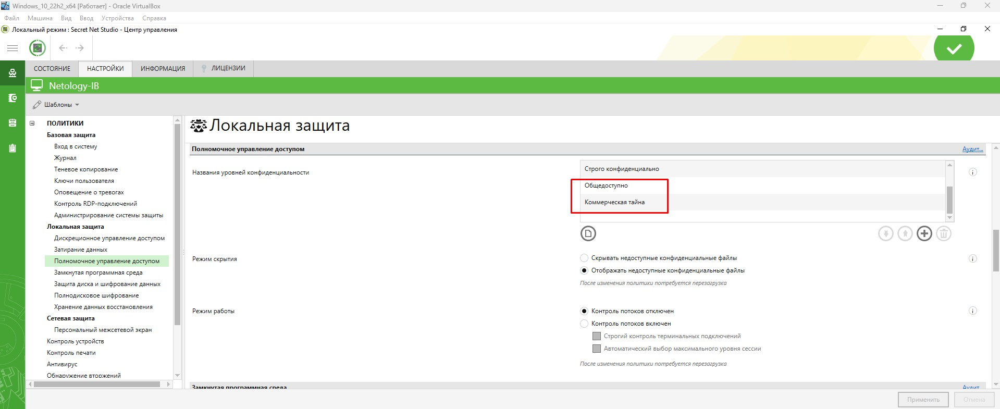

2. Создал двух пользователей с параметрами:

   * `ivanov` - уровень допуска «общедоступно», доверять парольной аутентификации Windows при следующем входе в систему:

   

   * `petrov` - уровень допуска «коммерческая тайна», печать конфиденциальных документов, вывод конфиденциальной информации, доверять парольной аутентификации Windows при следующем входе в систему:

   

3. Создал на диске `C` папку «КТ». В этой папке создал документ Word `Комм_тайна.docx` с содержанием «Коммерческая тайна».

   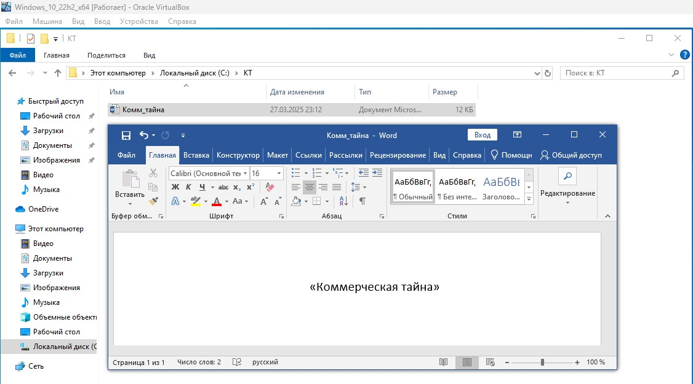

4. Сделал настройку полномочного управления доступом, чтобы пользователь `ivanov` не мог открыть конфиденциальный документ с коммерческой тайной:

   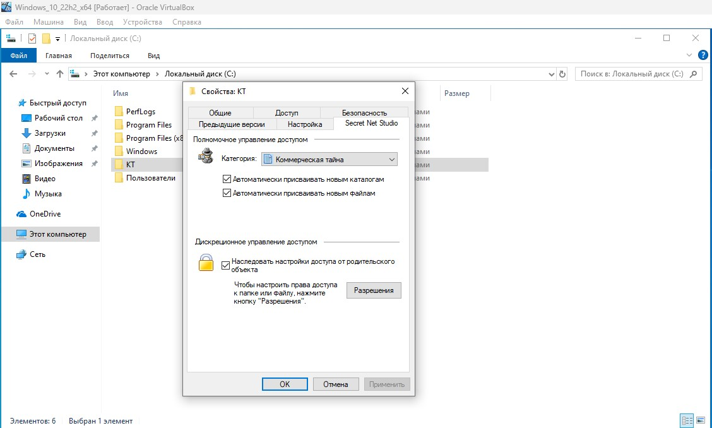

5. Проверяем, и видим что пользователь `ivanov` не может открыть данный файл:

   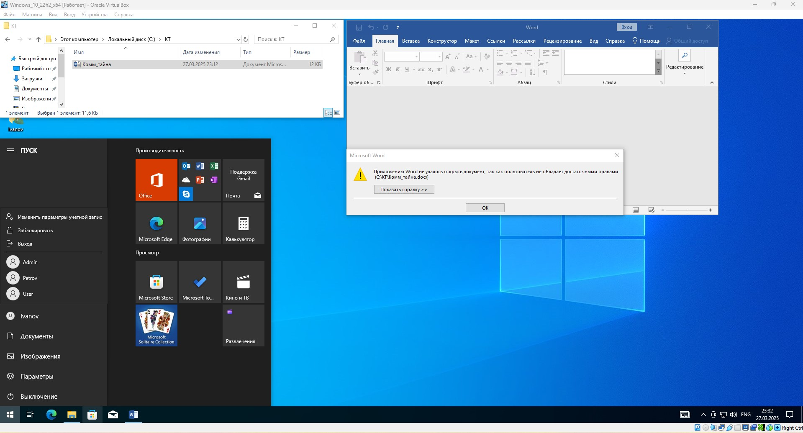

6. В свою очередь, пользователь `petrov` может открыть данный документ:

   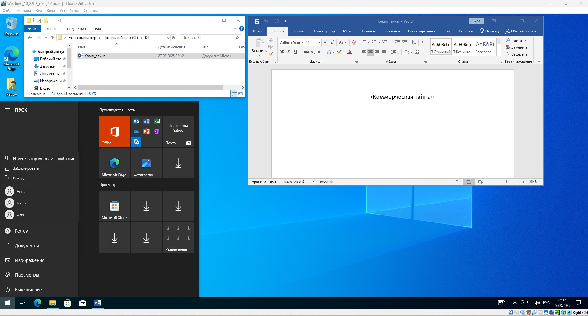

### Задание 4. Настройка контроля устройств

1. Запретил использование:

   * сменных и оптических дисков:

   

   * сетевых плат и модемов, Bluetooth-адаптеров, сотовых телефонов (смартфонов, КПК):

   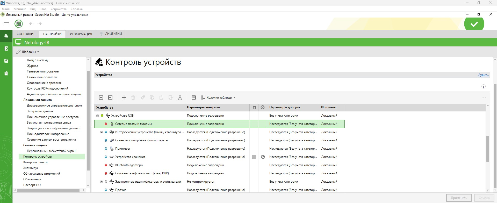

   * устройств PCMCIA, устройств IEEE1394, устройств Secure Digital:

   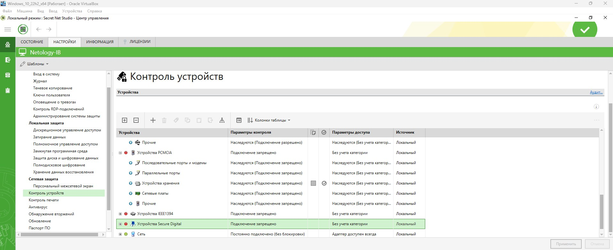

2. Для "Устройств хранения" запретил запись пользователю `petrov`:

   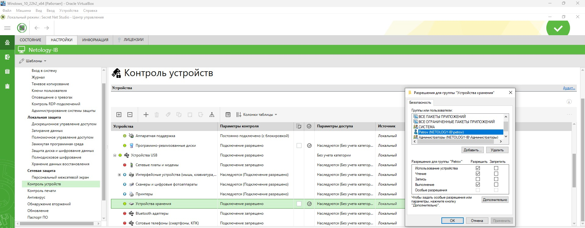
