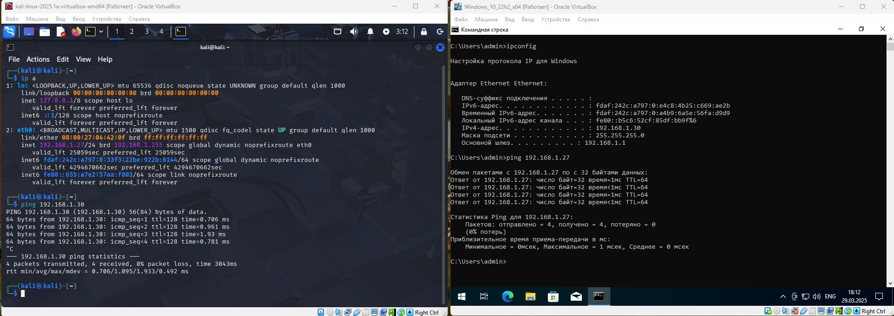
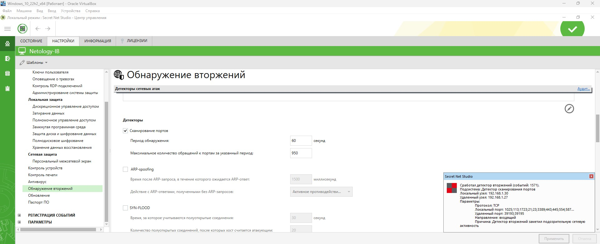
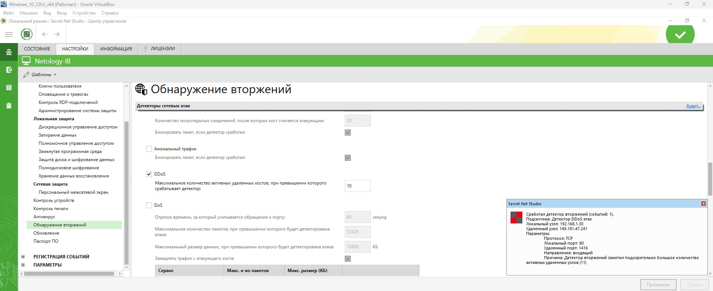
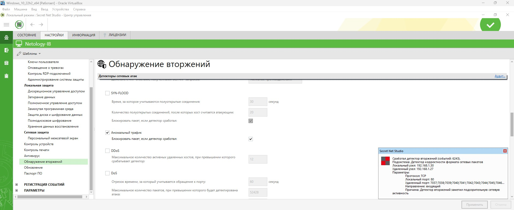

# Специалист по информационной безопасности: расширенный курс
## Модуль 5. Администрирование СЗИ
### Желобанов Егор SIB-48

# Домашнее задание к занятию «5.3. IDS/IPS»

### Описание задачи

Вы - специалист по ИБ. Руководство компании приняло решение свести к минимуму возможные атаки на компьютер руководителя. Перед вами поставлена задача по настройке IDS/IPS Secret Net Studio.

Для того чтобы выполнить эту задачу, вам необходимо подобрать оптимальные параметры, при которых IDS/IPS будет предотвращать вторжения на компьютер руководителя.

ВНИМАНИЕ! После каждого изменения параметров не забывайте нажимать кнопку «Применить», иначе настройки не активизируются.
Перед выполнением задания обязательно снимите галочку «Блокировка атакующего хоста при обнаружении атак». Это необходимо только в учебных целях, чтобы не ждать разблокировки.

### Чек-лист готовности

1. Используется виртуальная машина Windows 10 с установленным Secret Net Studio из прошлых заданий.
2. Развернута виртуальная машина Kali Linux.
3. На виртуальных машинах настроены сетевые адаптеры так, что они могут пинговать друг друга:

    * Windows 10 - `192.168.1.30`
    * Kali Linux - `192.168.1.27`

    

### Задание 1. Сканирование портов

1. В настройках «Обнаружение вторжений» в разделе «Детекторы» включил «Сканирование портов».
2. Период обнаружения оставил без изменений - 60 секунд.
3. Для начала параметр «Максимальное количество обращений к портам за указанный период» был выставлен в `1000`, запустил команду `sudo nmap 192.168.1.30`,
   и на виртуальной машине Windows 10 не сработал Secret Net. После уменьшения значения параметра до `950`, детектор сработал:

   

### Задание 2. DDoS

1. В настройках «Обнаружение вторжений» в разделе «Детекторы» выключил «Сканирование портов» и включил «DDoS».
2. Начал атаку с установки параметра «Максимальное количество активных удаленных хостов, при превышении которого срабатывает детектор» в `30`.
3. Уменьшая параметр на `2`, выяснил, что детектор срабатывает при установленном значении `10`:

   
   
### Задание 3. Аномальный трафик*

1. В настройках «Обнаружение вторжений» в разделе «Детекторы» выключил «DDoS» и включил «Аномальный трафик».
2. В качестве атаки выполнил команду `sudo hping3 -i u1000 -p 80 192.168.1.30`, и детектор сработал:

   
