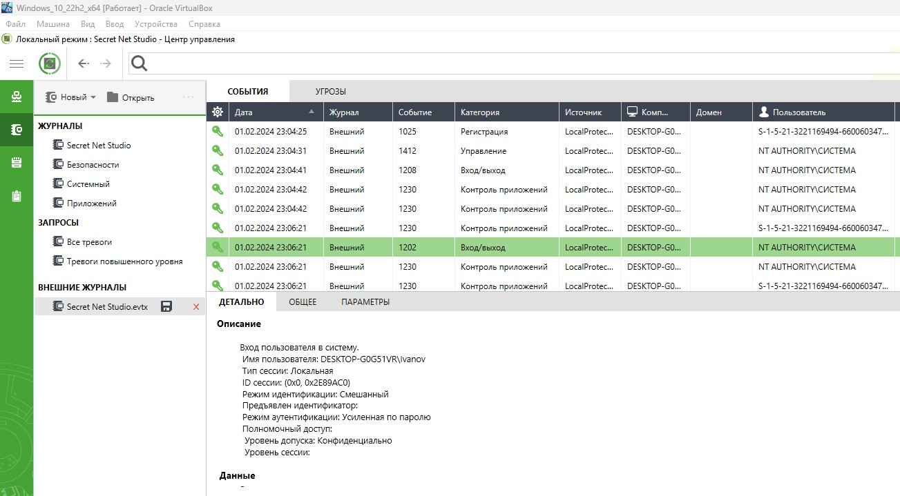
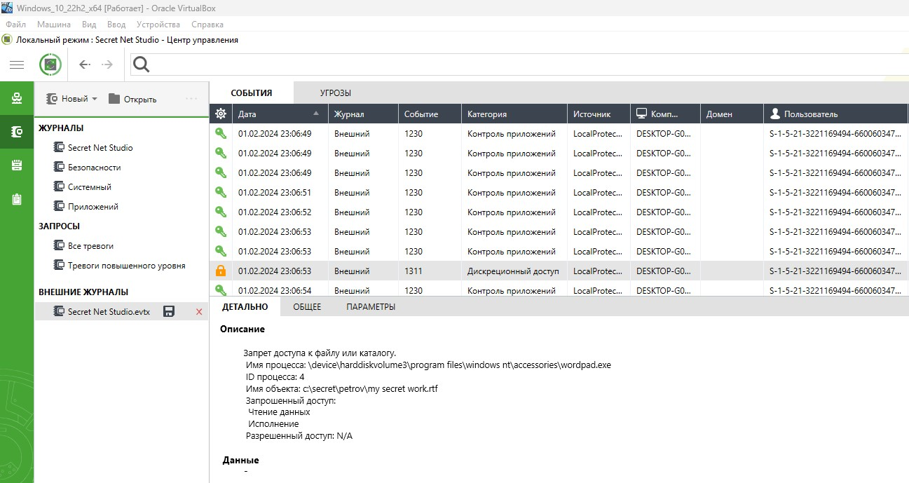
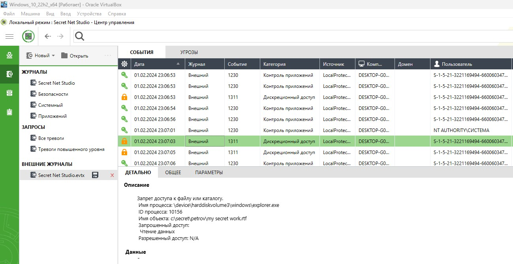
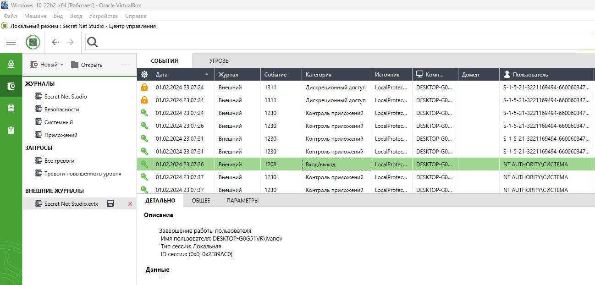
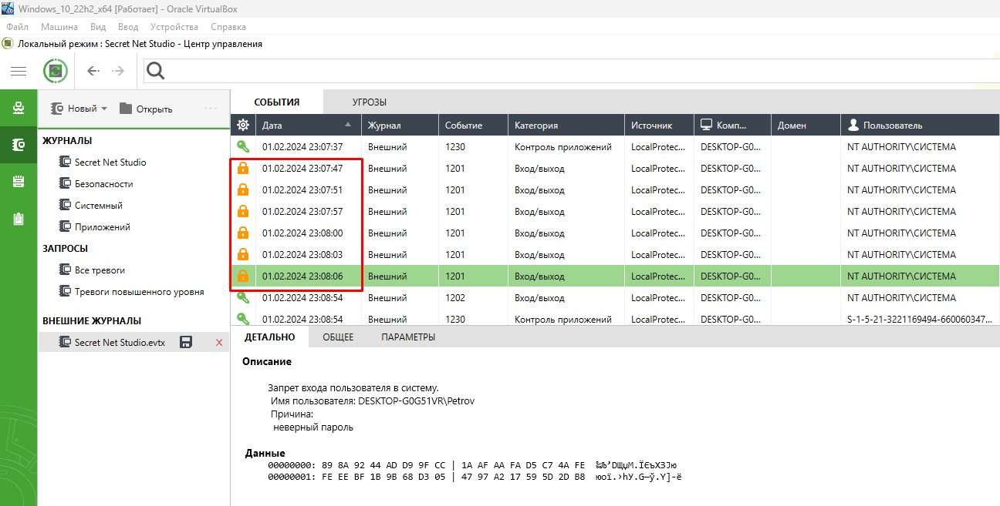
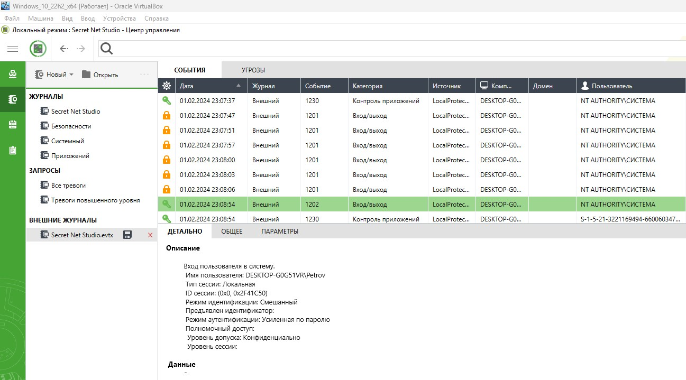
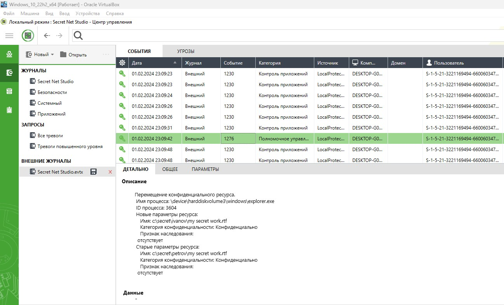

# Специалист по информационной безопасности: расширенный курс
## Модуль "Администрирование СЗИ"
### Желобанов Егор SIB-48

# Домашнее задание к занятию «1.4. SIEM»

### Чек-лист готовности к домашнему заданию

1. Изучены материалы лекции «SIEM» в личном кабинете.
2. Используется виртуальная машина Windows 10 с Secret Net Studio из прошлых заданий.
3. Загружен [журнал SIEM](assets/Secret%20Net%20Studio.evtx).

### Описание задачи

Вы работаете специалистом по ИБ в научно-исследовательском институте.

К руководству НИИ обратился научный сотрудник Петров и пожаловался, что старший научный сотрудник Иванов похитил у него рационализаторское предложение. Рационализаторское предложение было готово к распечатке и хранилось в папке на компьютере Петрова - `C:\Secret\Petrov`. 

Иванов всё отрицает и говорит, что это рационализаторское предложение сделал он сам на своём компьютере в своей папке - `C:\Secret\Ivanov`.

В ходе предварительного расследования установлено, что Иванов мог украсть файл 1 февраля 2024 года, когда Петров не вышел на работу по причине болезни. Иванов и Петров работают в одном кабинете, других сотрудников в этом кабинете нет. Иванов и Петров работают за одним компьютером под личными учётными записями `Petrov` и `Ivanov`. 

По камерам наблюдения установлено, что 1 февраля 2024 года в кабинете находился только Иванов. Никто из других сотрудников в этот день в кабинет не заходил. Также Петров рассказал, что примерно месяц назад сообщил Иванову пароль от своей учётной записи. Тогда ему срочно понадобилось распечатать отчёт, который находился в папке Петрова. Иванов подтвердил, что Петров когда-то говорил пароль, но заявил, что давно забыл его.

Руководство поставило вам задачу разобраться в ситуации, проанализировав журнал SIEM компьютера.

### Задание:

Проанализируйте журнал SIEM и восстановите картину инцидента:

1. Работал ли за компьютером Иванов в день инцидента?
2. Пытался ли Иванов скопировать какие-то файлы из личной папки Петрова? Если да, то какие?
3. Пытался ли Иванов войти в учётную запись Петрова?
4. Если пытался, то удалось ли ему это сделать?
5. И главный вопрос - действительно ли Иванов украл рационализаторское предложение?

### Ответы:

Ввиду моего часового пояса, дата и время в журнале немного неудобно выглядят - начало действий происходит `01.02.2024 в 23:04:25`.

1. Да, Иванов работал за ПК, зафиксирован успешный вход в систему в `23:06:21`:

    

2. Иванов пытался открыть файл `C:\secret\petrov\my secret work.rtf`, а также зайти в каталог, вероятно с целью скопировать.
   После нескольких безуспешных попыток, Иванов выполнил выход из системы в `23:07:26`:

   

   

   

3. Да, зафиксировано 6 попыток войти под учетной записью Петрова с неверным паролем с `23:03:47` по `23:08:06`:

   

4. Да, зафиксирован успешный вход под учетной записью Петрова в `23:08:54`:

   

5. Да, Иванов действительно украл рационализаторское предложение, поскольку в `23:09:42` зафиксировано изменение расположения
   объекта (процесс копирования) из `C:\secret\petrov\my secret work.rtf` в `C:\secret\ivanov\my secret work.rtf`, и в `23:09:53` выход из учетной записи Петрова:

   

   
