# Специалист по информационной безопасности: расширенный курс
## Модуль "Администрирование СЗИ"
### Желобанов Егор SIB-48

# Домашнее задание к занятию «1.5. Средства антивирусной защиты»

### Чек-лист готовности к домашнему заданию

1. Изучены материалы лекции «Средства антивирусной защиты».
2. Установлена виртуальная машина Windows 10, взята чистая копия до установки Secret Net Studio 8.

### Описание задачи

Вы являетесь специалистом по ИБ в компании. Руководство компании приняло решение внедрить САВЗ — Kaspersky Endpoint Security. Перед вами поставлена задача по установке и настройке САВЗ.

Для того чтобы выполнить эту задачу, вам необходимо выполнить следующие шаги:
1. Скачать и установить Kaspersky Endpoint Security.
2. Настроить реакцию САВЗ на обнаруженные вредоносные программы.
3. Установить пароль на доступ к настройкам.
4. Проверить работоспособность САВЗ с использованием тестового вируса.

### Задание 1. Установка Kaspersky Endpoint Security

1. Скачал и установил `Kaspersky Endpoint Security для Windows версии 12.8.0.505 Lite encryption`:

    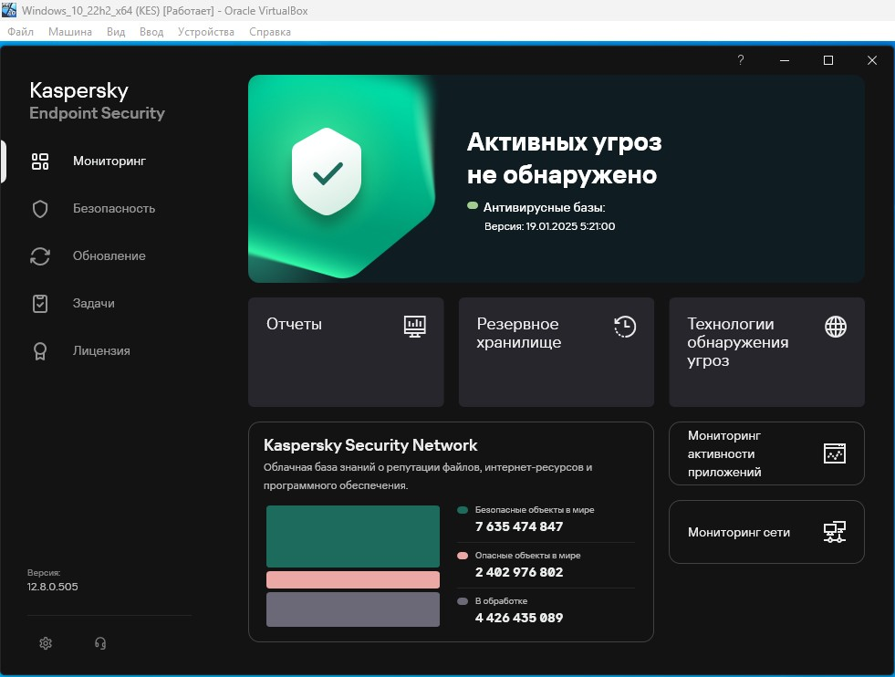

### Задание 2. Настройка реакции Kaspersky Endpoint Security на обнаруженные вредоносные программы

1. Перешел в `Настройки программы -> Защита от файловых угроз -> Расширенная настройка` и установил следующие параметры:

   * Уровень безопасности - Высокий
   * Действия при обнаружении угрозы - Лечить. Блокировать, если лечение невозможно.
   * Типы файлов - Все файлы.

      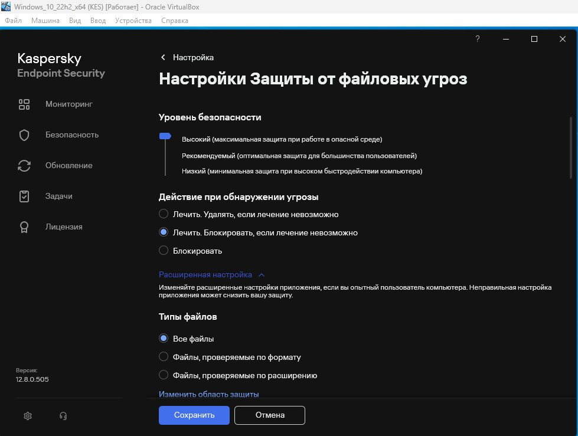

   * Эвристический анализ - Средний.
   * Снял галочку с «Проверять только новые и изменённые файлы».
   * Проверять архивы - Только новые и изменённые.
   * Проверять дистрибутивы - Только новые и изменённые.

      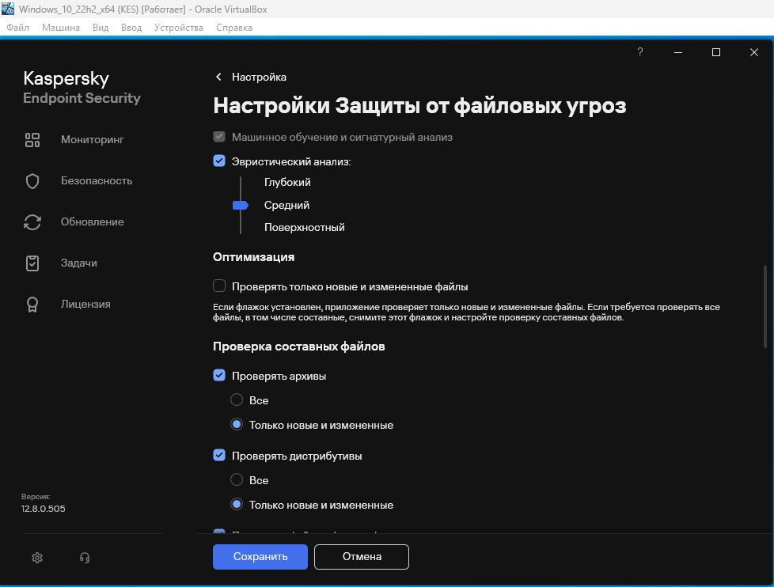

   * Проверять файлы офисных форматов - Все.
   * Не распаковывать составные файлы большого размера - Максимальный размер файла 100 МБ.
   * Распаковывать составные файлы в фоновом режиме - Минимальный размер файла 10 МБ.

      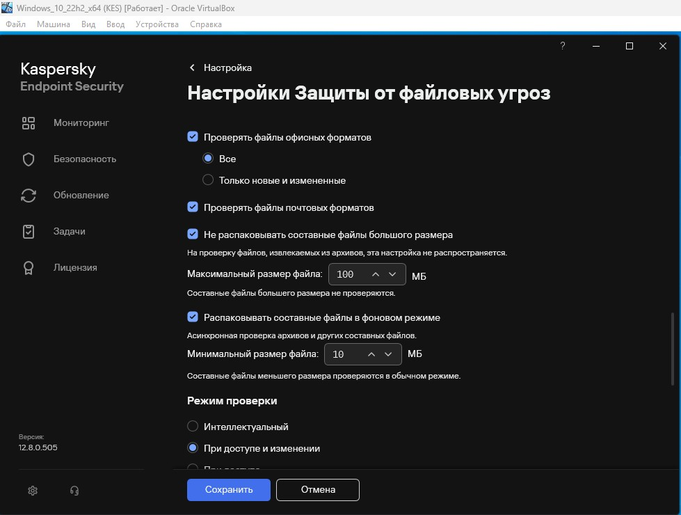

   * Режим проверки - При доступе и изменении.
   * Технологии проверки оставил без изменений и применил настройку:

      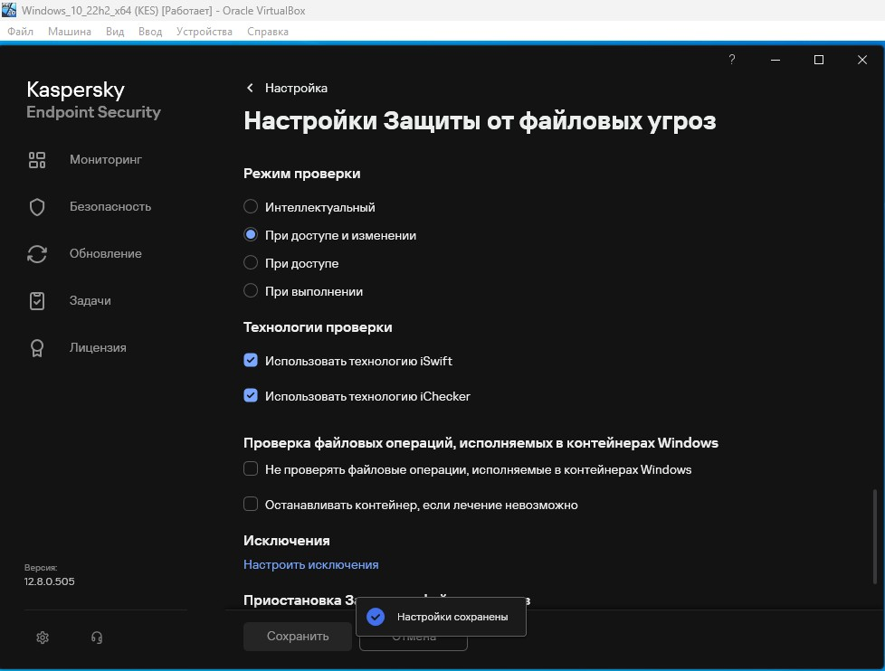

### Задание 3. Настройка периодичности полной проверки компьютера

1. Перешел в настройки `Задачи -> Настройки задачи полной проверки` и установил следующие настройки:

   * Уровень безопасности - Высокий.
   * Действия при обнаружении угрозы - Лечить. Блокировать, если лечение невозможно.

      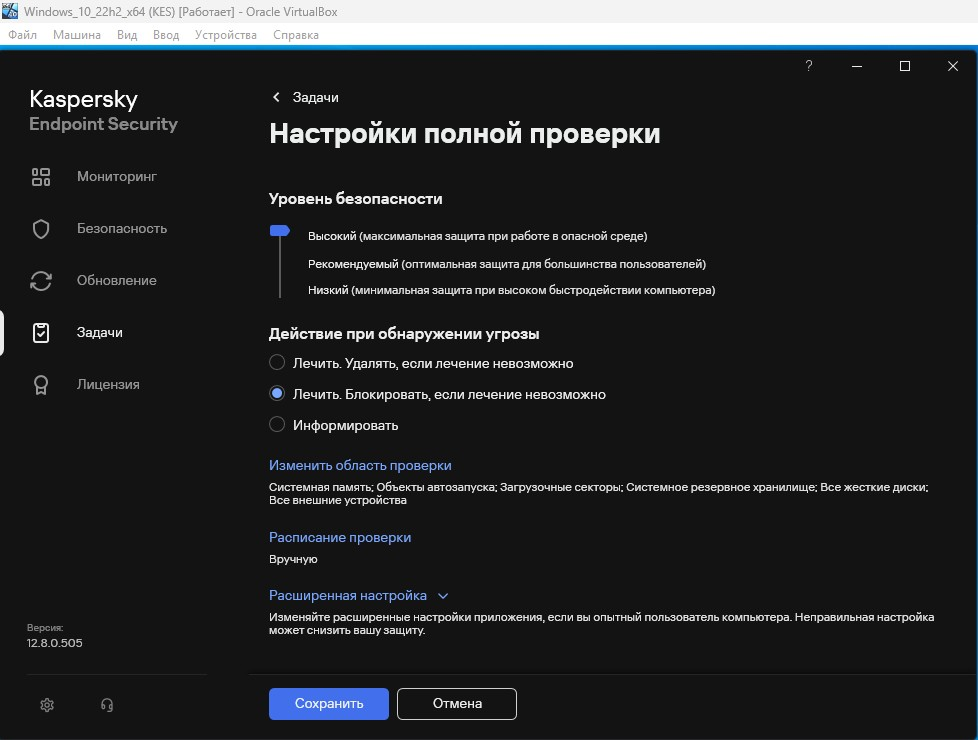

   * Расписание проверки - По дням, Выполнять каждые 1, Время 13:00, Запускать пропущенные задачи.

      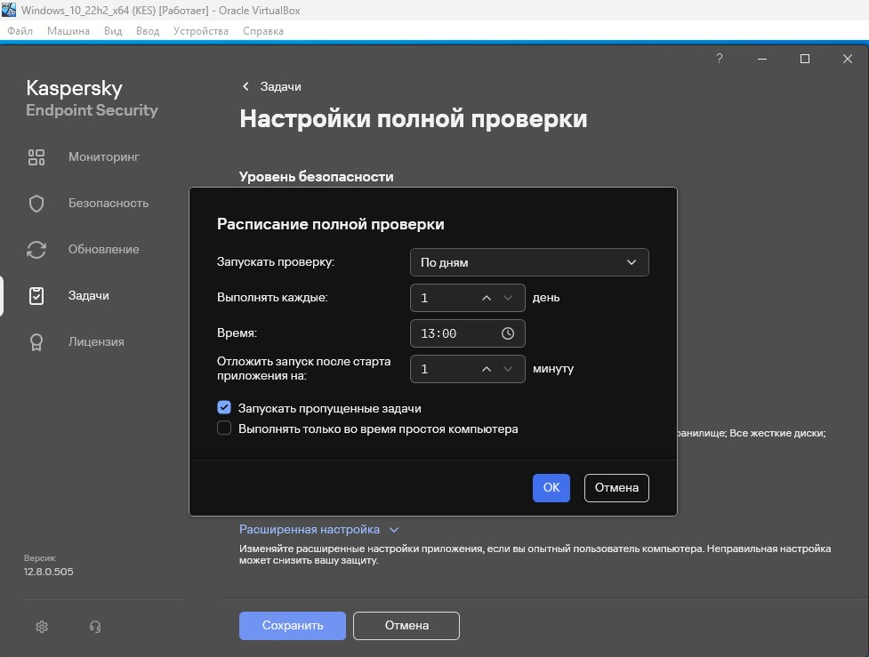

2. Сохранил установленные настройки:

   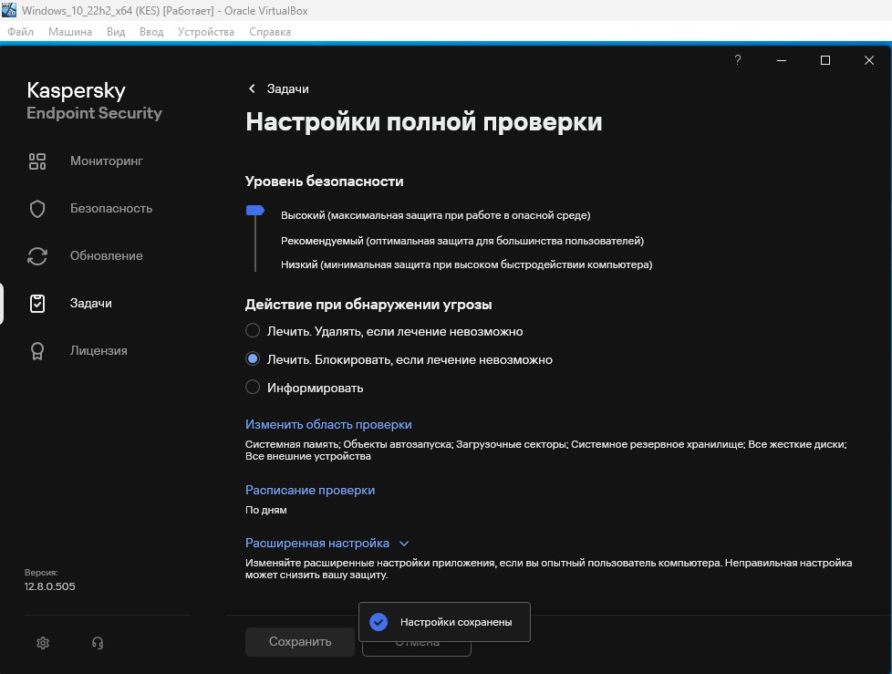

### Задание 4. Установка пароля на доступ к настройкам

1. Вернулся в `Настройки -> Интерфейс` и включил защиту паролем:

    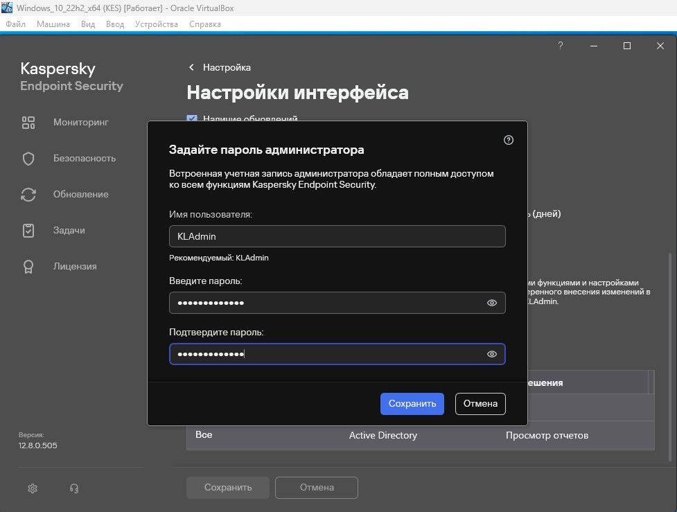

2. Применил установленную настройку:

    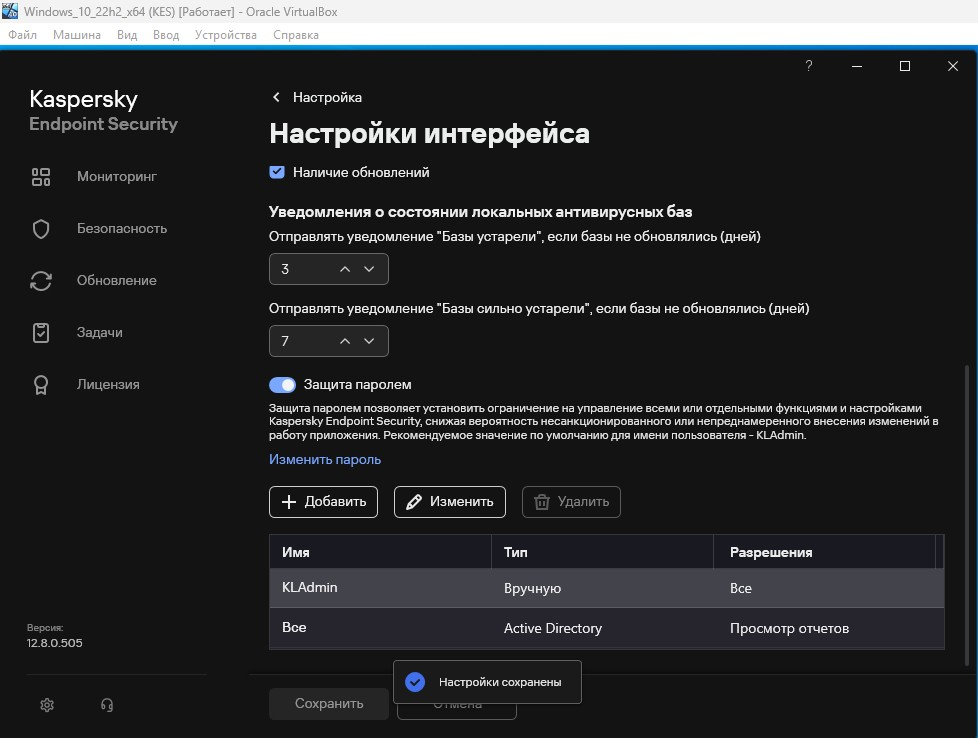

### Задание 5. Проверка функционирования Kaspersky Endpoint Security

1. Прошел по указанной [ссылке](https://support.kaspersky.ru/common/diagnostics/7399), создал на рабочем столе текстовый файл `Virus.txt` и скопировал в него текст вируса.
2. При открытии данного файла, KES на него отреагировал, но файл не был удален системой антивирусной защиты:

    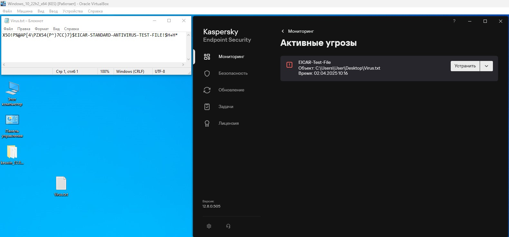

3. После изменения расширения файла на `.bat` и попытке запуска, KES удалил данный файл и просигнализировал об опасности:

    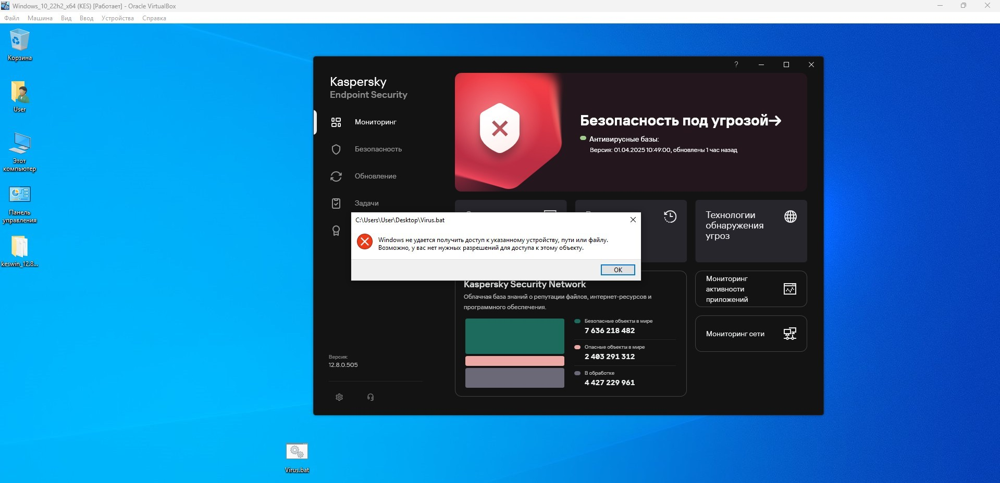
