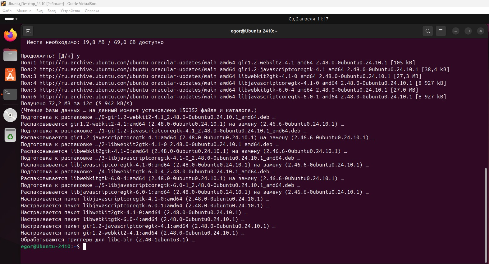
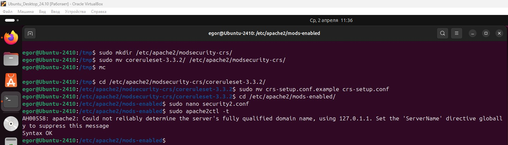
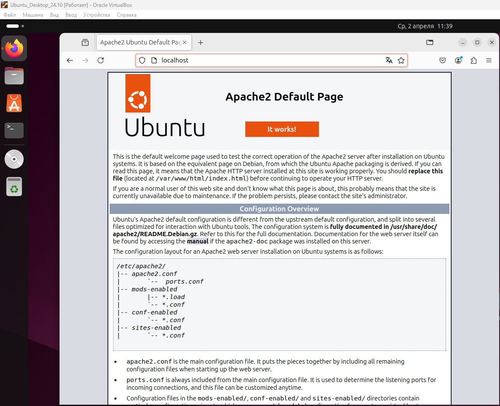
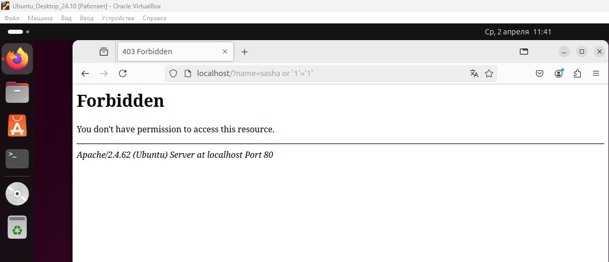

# Специалист по информационной безопасности: расширенный курс
## Модуль "Администрирование СЗИ"
### Желобанов Егор SIB-48

# Домашнее задание к занятию «1.6. WAF»

### Чек-лист готовности к домашнему заданию:

1. Изучены материалы лекции «WAF» в личном кабинете.
2. Установлена виртуальная машина Ubuntu 24.10 в Virtualbox.

### Описание задачи:

Вы работаете в службе ИБ. Руководство поставило задачу установить и настроить программный WAF OWASP ModeSecurity.

### Ответ:

1. Обновил на всякий случай все пакеты командой `sudo apt update && sudo apt upgrade -y`:

    

2. Далее приступил к установке и настройке `Apache` и `ModeSecurity` в соответствии с инструкцией, скриншоты процесса делать не буду, иначе их будет слишком много.
3. После установки и настройки выполнил команду для тестирования конфигурации веб-сервера: `sudo apache2ctl -t`:

   

4. Протестировал работу нашего веб-сервера в обычном режиме, перейдя по адресу в браузере: `http://localhost`:

   

5. Имитируем SQL-инъекцию: `http://localhost/?name=sasha or '1'='1'`. WAF заблокировал атаку, выдав код 403:

   
