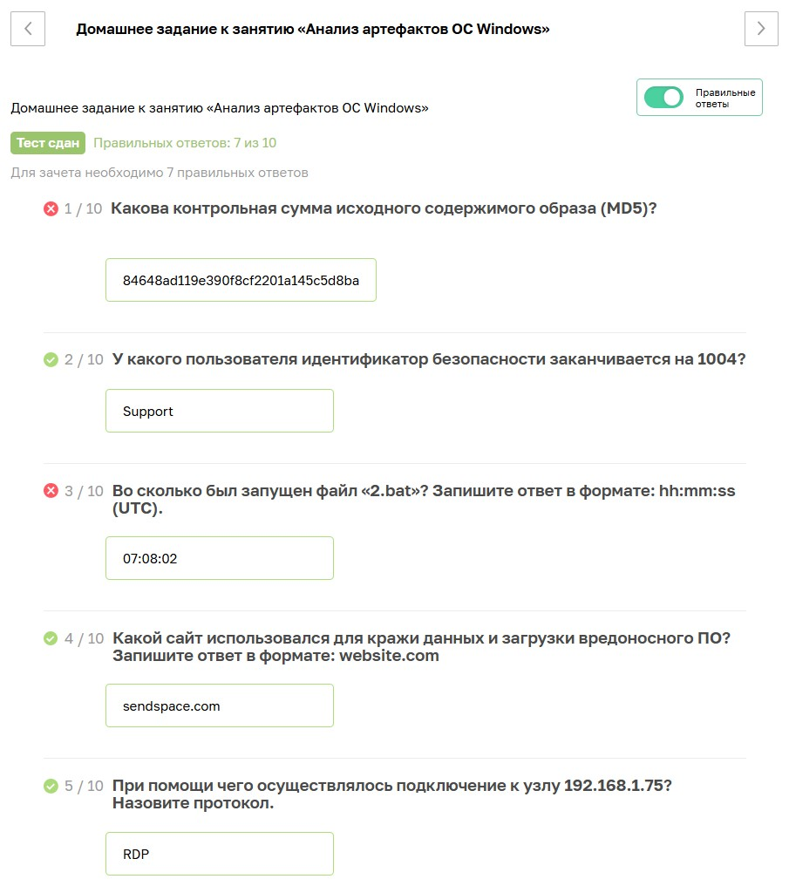
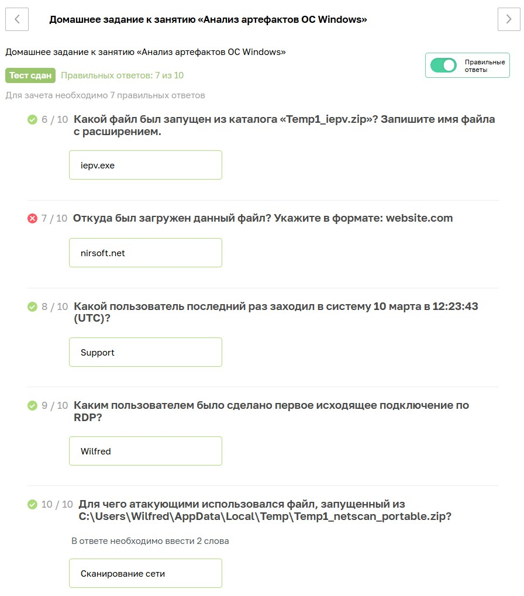

# Специалист по информационной безопасности: расширенный курс
## Модуль "Современная киберпреступность и методы противодействия"
### Желобанов Егор SIB-48

# Домашнее задание к занятию «1.1. Анализ артефактов ОС Windows»

