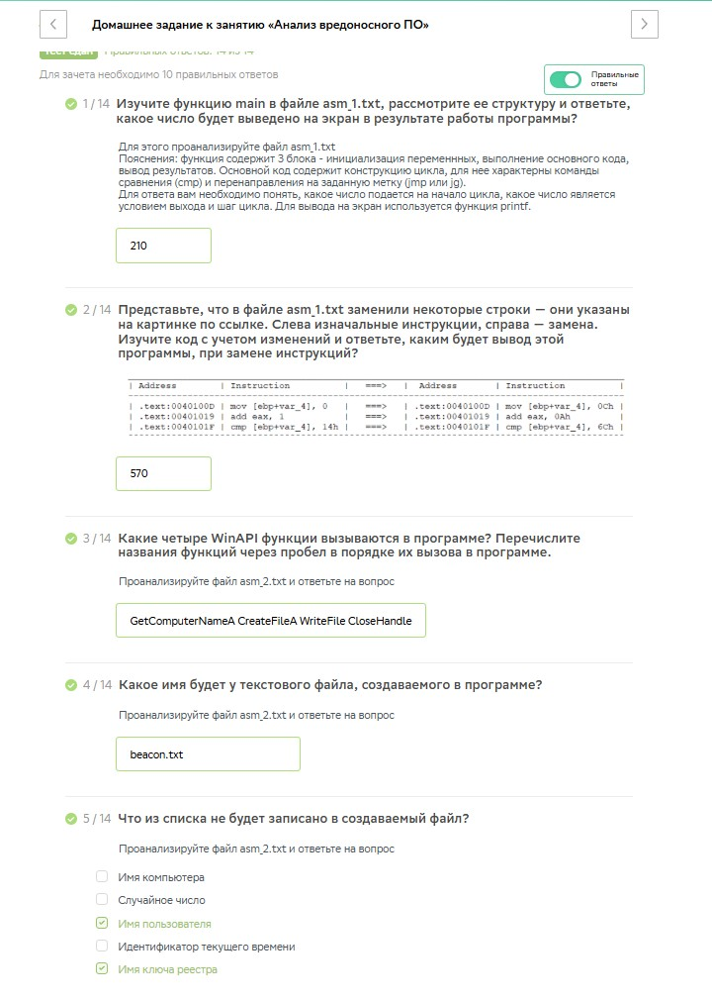
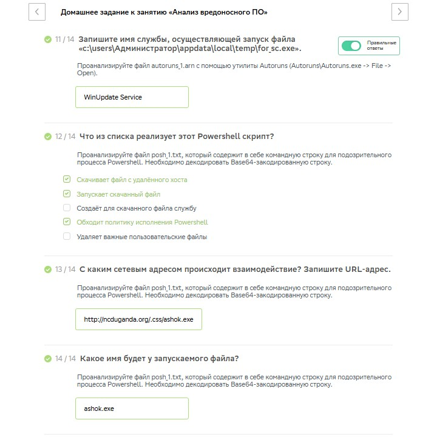

# Специалист по информационной безопасности: расширенный курс
## Модуль "Современная киберпреступность и методы противодействия"
### Желобанов Егор SIB-48

# Домашнее задание к занятию «3.1. Анализ вредоносного ПО»

