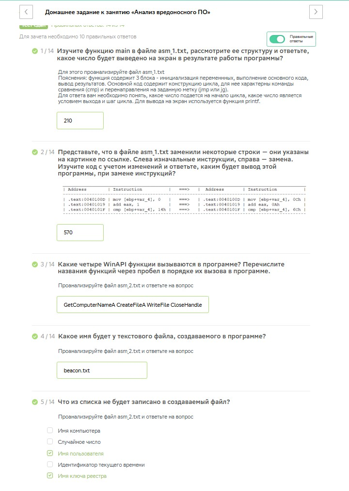
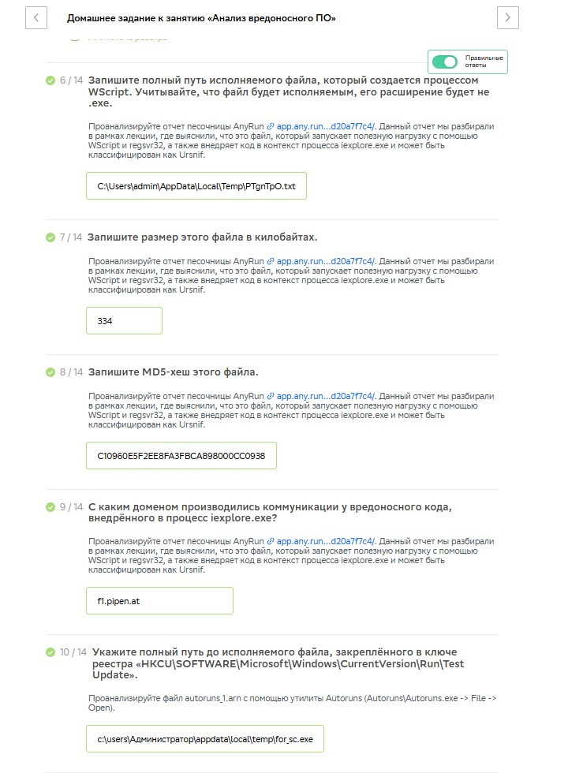
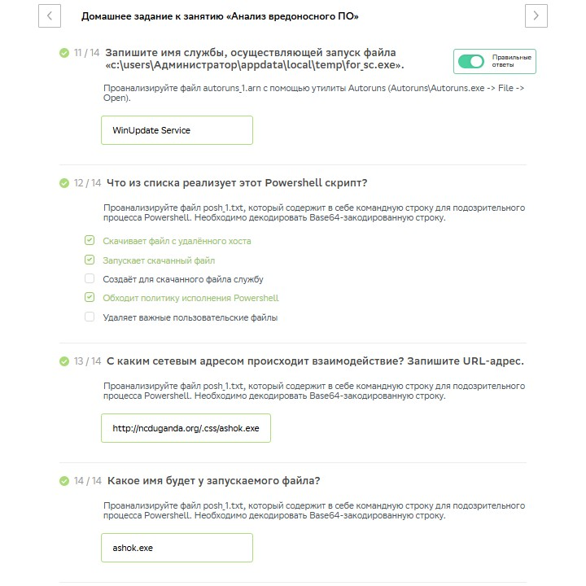

# Специалист по информационной безопасности: расширенный курс
## Модуль 6. Современная киберпреступность и методы противодействия
### Желобанов Егор SIB-48

# Домашнее задание к занятию «6.3. Анализ вредоносного ПО»

