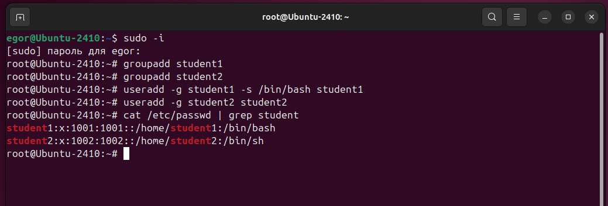
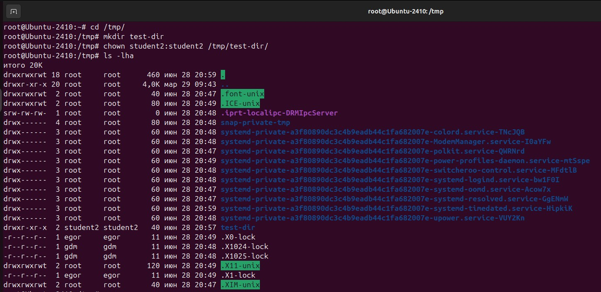
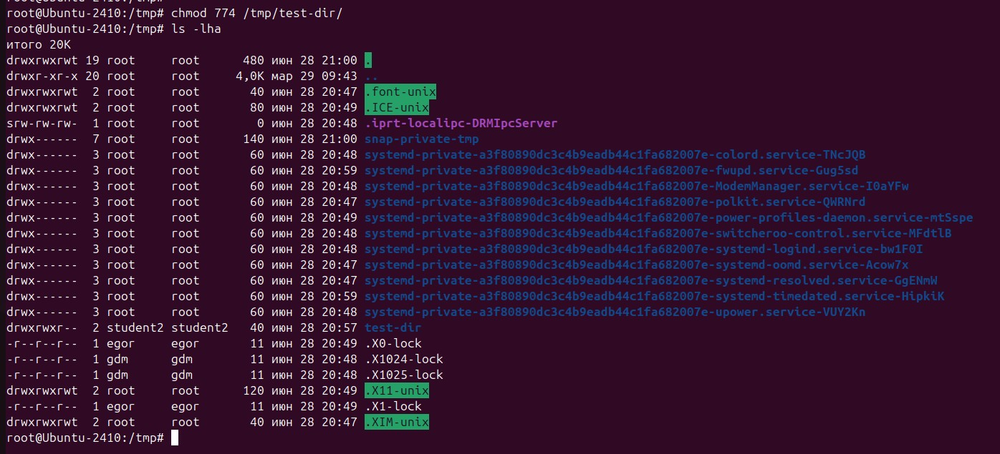
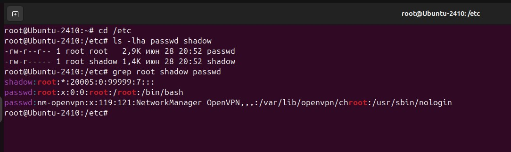

# Специалист по информационной безопасности: специализация Pentest
## Модуль 7. Attack & Defence
### Желобанов Егор SIBDEF-48

# Домашнее задание к занятию «7.1. Linux Hardening»

### Задание 1

- Создайте пользователя `student1` с оболочкой bash, входящего в группу `student1`.
- Создайте пользователя `student2`, входящего в группу `student2`.

------

### Задание 2

- Создайте в общем каталоге, например, /tmp, директорию.
- Назначьте для неё полный доступ со стороны группы `student2` и доступ на чтение всем остальным.

------

### Задание 3

- Определите, какой режим доступа установлен для файлов `/etc/passwd` и `/etc/shadow`.
- Объясните, зачем понадобилось именно два файла.

Файлы `/etc/passwd` и `/etc/shadow` в Linux используются для хранения информации о пользователях и их паролях, 
но разделены для повышения безопасности. 

`/etc/passwd` содержит общедоступную информацию о пользователях, такую как их UID, GID, домашняя директория и оболочка, 
но не хранит пароли в открытом виде. Пароли, вместо этого, хранятся в `/etc/shadow` в зашифрованном виде, 
и этот файл доступен для чтения только пользователю root. Разделение этих файлов позволяет предотвратить несанкционированный 
доступ к паролям, даже если `/etc/passwd` будет скомпрометирован.

------

### Задание 4*

Изучите информацию о SELinux из открытых источников.

Ответьте на вопросы:

1. Что из того, что предлагает SELinux, может быть реализовано в стандартном Linux?

    * Контроль доступа к файлам и процессам:
      Стандартный Linux использует систему прав доступа (владелец, группа, остальные), но SELinux предоставляет более 
      детальный контроль, используя метки безопасности и политики. Хотя можно использовать ACL (списки контроля доступа) 
      в стандартном Linux для более тонкой настройки, они не обеспечивают такой же гибкости и централизованного управления, как SELinux.

    * Ограничение прав доступа для приложений:
      SELinux может ограничивать доступ приложений к ресурсам системы, что может быть сделано в стандартном Linux с 
      помощью различных механизмов, таких как chroot или использование контейнеров, но SELinux предоставляет более надежную и гибкую систему.

    * Журналирование:
      SELinux предоставляет подробное журналирование операций, что полезно для отладки и анализа безопасности. 
      Стандартный Linux также имеет механизмы журналирования, но они могут быть менее детализированными или сложными в настройке. 

2. Можно ли установить SELinux поверх существующей ОС Linux?

    Да, SELinux может быть установлен поверх существующей ОС Linux, так как он является модулем ядра. 
    Обычно он включается в дистрибутивы Linux, такие как Red Hat Enterprise Linux, CentOS, Fedora. 
    Если он не установлен по умолчанию, его можно установить из репозиториев дистрибутива и включить. 
    В некоторых случаях, может потребоваться перекомпиляция ядра, если используемое ядро не поддерживает SELinux.
    После установки SELinux его можно настроить и активировать.
