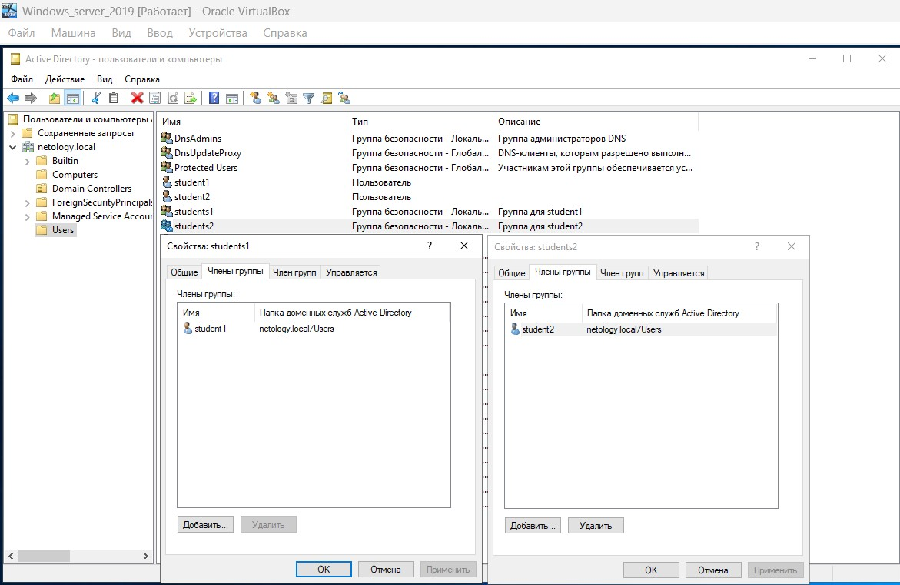

# Специалист по информационной безопасности: специализация Pentest
## Модуль 7. Attack & Defence
### Желобанов Егор SIBDEF-48

# Домашнее задание к занятию «7.3. Active Directory. Часть 1»

### Задание 1

1. Скачайте и установите Windows Server 2019 (20162012), используя файл по [ссылке](https://www.microsoft.com/en-us/evalcenter/evaluate-windows-server-2019). 

Настройка виртуальной машины.

Для пользователей с процессорами ARM (M Apple Silicon или другими) можно воспользоваться системой визуализации https://www.qemu.org/. 
Для Apple Mac — https://github.com/utmapp/UTM (docs https://docs.getutm.app/).

Для настройки виртуальной машины:
- два сетевых интерфейса: NAT и внутренняя сеть;
- оперативная память — 2–4 Гб.

### Ответ:

Скачал и установил windows server 2019, единственное параметры первого сетевого адаптера
у меня не NAT а сетевой мост:

2. Настройте Active Directory, используя материалы из открытых источников ниже:

- [материал 1](https://1cloud.ru/help/windows/active-directory-domain-services-ustanovka-i-nastrojka-windows-server);
- [материал 2](https://habr.com/ru/company/testo_lang/blog/525326/);
- [материал 3](https://efsol.ru/manuals/active-directory.html).

Установка ролей и компонентов, настройка Active Directory:

Контроллер домена развернут:

------

### Задание 2

Создайте в AD:

- пользователя `student1`, входящего в группу `students1`;
- пользователя `student2`, входящего в группу `students2`.

------

### Задание 3

- Создайте или используйте существующую ВМ с установленной ОС Windows и подключите к домену [ссылке](https://docs.microsoft.com/ru-ru/windows-server/identity/ad-fs/deployment/join-a-computer-to-a-domain);
- Зайдите под доменными учётными записями.

Добавил ВМ в домен `netology.local`  авторизовался под разными пользователями:

------

## Дополнительные задания со звёздочкой.

Эти задания необязательные.  Их выполнение никак не влияет на получение зачёта по домашней работе. Вы можете их выполнить, если хотите усвоить полученный материал и лучше разобраться в теме.

------

### Задание 4*

Настройте любую политику GPO и проверьте, что она распространилась на рабочую станцию:

- https://1cloud.ru/help/windows/gruppovye-politiki-active-directory;
- https://windowsnotes.ru/activedirectory/primenenie-gruppovyx-politik-chast-1/.

Ответ:

Создал в домене OU `vms`, и переместил в нее виртуальную машину `NETOLOGY-IB`:

1

Создал 2 групповые политики:

* GPO_disk1 - она создаст диск `W` ссылающийся на `\\AD-NETOLOGY\Disk1` для группы students1
* GPO_disk2 - она создаст диск `X` ссылающийся на `\\AD-NETOLOGY\Disk2` для группы students2

Скриншоты политики `GPO_disk1`, вторая политика создана аналогично:

И авторизуемся под разными пользователями:

Как вариант, можно было создать одну политику, и внутри подключать диски, применив таргетинг на группу безопасности.
И в зависимости от членства пользователя в группе, подключать определенный сетевой ресурс.
