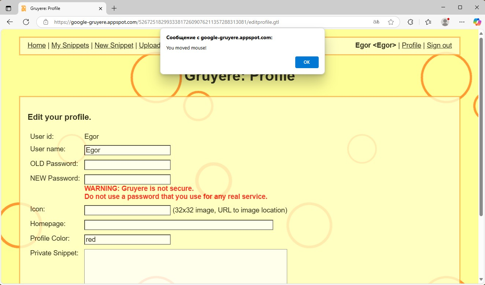
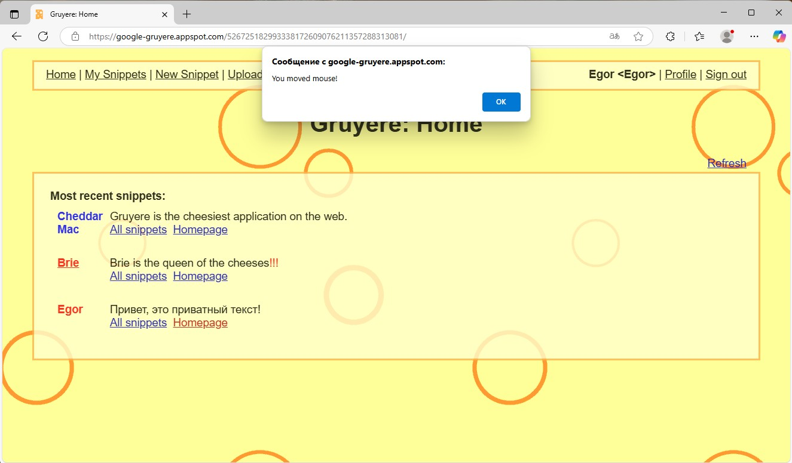
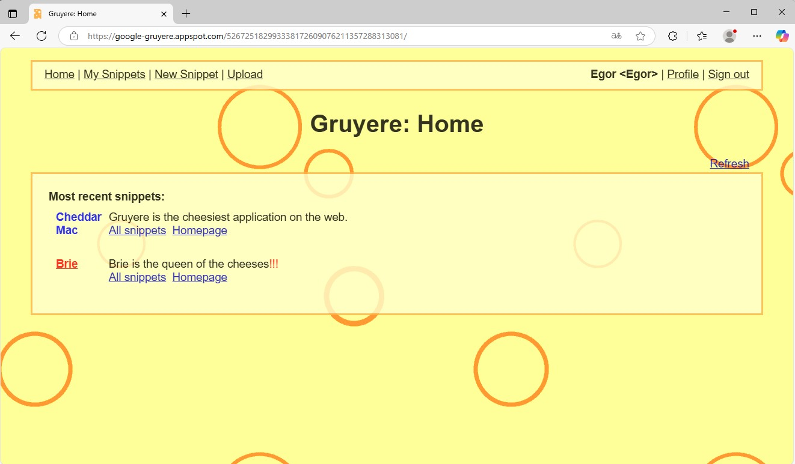
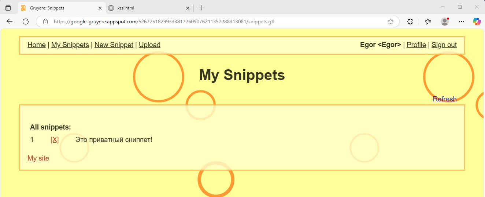
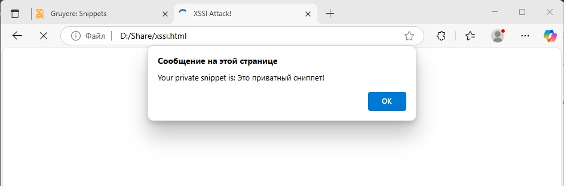
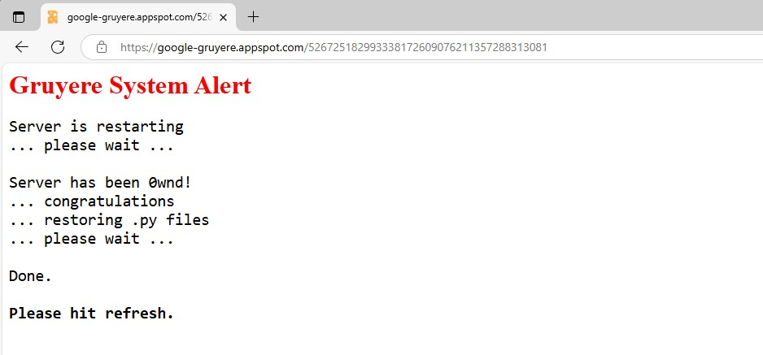
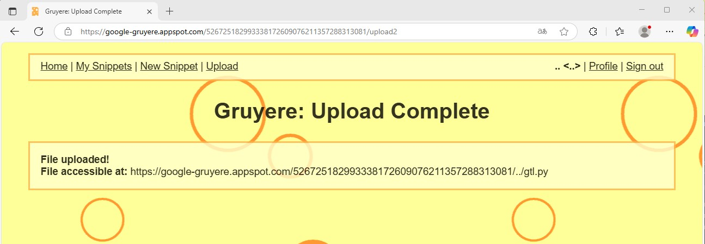

# Специалист по информационной безопасности: специализация Pentest
## Модуль 7. Attack & Defence
### Желобанов Егор SIBDEF-48

# Домашнее задание к занятию «7.6. Penetration Testing. Часть 1»

### Задание 1

Используйте инструменты OSINT и найдите информацию о любом сервисе, которым пользуйтесь каждый день. 

Рекомендуем искать: 
- расположение дата-центров;
- почтовые сервера;
- чаты;
- файлы в открытом доступе;
- адреса офисов;
- ресурсы, где можно найти сотрудников компании и т. д.

### Ответ:

Отчет по ресурсу **wildberries.ru**

Общество с ограниченной ответственностью «Вайлдберриз»

1. ООО «Вайлдберриз» имеет свой собственный ЦОД, информация о котором найдена на [официальном сайте](https://datacenters.wildberries.ru/ru),
    где указано, что ЦОД построен на территории одного из крупнейших распределительных центров Wildberries:

    

    С помощью поискового запроса получаем адрес: Московская область, город Электросталь, посёлок Случайный, территория Массив 3, 5.

2. Почтовый сервер - `webmail.wildberries.ru`, привожу результаты выполнения команд в Kali Linux и Windows 11:

    

    

3. Чатов касательно Wildberries огромное количество, например на [ресурсе](https://tg-cat.com/?search=wildberries&type=supergroup&lang=ru)
    в базе более 2000 чатов. Возьмем несколько чатов:

    * https://t.me/wbsearch
    * https://t.me/wbofficialchat 
    * https://t.me/contentwbchat

4. Файлов в открытом доступе также немало, укажу несколько из них:

    * https://static-basket-02.wb.ru/vol20/offers/prd/product/latest.pdf
    * https://pro.wildberries.ru/pro/app/upload/documents/prowb/Guide-for-sellers.pdf?from=seller_landing
    * https://static-basket-02.wbbasket.ru/vol20/supplier-portal-core/0.0.2/vendor-docs/opisanie_tekhnicheskoj_arhitektury.pdf
    * https://cmp.wildberries.ru/cmpf/%D0%98%D0%BD%D1%81%D1%82%D1%80%D1%83%D0%BA%D1%86%D0%B8%D1%8F%20%D0%BF%D0%BE%20%D0%BF%D0%BE%D0%BA%D0%B0%D0%B7%D0%B0%D0%BC.pdf
    * https://wb-bank.ru/documents/dogovor-o-kompleksnom-obsluzhivanii-klienta-oferta.pdf

5. Юридический адрес: 142181, Московская область, д Коледино, тер. Индустриальный Парк Коледино, д. 6 стр. 1

6. На [оффсайте ЦОД Wildberries](https://datacenters.wildberries.ru/ru/team) есть раздел, где указаны сотрудники этого ЦОД.
------

### Задание 2

- Проведите первичный пентест уязвимого приложения Google Gruyere с помощью OWASP ZAP или Burp Suite. 
- Найдите в приложениях XSS, XSRF, XSSI, Path Traversal и Code Execution. Какая-то часть уязвимостей может быть найдена автоматически, другая часть найдётся только вручную. 

Не рекомендуем пользоваться ответами, но можно посмотреть в подсказки.
[Google Gruyere](https://google-gruyere.appspot.com/).

Пришлите отчёт о том:
- каким образом вы смогли найти уязвимости;
- как можно эксплуатировать эти уязвимости приложений.

### Ответ:

URL экземпляра - [https://google-gruyere.appspot.com/526725182993338172609076211357288313081/](https://google-gruyere.appspot.com/526725182993338172609076211357288313081/)

Для проведения пентеста я использую ZAP в виртуальной машине Kali Linux:


Отчет выполнения сканирования сохранил в форматах [mhtml](assets/task02/ZAP%20by%20Checkmarx%20Scanning%20Report.mhtml) и
[PDF](assets/task02/ZAP%20by%20Checkmarx%20Scanning%20Report.pdf).

Найденные уязвимости:

* Cross Site Scripting (DOM Based) - найдена при автоматическом сканировании сайта.

    Позволяет выполнить скрипт из адресной строки браузера, например: `https://google-gruyere.appspot.com/526725182993338172609076211357288313081/feed.gtl?uid=%3Cscript%3Ealert(%27Hello!%27)%3C/script%3E`:

    

* Cross Site Scripting (Reflected) - найдена при автоматическом сканировании сайта.

    При редактировании профиля в строке `Color` можно ввести `red' onload='alert("Hello")' onmouseover='alert("You moved mouse!")`,
    и если снова зайти в профиль, то при наведении курсора мыши на поле `Color`, получаем алерт:

    

    А также в списке сниппетов при наведении курсора мыши на свой логин:

    

* Path Traversal - найдена вручную с использованием подсказок и в результате выполнения команды `curl https://google-gruyere.appspot.com/526725182993338172609076211357288313081%2f..%2fsecret.txt`:

   

* XSRF - найдена вручную с помощью подсказок. У созданного снипета, если навести курсор на значок удаления [X], видно его URL.
    Соответственно данную уязвимость можно использовать, например отправив POST или GET запрос на этот URL, в моем случае это
    `https://google-gruyere.appspot.com/526725182993338172609076211357288313081/deletesnippet?index=0`. Т.е. можно отправить пользователю
    данную ссылку, и он того не зная удалит информацию на сайте.

    Отправляем GET запрос, и видим что сниппет удалился:

    

* XSSI - найдена вручную с помощью подсказок. Можно создать стороннюю страницу, с кодом:

    ```javascript
    <script>function _feed(s) {alert("Your private snippet is: " + s['private_snippet']);}</script>
    <script src="http://google-gruyere.appspot.com/526725182993338172609076211357288313081/feed.gtl"></script>
    ```
    И отправить пользователю ссылку на нее. Зайдя, мы получим алерт с содержимым сниппетов, соответственно эти сниппеты уже
    дальше можно также направить и на сторонний сайт, модифицировав скрипт как нам угодно.

    Сниппет:

    

    Получение алерта со страницыи содержимое сниппета:

    

* Code Execution - найдена вручную с помощью подсказок. Данная атака не увенчалась успехом, файл [gtl.py](assets/task02/gtl.py)
    был модифицирован - добавлена строка `print("Hello Netology!")`. Созданы пользователи разных вариантов ("...", ..., .. и т.д.), 
    но при перезапуске сервера получаю сообщение, что файл восстановлен:

    

    При этом файл был загружен:

    
