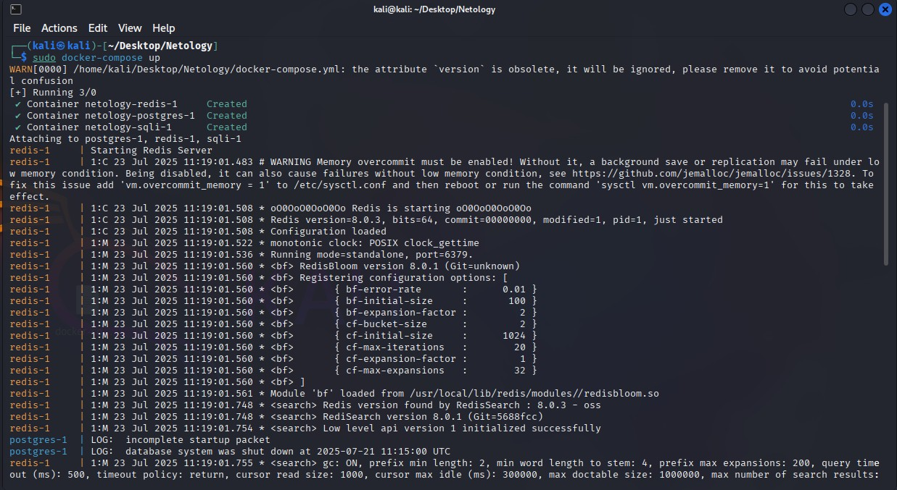
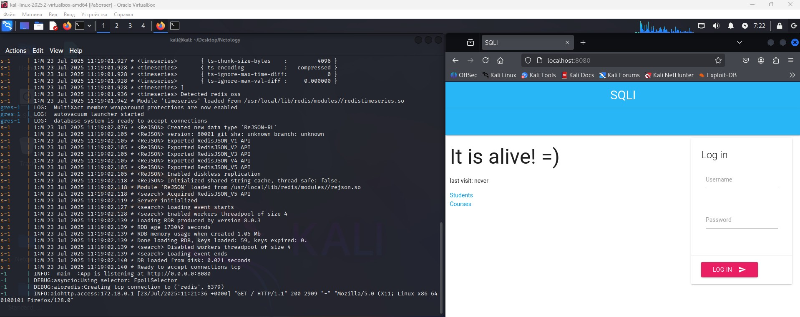
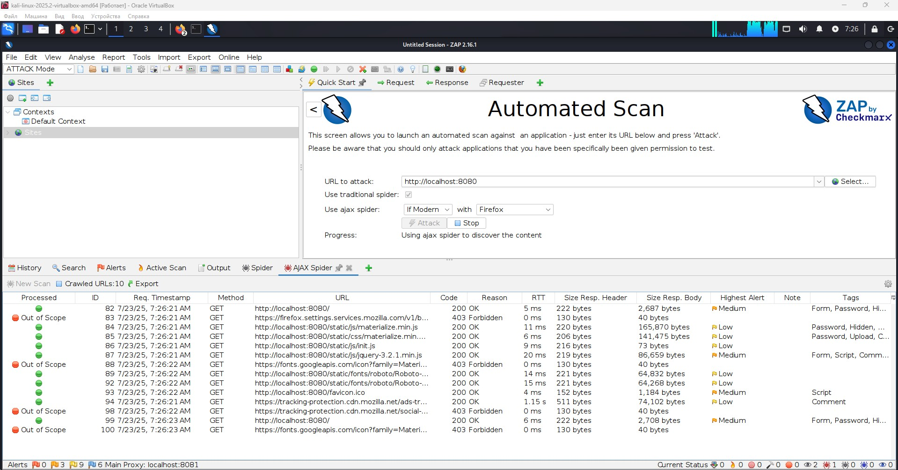

# Специалист по информационной безопасности: специализация Pentest
## Модуль 7. Attack & Defence
### Желобанов Егор SIBDEF-48

# Домашнее задание к занятию «7.7. Penetration Testing. Часть 2»

### Задание 1

1. Запустите приложение из файла [docker-compose.yml](assets/docker-compose.yml).
2. Проведите пентест приложения и найдите как минимум 4 уязвимости. 
3. Напишите в ответе, какие уязвимости были найдены.

### Ответ:

1. Запустил приложение командой `sudo docker-compose up`

   

   В виртуальной машине Kali запустил браузер и ввел адрес `http://localhost:8080/`:

   

2. Запустил сканирование ZAP адреса `localhost:8080`, методами `Standard Mode` и `Attack Mode`:

   

   По результатам сканирования получены файлы репортов:

   * [Standard Mode](assets/Standard_Mode_2025-07-20-ZAP-Report.mhtml)
   * [Attack Mode](assets/Attack_Mode_2025-07-21-ZAP-Report.mhtml)

3. Найденные уязвимости:

   * Cross Site Scripting (Persistent)
   * Cross Site Scripting (Reflected)
------

### Задание 2

После проведённого аудита напишите отчёт в формате markdown или doc. 

Отчёт должен содержать:
- полезную информацию об уязвимостях;
- оценку критичности;
- подтверждения нахождения;
- предложения по исправлению.

Загрузите отчёт в личном кабинете студента.

------
